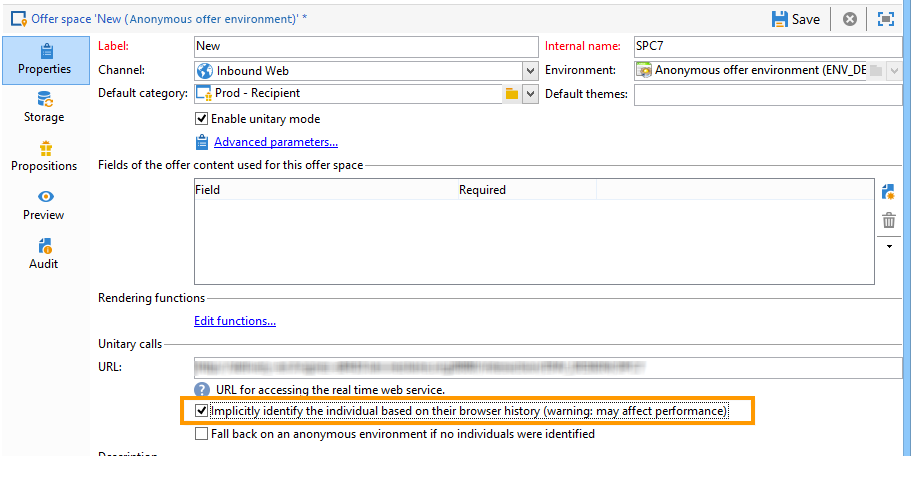

# 匿名互动{#anonymous-interactions}

 观看此视  频可获取如何将选件交付给已识别和匿名目标的概述。

## 定位和存储匿名交互的环境 {#targeting-and-storing-an-environment-for-anonymous-interactions}

默认情况下，交互会附带一个预配置的环境，以定位收件人表（已识别的选件）。 如果您希望定位其他表（匿名选件的访客表或特定的收件人表），则需要使用Target映射向导来创建环境。 有关更多信息，请参阅[创建选件环境](../../interaction/using/live-design-environments.md#creating-an-offer-environment)。

通过映射创建向导创建匿名环境时，环境的&#x200B;**[!UICONTROL General]**&#x200B;选项卡中会自动选中&#x200B;**[!UICONTROL Environment dedicated to incoming anonymous interactions]**&#x200B;框。

**[!UICONTROL Targeting dimension]**&#x200B;自动完成。 默认情况下，它链接到访客表。

出现&#x200B;**[!UICONTROL Visitor folder]**&#x200B;字段。 自动完成链接到&#x200B;**[!UICONTROL Visitors]**&#x200B;文件夹。 利用此字段，可选择访客配置文件的存储位置。

>[!NOTE]
>
>如果要过滤多种类型的访客（例如，对于为一个或多个品牌提供匿名选件的访客），您需要为每个品牌创建一个环境，并为每个环境创建一个&#x200B;**[!UICONTROL Visitors]**&#x200B;类型文件夹。

## 匿名交互的选件目录 {#offer-catalog-for-anonymous-interactions}

与出站交互一样，集客交互也会组织在由类别和选件组成的选件目录中。

要创建类别和空格，请应用与已识别访客相同的流程（请参阅[创建选件类别](../../interaction/using/creating-offer-categories.md)和[创建选件环境](../../interaction/using/live-design-environments.md#creating-an-offer-environment)）。

## 匿名访客 {#anonymous-visitors}

匿名访客在连接时可能会被提交到Cookie识别流程。 这种隐式识别基于访客的浏览器历史记录。

在此步骤中，将比较由Cookie恢复的数据与数据库中的数据。 在某些情况下，访客会被识别（然后被隐式识别），而在其他情况下，访客不会被识别（因此保持匿名）。

要运行此分析，请在选件空间中选中&#x200B;**[!UICONTROL Implicitly identify the individual based on their browser history]**&#x200B;选项。

## 处理未识别的匿名访客 {#processing-unidentified-anonymous-visitors}

分析后，如果未识别匿名访客，则可以将其数据存储在给定空间中。 这样，您就可以根据指定的分类规则，向专门针对此类访客的选件提出建议。

如果没有允许您识别联系人的元素，或者如果您不想向可隐式识别的联系人建议已识别的选件，则可以选择在匿名环境中进行回退。

要执行此操作，请检查&#x200B;**[!UICONTROL Fall back on an anonymous environment if no individuals were identified]**，然后在&#x200B;**[!UICONTROL Linked anonymous space]**&#x200B;中指定指定选件空间时，为这些未识别的访客指定专用的环境。

