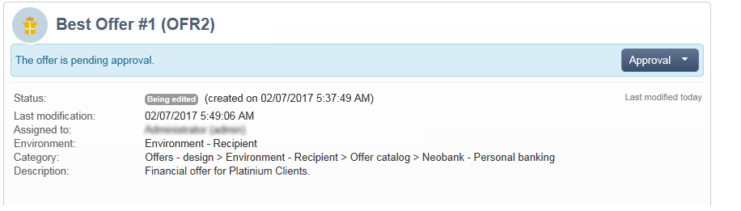
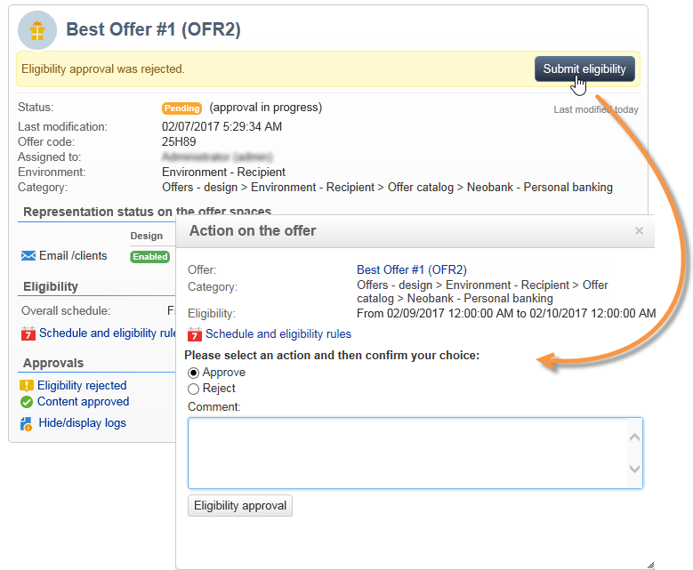

# 批准和激活优惠{#approving-and-activating-an-offer}

选件内容完成后，您需要批准该内容以将其复制到实时环境中并进行交付。 批准涉及选件内容及其资格。

选件仪表板上的横幅可告知您选件是否需要经过批准周期。

## 批准优惠内容{#approving-offer-content}

批准选件内容意味着选择要在实时环境中提供的表示形式。

选件的内容在每个空间中具有一个表示形式。 由于每个选件空间都有其自己的结构和自己的渲染功能，因此选件表示方式可能会有所不同。

您可以选择在某些可用空间上批准选件内容，而在其他空间上拒绝该选件内容。

>[!IMPORTANT]
>
>选件的内容和资格获得批准后，发布工作流程（选件通知）将自动运行，并且该选件会处于活跃状态并在所有激活的空间上可用。

要批准选件内容，请应用以下步骤：

1. 单击&#x200B;**[!UICONTROL Approval]**&#x200B;按钮，然后在弹出窗口中选择&#x200B;**[!UICONTROL Approve content]**。

   

1. 使用下拉列表，选择要编辑的表示法或要发布到实时环境的表示法，然后单击&#x200B;**[!UICONTROL Content approval]**。

   

   选件内容获得批准后，信息会在选件功能板表格中进行更新。

   

   >[!NOTE]
   >
   >**[!UICONTROL Content approved]**&#x200B;提及并不意味着已启用并批准所有选件表示形式。 它表示内容批准流程已完成，无论是否已启用/批准所有选件。

## 批准优惠资格{#approving-offer-eligibility}

批准选件资格是指接受或拒绝选件权重以及在选件中配置或从父类别中创建的规则继承的资格规则。

>[!IMPORTANT]
>
>选件的内容和资格获得批准后，发布工作流程（选件通知）将自动运行，并且该选件会处于活跃状态并在所有激活的空间上可用。

* 可通过单击&#x200B;**[!UICONTROL Schedule and eligibility rules]**&#x200B;查看规则的完整列表。

   

* 要更改资格规则，请单击&#x200B;**[!UICONTROL Reject]**，然后单击&#x200B;**[!UICONTROL Eligibility approval]**。

   

   选件功能板上的各种状态已更新。

   

* 要接受选件资格，请单击&#x200B;**[!UICONTROL Approve eligibility]**。

   

   批准资格，根据需要添加评论，然后单击&#x200B;**[!UICONTROL Eligibility approval]**。

   

   选件功能板上的各种状态已更新。

   

## 批准跟踪{#approval-tracking}

批准跟踪可在选件功能板中使用。 单击&#x200B;**[!UICONTROL Hide/display logs]**&#x200B;以访问。

>[!NOTE]
>
>选件的&#x200B;**[!UICONTROL Audit]**&#x200B;选项卡中也提供了跟踪功能，其中包含审阅人评论的详细信息。

## 重新启动批准{#restart-the-approval}

启动批准后，即可重新启动该批准。 为此，请按照以下说明操作：

1. 单击选件仪表板上的&#x200B;**[!UICONTROL Content approved]**。
1. 在出现的&#x200B;**[!UICONTROL Edit]**&#x200B;窗口中，选择要重新启动的批准，然后单击&#x200B;**[!UICONTROL Re-initialize approval to submit it again]**。
1. 单击&#x200B;**[!UICONTROL Ok]**&#x200B;进行确认。

## 发布选件{#publishing-the-offer}

选件的内容和资格均获得批准后，该选件将通过一个工作流程发布，该工作流程会为其批准周期已完成的每个选件自动运行。 **[!UICONTROL Offer notification]**&#x200B;工作流还每小时运行一次，以便将选件目录中包含的空间和类别（如有必要）从设计环境同步到实时环境。

设计环境中可用选件的功能板包含有关发布的信息，包括实时环境中匹配选件的名称。

要显示实时环境中可用的选件，请单击选件标签：实时选件有一个包含其所有相关信息的功能板。

## 禁用选件{#disabling-an-offer}

选件获得批准后，即可将其禁用。

要实现此目的，请转到功能板，查看在线选件或等待联机的选件，然后单击&#x200B;**[!UICONTROL Disable offer]**。

您还可以直接禁用类别，方法是转到&#x200B;**[!UICONTROL Eligibility]**&#x200B;选项卡并选中&#x200B;**[!UICONTROL Enabled]**&#x200B;框。

>[!NOTE]
>
>在设计环境中删除某个选件后，该选件会在链接的在线环境中自动停用。 在建议保留期后，将从在线环境中删除已停用的选件。

