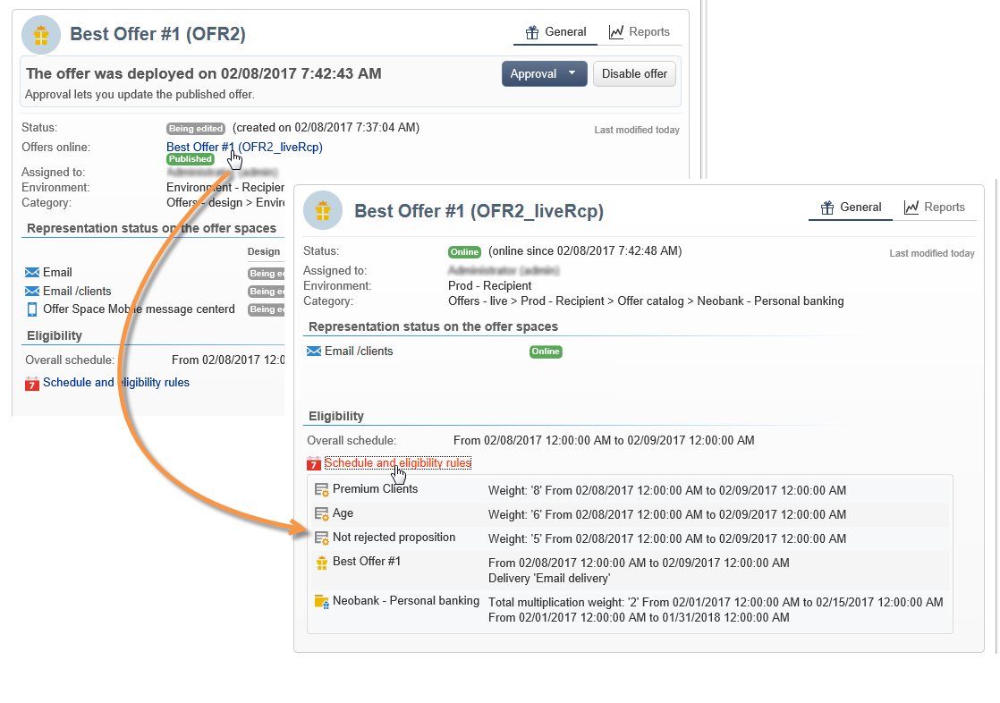

# 批准和激活优惠{#approving-and-activating-an-offer}

选件内容完成后，您需要批准它以复制到实时环境中并进行交付。 批准涉及优惠内容及其资格。

优惠仪表板上的横幅会告知您优惠是否需要经历批准周期。

## 批准优惠内容 {#approving-offer-content}

批准优惠内容意味着选择您希望在实时环境中可用的呈现。

选件的内容在每个空间中具有一个表示形式。 由于每个选件空间都有其自己的结构和渲染功能，因此选件表示可能会有所不同。

您可以选择批准某些可用空间上的选件内容，拒绝其他空间上的选件内容。

>[!IMPORTANT]
>
>选件的内容和资格获得批准后，发布工作流（选件通知）将自动运行，选件将在所有激活的空间中上线并可用。

要批准选件内容，请应用以下步骤：

1. 单击&#x200B;**[!UICONTROL Approval]**&#x200B;按钮并在弹出窗口中选择&#x200B;**[!UICONTROL Approve content]**。

   

1. 使用下拉列表，选择要继续编辑的演示文稿或要发布到实时环境的演示文稿，然后单击&#x200B;**[!UICONTROL Content approval]**。

   

   批准优惠内容后，将更新优惠仪表板表格中的信息。

   

   >[!NOTE]
   >
   >**[!UICONTROL Content approved]**&#x200B;提及并不意味着已启用并批准所有优惠呈现。 它指示内容批准流程已完成，无论是否已启用/批准所有选件。

## 批准优惠资格 {#approving-offer-eligibility}

批准优惠资格意味着接受或拒绝优惠权重，以及同样在优惠中配置或从父类别中创建的规则继承的资格规则。

>[!IMPORTANT]
>
>选件的内容和资格获得批准后，发布工作流（选件通知）将自动运行，选件将在所有激活的空间中上线并可用。

* 单击&#x200B;**[!UICONTROL Schedule and eligibility rules]**&#x200B;可以查看规则的完整列表。

  

* 要更改资格规则，请单击&#x200B;**[!UICONTROL Reject]**，然后单击&#x200B;**[!UICONTROL Eligibility approval]**。

  

  优惠仪表板上的各种状态都会更新。

  

* 要接受优惠资格，请单击&#x200B;**[!UICONTROL Approve eligibility]**。

  

  批准资格，根据需要添加评论，然后单击&#x200B;**[!UICONTROL Eligibility approval]**。

  

  优惠仪表板上的各种状态都会更新。

  

## 审批跟踪 {#approval-tracking}

审批跟踪在优惠仪表板上可用。 单击&#x200B;**[!UICONTROL Hide/display logs]**&#x200B;以访问它。

>[!NOTE]
>
>选件的&#x200B;**[!UICONTROL Audit]**&#x200B;选项卡中也提供了跟踪功能，其中包含审阅人评论的详细信息。

## 重新开始审批 {#restart-the-approval}

启动批准后，即可重新启动该程序。 为此，请按照以下说明操作：

1. 单击优惠仪表板上的&#x200B;**[!UICONTROL Content approved]**。
1. 在出现的&#x200B;**[!UICONTROL Edit]**&#x200B;窗口中，选择要重新启动的审批，然后单击&#x200B;**[!UICONTROL Re-initialize approval to submit it again]**。
1. 单击&#x200B;**[!UICONTROL Ok]**&#x200B;确认。

## 发布优惠 {#publishing-the-offer}

选件的内容和资格获得批准后，选件将由工作流发布，该工作流会为其批准周期结束的每个选件自动运行。 **[!UICONTROL Offer notification]**&#x200B;工作流还每小时运行一次，以便将（如有必要）优惠目录中包含的空间和类别从设计环境同步到实时环境。

设计环境中可用选件的功能板包含有关发布的信息，包括实时环境中匹配选件的名称。

要显示实时环境中可用的选件，请单击选件标签：实时选件具有一个包含其所有相关信息的功能板。

## 禁用选件 {#disabling-an-offer}

选件获得批准后，您可以将其禁用。

为此，请转到仪表板以获取联机选件或等待联机选件，然后单击&#x200B;**[!UICONTROL Disable offer]**。

您还可以通过转到&#x200B;**[!UICONTROL Eligibility]**&#x200B;选项卡并选中&#x200B;**[!UICONTROL Enabled]**&#x200B;框直接禁用类别。

>[!NOTE]
>
>在设计环境中删除选件后，该选件会在链接的在线环境中自动停用。 在建议保留期过后，将从在线环境中删除停用的优惠。

