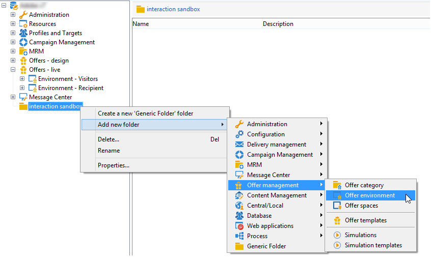

# 创建测试环境{#creating-a-test-environment}

要创建测试环境（沙盒模式），请应用以下步骤：

>[!IMPORTANT]
>
>仅将此环境创建方法用于测试环境。 在所有其他情况下，均使用目标映射助手。 有关详细信息，请参阅[创建优惠环境](../../interaction/using/live-design-environments.md#creating-an-offer-environment)。

1. 启动Adobe Campaign资源管理器，然后转到实例根。
1. 右键单击并使用下拉菜单添加&#x200B;**[!UICONTROL Generic folder]**。

   

1. 接下来，转到您刚刚创建的文件夹，并使用右键单击菜单添加&#x200B;**[!UICONTROL Offer environment]**。

   

1. 应用相同的流程来创建环境子文件夹和元素。
1. 完成测试并希望在生产环境中使用环境后，在设计环境中复制选件和空间。 （右键单击> **[!UICONTROL Actions]** > **[!UICONTROL Deploy]** ）。

   
