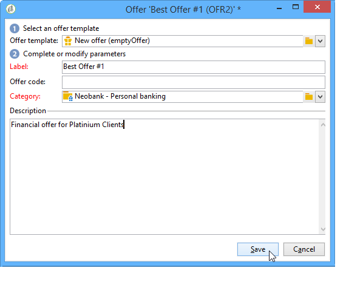
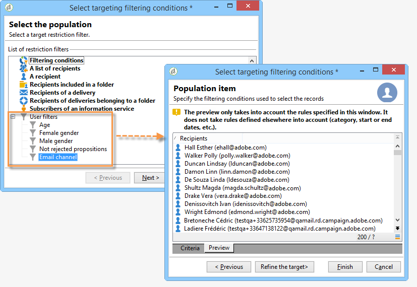

# 创建优惠{#creating-an-offer}


## 创建选件 {#creating-the-offer}

要创建选件，请应用以下步骤：

1. 转到 **[!UICONTROL Campaigns]** ，然后单击 **[!UICONTROL Offers]** 链接。

   

1. 单击 **[!UICONTROL Create]** 按钮。

   

1. 更改标签并选择选件应属于的类别。

   

1. 单击 **[!UICONTROL Save]** 以创建选件。

   

   该选件在平台中可用，并且可以配置其内容。

   

## 配置优惠资格 {#configuring-offer-eligibility}

在 **[!UICONTROL Eligibility]** 选项卡，定义选件的有效期限以及可显示的期限、要应用于目标的过滤器和选件权重。

### 定义优惠的资格期限 {#defining-the-eligibility-period-of-an-offer}

要定义选件的资格期，请使用下拉列表并在日历中选择开始日期和结束日期。


在这些日期之外，交互引擎将不会选择选件。 如果您还为选件类别配置了资格日期，则将适用最严格的期限。

### 目标上的过滤器 {#filters-on-the-target}

您可以将过滤器应用到选件目标。

为此，请单击 **[!UICONTROL Edit query]** 链接，然后选择要应用的过滤器。 (请参阅 [此部分](../../platform/using/steps-to-create-a-query.md#step-4---filter-data))。


如果已创建预定义过滤器，则可以从用户过滤器列表中选择它们。 有关更多信息，请参阅 [创建预定义过滤器](../../interaction/using/creating-predefined-filters.md).



### 优惠权重 {#offer-weight}

要使引擎能够在目标符合条件的多个选件之间做出决定，您需要为选件分配一个或多个权重。 您还可以根据需要将过滤器应用到目标，或限制权重要应用到的选件空间。 与重量较轻的选件相比，将更喜欢权重较大的选件。

您可以为同一选件配置多个权重，例如，以区分特定时段、特定目标，甚至选件空间。

例如，对于年龄在18到25岁的联系人，选件可以具有A的重量，对于超过该范围的联系人，选件可以具有B的重量。 如果选件在整个夏天都符合条件，则它在7月份的权重为A，在8月份的权重为B。

>[!NOTE]
>
>可以根据选件所属类别的参数暂时修改分配的权重。 有关更多信息，请参阅 [创建选件类别](../../interaction/using/creating-offer-categories.md).

要在选件中创建权重，请应用以下步骤：

1. 单击 **[!UICONTROL Add]**。

   

1. 更改标签并分配权重。 默认情况下，为1。

   

   >[!IMPORTANT]
   >
   >如果未输入权重(0)，则目标将不被视为符合选件条件。

1. 如果您希望将权重应用于给定期间，请定义资格日期。

   

1. 如有必要，请将权重限制为特定选件空间。

   

1. 将过滤器应用到目标。

   

1. 单击 **[!UICONTROL OK]** 以节省重量。

   

   >[!NOTE]
   >
   >如果目标符合为选定选件赋予多个权重的条件，则引擎会保持最佳（最高）权重。 在调用选件引擎时，每个联系人最多选择一个选件。

### 优惠资格规则摘要 {#a-summary-of-offer-eligibility-rules}

配置完成后，资格规则的摘要将显示在选件仪表板中。

要查看该动态消息，请单击 **[!UICONTROL Schedule and eligibility rules]** 链接。


## 创建选件内容 {#creating-the-offer-content}

1. 单击 **[!UICONTROL Edit]** ，然后单击 **[!UICONTROL Content]** 选项卡。

   

1. 填写选件内容的各个字段。

   * **[!UICONTROL Title]** :指定要在选件中显示的标题。 警告：这不是指在 **[!UICONTROL General]** 选项卡。
   * **[!UICONTROL Destination URL]** :指定选件的URL。 要正确处理，必须以“http://”或“https://”开头。
   * **[!UICONTROL Image URL]** :指定选件图像的URL或访问路径。
   * **[!UICONTROL HTML content]** / **[!UICONTROL Text content]** :在所需的选项卡中输入选件的正文。 要生成跟踪，请 **[!UICONTROL HTML content]** 必须由HTML元素组成，这些元素可以包含在 `<div>` 类型元素。 例如， `<table>` HTML页面中的元素将如下所示：

   ```
      <div> 
       <table>
        <tr>
         <th>Month</th>
         <th>Savings</th>   
        </tr>   
        <tr>    
         <td>January</td>
         <td>$100</td>   
        </tr> 
       </table> 
      </div>
   ```

   定义接受URL的详情请见 [在建议被接受时配置状态](../../interaction/using/creating-offer-spaces.md#configuring-the-status-when-the-proposition-is-accepted) 中。

   

   要查找在选件空间配置期间定义的必填字段，请单击 **[!UICONTROL Content definitions]** 链接以显示列表。 有关更多信息，请参阅 [创建优惠空间](../../interaction/using/creating-offer-spaces.md).

   

   在此示例中，选件必须包含标题、图像、HTML内容和目标URL。

## 预览选件 {#previewing-the-offer}

配置选件内容后，您便可以立即预览该选件，该选件将显示给其收件人。 操作步骤：

1. 单击 **[!UICONTROL Preview]** 选项卡。

   

1. 选择要查看的选件的表示形式。

   

1. 如果您已对选件内容进行了个性化，请选择选件目标以查看个性化。

   

## 为优惠创建假设 {#creating-a-hypothesis-on-an-offer}

您可以针对您的选件建议创建假设。 这可让您确定选件对相关产品执行的购买的影响。

>[!NOTE]
>
>这些假设是通过响应管理器执行的。 请核实您的许可协议。

在其中引用了对优惠建议进行的假设 **[!UICONTROL Measure]** 选项卡。

有关创建假设验证的详细信息，请参阅 [本页](../../response/using/about-response-manager.md).


