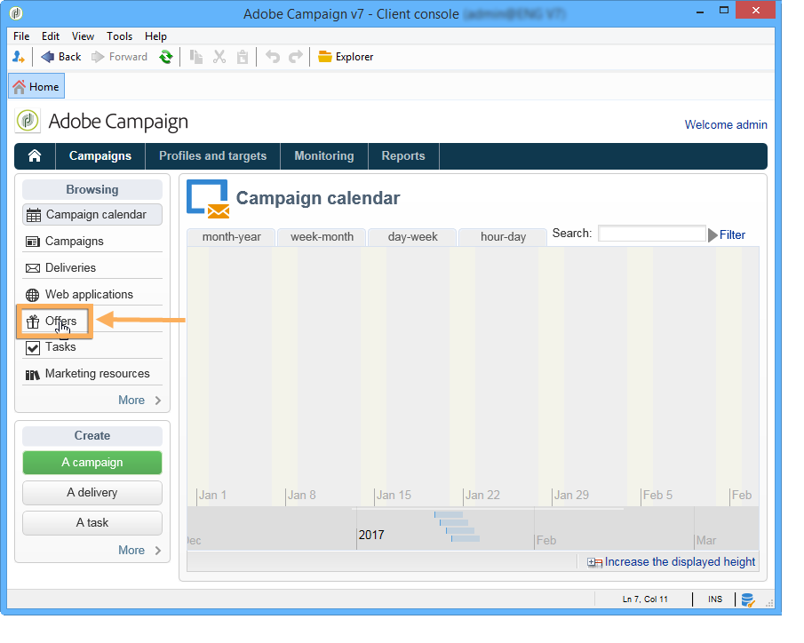
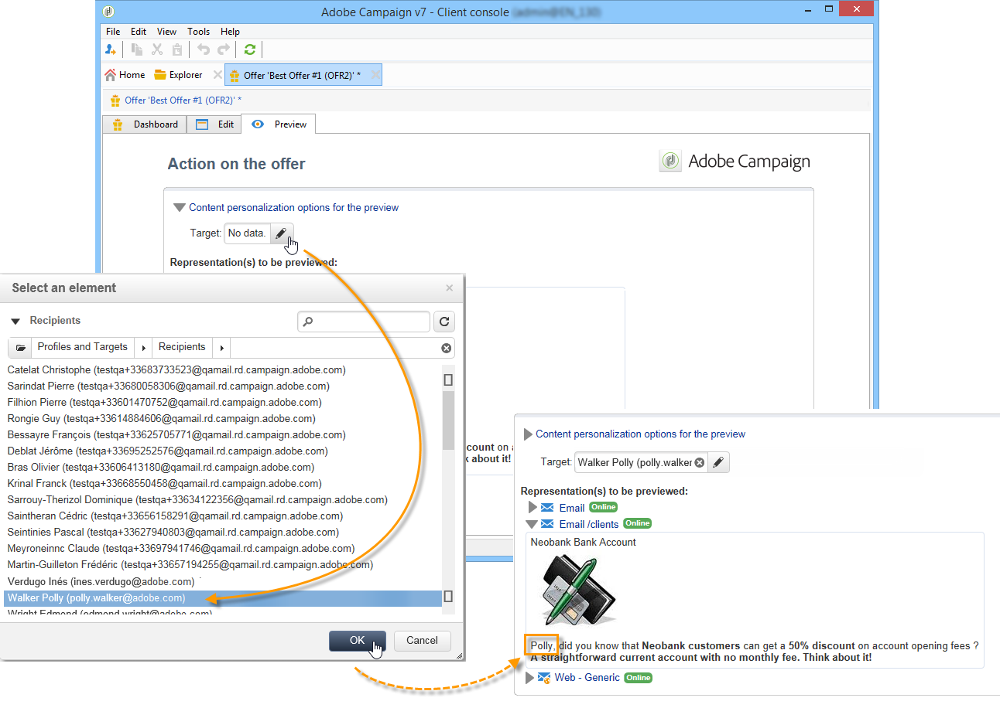

# 创建选件{#creating-an-offer}

## 创建选件 {#creating-the-offer}

要创建选件，请应用以下步骤：

1. 转到宇宙 **[!UICONTROL Campaigns]** 并单击链 **[!UICONTROL Offers]** 接。

   

1. Click the **[!UICONTROL Create]** button.

   

1. 更改标签并选择选件应属于的类别。

   

1. 单击 **[!UICONTROL Save]** 以创建选件。

   

   该选件在平台中可用，并且可以配置其内容。

   

## 配置优惠资格 {#configuring-offer-eligibility}

在选项 **[!UICONTROL Eligibility]** 卡中，定义选件的有效期，并可显示该选件的期限、要应用到目标的过滤器以及选件权重。

### 定义选件的资格期 {#defining-the-eligibility-period-of-an-offer}

要定义选件的资格期，请使用下拉列表并在日历中选择开始和结束日期。


在这些日期之外，交互引擎不会选择该选件。 如果您还为选件类别配置了资格日期，则限制最严格的期限将适用。

### 目标上的过滤器 {#filters-on-the-target}

您可以将过滤器应用到选件目标。

为此，请单击链 **[!UICONTROL Edit query]** 接并选择要应用的过滤器。 (Refer to [this section](../../platform/using/steps-to-create-a-query.md#step-4---filter-data)).


如果已经创建了预定义的过滤器，则可以从用户过滤器列表中选择它们。 有关此内容的详细信息，请参阅创 [建预定义的过滤器](../../interaction/using/creating-predefined-filters.md)。


### 优惠权重 {#offer-weight}

要使引擎能够在多个选件之间确定目标符合条件，您需要为选件分配一个或多个权重。 如有必要，您还可以将过滤器应用到目标，或者限制权重将应用到的选件空间。 与重量较轻的优惠相比，重量较重的优惠将更为优先。

您可以为同一选件配置多个权重，例如，以区分支持时段、特定目标甚至选件空间。

例如，对于年龄在18到25岁的触头，选件可以具有A的重量，对于高于该范围的触头，选件可以具有B的重量。 如果某个报价在整个夏季都符合条件，则它在7月份也可以有A，在8月份可以有B。

>[!NOTE]
>
>可以根据选件所属类别的参数临时修改分配权重。 有关此信息的详细信息，请参阅创 [建选件类别](../../interaction/using/creating-offer-categories.md)。

要在选件中创建权重，请应用以下步骤：

1. 单击 **[!UICONTROL Add]**.

   

1. 更改标签并指定粗细。 默认情况下，它为1。

   

   >[!CAUTION]
   >
   >如果未输入权重(0)，则目标将不会被视为有资格获得该选件。

1. 如果您希望权重适用于给定期间，请定义资格日期。

   

1. 如有必要，请将权重限制到特定的选件空间。

   

1. 对目标应用过滤器。

   

1. 单 **[!UICONTROL OK]** 击可节省重量。

   

   >[!NOTE]
   >
   >如果目标有资格获得选定选件的多个权重，则引擎将保持最佳（最高）权重。 在调用选件引擎时，每个联系人最多选择一个选件。

### 优惠资格规则摘要 {#a-summary-of-offer-eligibility-rules}

完成配置后，优惠控制板上将提供资格规则的摘要。

要查看它，请单击该 **[!UICONTROL Schedule and eligibility rules]** 链接。


## 创建选件内容 {#creating-the-offer-content}

1. 单击选 **[!UICONTROL Edit]** 项卡，然后单击选 **[!UICONTROL Content]** 项卡。

   

1. 填写选件内容的各个字段。

   * **[!UICONTROL Title]** :指定要在选件中显示的标题。 警告：这不是指选件的标签，该标签在选项卡中定 **[!UICONTROL General]** 义。
   * **[!UICONTROL Destination URL]** :指定您的选件的URL。 要正确处理，它必须以“http://”或“https://”开头。
   * **[!UICONTROL Image URL]** :指定选件图像的URL或访问路径。
   * **[!UICONTROL HTML content]** / **[!UICONTROL Text content]** :在要使用的选项卡中输入选件的正文。 要生成跟踪， **[!UICONTROL HTML content]** 必须由HTML元素组成，这些元素可以包含在类型元 `<div>` 素中。 例如，HTML页中元 `<table>` 素的结果将如下：

   ```
      <div> 
       <table>
        <tr>
         <th>Month</th>
         <th>Savings</th>   
        </tr>   
        <tr>    
         <td>January</td>
         <td>$100</td>   
        </tr> 
       </table> 
      </div>
   ```

   定义接受URL的操作将显示在 [配置接受主张时的状态部分](../../interaction/using/creating-offer-spaces.md#configuring-the-status-when-the-proposition-is-accepted) 。

   

   要查找在选件空间配置过程中定义的必填字段，请单击链 **[!UICONTROL Content definitions]** 接以显示列表。 有关此内容的详细信息，请参阅 [创建选件空间](../../interaction/using/creating-offer-spaces.md)。

   

   在此示例中，选件必须包括标题、图像、HTML内容和目标URL。

## 预览选件 {#previewing-the-offer}

一旦配置了选件内容，您就可以预览该选件将显示给其收件人的效果。 操作步骤：

1. 单击选 **[!UICONTROL Preview]** 项卡。

   

1. 选择要查看的选件的表示形式。

   

1. 如果您已经个性化了优惠内容，请选择优惠目标以查看个性化。

   

## 为选件创建假设 {#creating-a-hypothesis-on-an-offer}

您可以对您的报价提出假设。 这样，您就可以确定优惠对相关产品所执行的购买的影响。

>[!NOTE]
>
>这些假设通过响应管理器进行。 请检查您的许可协议。

在其标签中引用了关于报价提案的假设 **[!UICONTROL Measure]** 。

本页详细介绍了如何创 [建假设](../../campaign/using/about-response-manager.md)。


