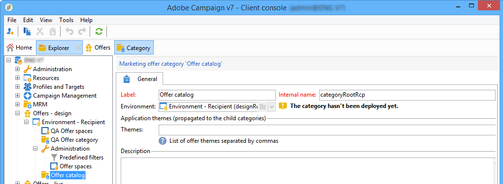
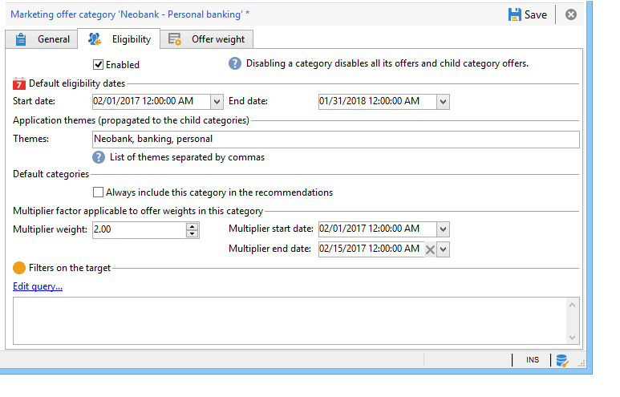
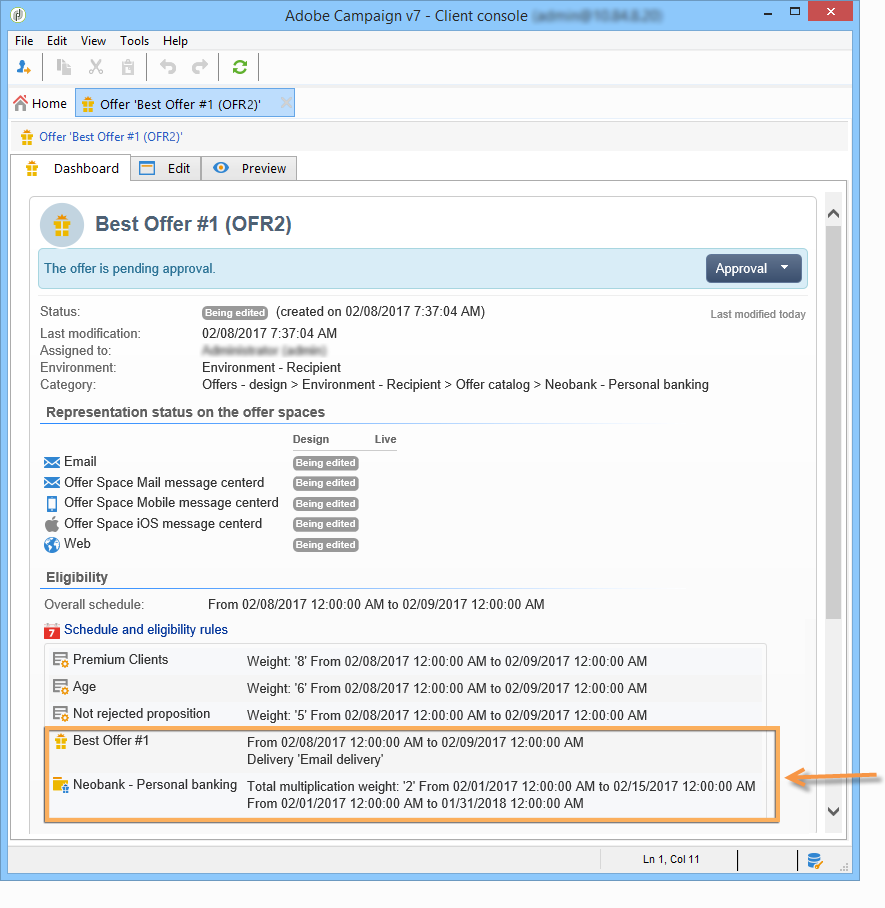

# 创建优惠类别{#creating-offer-categories}

优惠类别的创建只能在 **[!UICONTROL Design]** 环境。 它们会自动部署在 **[!UICONTROL Live]** 环境（即可用），即其包含的已创建/已修改选件获得批准的时间。 默认情况下， **[!UICONTROL Design]** 环境包含一个类别，用于接收所有选件。 可以创建子类别以将层次结构添加到目录选件。

对于每个类别，您可以定义资格日期，即在超过该日期后，类别中包含的优惠将不再呈现给其目标。 如果您希望优惠引擎选择特定类别的优惠作为优先级，以便更好地展示产品，例如，您可以通过为类别添加相乘权重来增加给定时段的权重。

要创建其他类别，请应用以下步骤：

1. 转到 **[!UICONTROL Offer catalog]** 文件夹。

   

1. 右键单击并选择 **[!UICONTROL Create a new "Offer category" folder]** 下拉列表中。

   

1. 重新命名类别。 您可以稍后使用编辑标签 **[!UICONTROL General]** 选项卡。

   

   >[!NOTE]
   >
   >重复这些步骤以创建所需数量的类别。

   此后，您可以根据需要执行以下操作：

   * 从以下日期分配资格日期 **[!UICONTROL Eligibility]** 选项卡。

     

   * 输入可用于从该类别中选择选件的关键字，使用 **[!UICONTROL Themes]** 字段。

     

     >[!NOTE]
     >
     >在调用优惠引擎时，仅选择目录中与主题或类别匹配参数的部分。

   * 在给定时间段内，通过暂时“提升”类别的选件权重 **[!UICONTROL Multiplier weight]** 字段。

     

类别中包含的优惠信息板上提供了资格规则的回顾。 要查看其内容，请单击 **[!UICONTROL Schedule and eligibility rules of the offer]** 链接。

