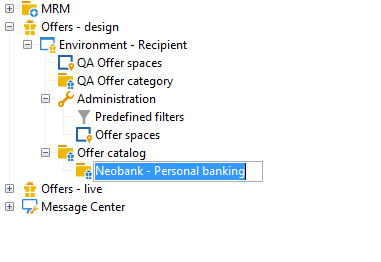

# 创建优惠类别{#creating-offer-categories}

创建优惠类别只能在环境中进 **[!UICONTROL Design]** 行。 当包含的已创建／修 **[!UICONTROL Live]** 改环境被批准时，这些优惠会自动部署在该中（即已提供）。 默认情况下， **[!UICONTROL Design]** 环境包含接收所有优惠的类别。 可以创建子类别以将层次结构添加到目录优惠。

对于每个类别，您可以定义资格日期，即类别中包含的优惠可能不再显示给其目标的期间。 如果希望优惠引擎将特定类别的优惠选为优先级，则可以通过向类别添加倍数权重来增加给定期间的权重，以更好地展示产品。

要创建其他类别，请应用以下步骤：

1. Go to the **[!UICONTROL Offer catalog]** folder.

   

1. 右键单击并从 **[!UICONTROL Create a new "Offer category" folder]** 下拉列表中进行选择。

   

1. 重新命名类别。 您以后可以使用选项卡编辑标 **[!UICONTROL General]** 签。

   

   >[!NOTE]
   >
   >重复这些步骤以创建所需数量的类别。

   之后，您可以根据需要：

   * 从标签中分配资格 **[!UICONTROL Eligibility]** 日期。

      

   * 使用字段输入可用于从此优惠中选择类别的关 **[!UICONTROL Themes]** 键字。

      

      >[!NOTE]
      >
      >调用优惠引擎时，只会选择主题或类别与参数匹配的目录部分。

   * 通过字段临时“提升”指定时段类别的优惠 **[!UICONTROL Multiplier weight]** 权重。

      

合格规则仪表板包括在类别中的优惠。 要视图它们，请单击 **[!UICONTROL Schedule and eligibility rules of the offer]** 链接。

