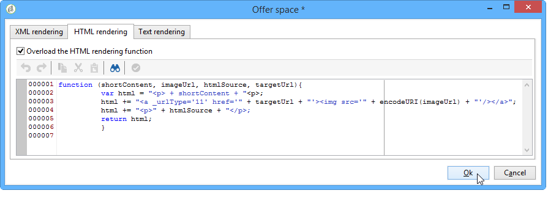

# 创建优惠空间{#creating-offer-spaces}


优惠空间创建只能由执行 **技术管理员** 具有优惠空间子文件夹的访问权限。 优惠空间只能在设计环境中创建，并在优惠审批期间自动复制到实时环境中。

目录选件的内容在选件空间中配置。 默认情况下，内容可包含以下字段： **[!UICONTROL Title]**， **[!UICONTROL Destination URL]**， **[!UICONTROL Image URL]**， **[!UICONTROL HTML content]** 和 **[!UICONTROL Text content]**. 字段序列在选件空间中配置。

高级参数允许您指定联系人标识键（例如，可由各种元素组成，同时包含名称和电子邮件字段）。 有关详情，请参阅 [呈现已识别的优惠](../../interaction/using/integration-via-javascript--client-side-.md#presenting-an-identified-offer) 部分。

HTML或XML渲染是通过渲染函数创建的。 渲染函数中定义的字段序列必须与内容中配置的序列相同。


要创建新的选件空间，请应用以下进程：

1. 转到优惠空间列表，然后单击 **[!UICONTROL New]**.

   

1. 选择要使用的渠道并更改优惠空间的标签。

   

1. 查看 **[!UICONTROL Enable unitary mode]** 框（如果以下情况之一适用于您）：

   * 您正在使用与消息中心的交互
   * 您使用的是交互的单一模式（集客交互）

1. 转到 **[!UICONTROL Content field]** 窗口，然后单击 **[!UICONTROL Add]**.

   

1. 转到 **[!UICONTROL Content]** 节点并按以下顺序选择字段： **[!UICONTROL Title]**，则 **[!UICONTROL Image URL]**，则 **[!UICONTROL HTML content]**，则 **[!UICONTROL Destination URL]**.

   

1. 查看 **[!UICONTROL Required]** 框，使每个字段成为必填字段。

   >[!NOTE]
   >
   >此配置在预览中使用，如果相关选件中缺少某个必需元素，则在发布时会使选件空间无效。 但是，如果优惠空间中已存在优惠，则不会将这些标准考虑在内。

   

1. 单击 **[!UICONTROL Edit functions]** 创建渲染函数。

   这些函数用于在优惠空间上生成优惠呈现。 有多种可能的格式：出站交互的HTML或文本，入站交互的XML。

   

1. 转到 **[!UICONTROL HTML rendering]** 选项卡并选择 **[!UICONTROL Overload the HTML rendering function]**.
1. 插入渲染函数。

   

如有必要，您可以重载入站交互的XML渲染函数。 您还可以为出站交互重载HTML和文本渲染函数。 有关更多信息，请参阅 [关于入站渠道](../../interaction/using/about-inbound-channels.md).

## 优惠建议状态 {#offer-proposition-statuses}

根据与目标群体的交互，优惠建议可以具有各种状态。 交互附带一组值，这些值可以在优惠命题的整个生命周期中应用于优惠命题。 但是，您需要配置平台，以便在创建和接受优惠建议时更改状态。

>[!NOTE]
>
>优惠建议的状态不会立即更新。 跟踪由跟踪工作流执行，该工作流每小时触发一次。

### 状态列表 {#status-list}

交互包括以下可用于确定优惠建议状态的值：

* **[!UICONTROL Accepted]**.
* **[!UICONTROL Scheduled]**.
* **[!UICONTROL Generated]**.
* **[!UICONTROL Interested]**.
* **[!UICONTROL Presented]**.
* **[!UICONTROL Rejected]**.

默认情况下不应用这些值：必须配置它们。

>[!NOTE]
>
>如果优惠已链接到状态为“已发送”的投放，则优惠建议的状态将自动更改为“已呈现”。

### 创建建议时配置状态 {#configuring-the-status-when-the-proposition-is-created}

当交互引擎创建优惠建议时，其状态会更改，无论它是集客还是叫客交互。 这两个值之间的选择取决于中选件空间的配置方式 **[!UICONTROL Design]** 环境

对于每个空间，您可以根据要在选件报表中显示的信息，配置在创建建议时要应用的状态。

为此，请使用以下流程：

1. 转到 **[!UICONTROL Storage]** 选项卡。
1. 选择创建建议时要应用于建议的状态。

   

### 配置建议被接受时的状态 {#configuring-the-status-when-the-proposition-is-accepted}

接受优惠建议后，您可以使用默认提供的值之一来配置建议的新状态。 当收件人单击优惠中的链接（这将调用交互引擎）时，更新生效。

为此，请使用以下流程：

1. 转到 **[!UICONTROL Storage]** 选项卡。
1. 选择建议被接受时您希望应用于建议的状态。

   

**入站互动**

此 **[!UICONTROL Storage]** 选项卡用于定义状态 **已建议** 和 **已接受** 仅限优惠建议。 对于入站交互，应直接在用于调用优惠引擎的URL中指定优惠建议的状态，而不是通过界面指定。 这样，您将能够指定在其他情况下要应用的状态，例如，如果优惠建议被拒绝。

```
<BASE_URL>?a=UpdateStatus&p=<PRIMARY_KEY_OF_THE_PROPOSITION>&st=<NEW_STATUS_OF_THE_PROPOSITION>&r=<REDIRECT_URL>
```

例如，建议(标识符 **40004**)，它与 **家庭保险** 选件显示在 **新银行** 站点包含以下URL：

```
<BASE_URL>?a=UpdateStatus&p=<40004>&st=<3>&r=<"http://www.neobank.com/insurance/subscribe.html">
```

一旦访客点击了选件，随后又点击了URL， **[!UICONTROL Accepted]** 状态（值） **3**)应用于建议，并且访客被重定向到 **新银行** 办理保险合约的地点。

>[!NOTE]
>
>如果要在URL中指定其他状态（例如，如果优惠建议被拒绝），请使用与所需状态对应的值。 示例： **[!UICONTROL Rejected]** = &quot;5&quot;， **[!UICONTROL Presented]** =“1”等。
>
>状态及其值可在 **[!UICONTROL Offer propositions (nms)]** 数据架构。 有关详细信息，请参见[此页面](../../configuration/using/data-schemas.md)。

**出站交互**

如果进行叫客互动，您可以自动应用 **[!UICONTROL Interested]** 投放包含链接时优惠建议的状态。 只需添加 **_urlType=&quot;11&quot;** 链接的值：

```
<a _urlType="11" href="<DEST_URL>">Link inserted into the delivery</a>
```

## 每个空间的优惠预览 {#offer-preview-per-space}

在此选项卡中，您可以查看收件人通过所选方法符合条件的优惠。 在下面的示例中，收件人有资格通过邮件获得三个优惠建议。


如果收件人不符合任何优惠的条件，则会在预览中显示。


当上下文限制为空格时，预览可以忽略上下文。 当交互架构已扩展，可使用入站渠道添加空间中引用的字段时，会出现这种情况(有关更多信息，请参阅 [扩展示例](../../interaction/using/extension-example.md))。
