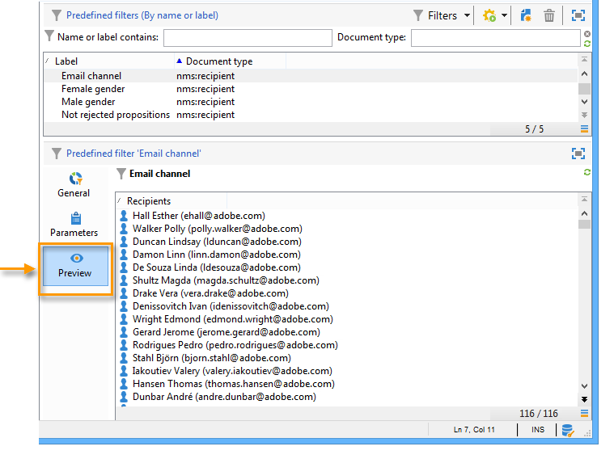

# 创建预定义过滤器{#creating-predefined-filters}

通过预定义过滤器，您可以为目标群体创建资格规则，这些规则可在选件创建期间轻松重复使用。 它们特定于每个环境，并考虑选件参数。

要创建过滤器，请应用以下流程：

1. 转到&#x200B;**[!UICONTROL Administration]**&#x200B;文件夹并选择&#x200B;**[!UICONTROL Pre-defined offer filters]**。

   

1. 单击 **[!UICONTROL New]**。

   

1. 更改标签以便稍后能够识别过滤器。

   

1. 选择筛选条件将涉及的字段。

   

1. 根据需要选择运算符和值，然后保存查询。

   

1. 单击&#x200B;**[!UICONTROL Preview]**&#x200B;以查看筛选结果。

   

**相关主题**

* [将常用查询另存为可编辑的预定义过滤器](https://helpx.adobe.com/campaign/kb/simplifying-campaign-management-acc.html#Savefrequentlyusedqueriesaseditablepredefinedfilters)
