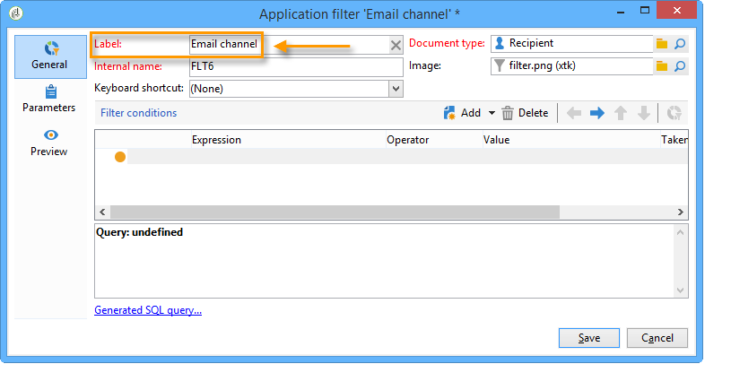
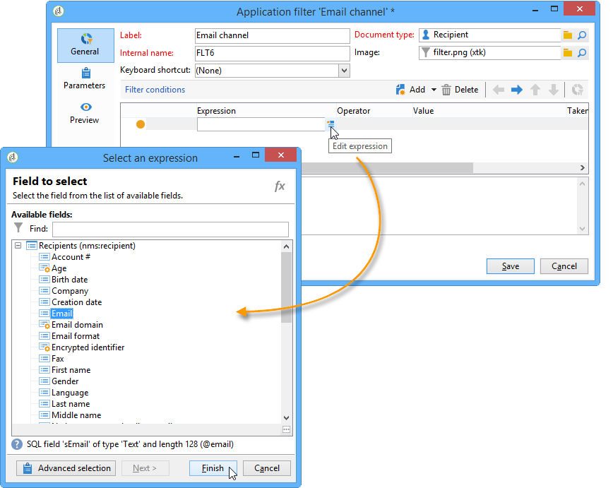
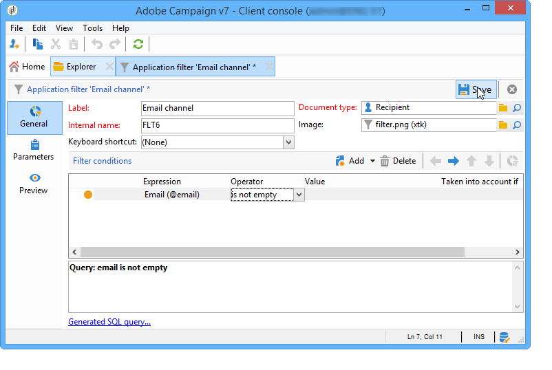

# 创建预定义过滤器{#creating-predefined-filters}

通过预定义过滤器，您可以为目标群体创建资格规则，以便在创建选件期间轻松重复使用。 它们特定于每个环境，并将选件参数考虑在内。

要创建过滤器，请应用以下流程：

1. 转到&#x200B;**[!UICONTROL Administration]**&#x200B;文件夹并选择&#x200B;**[!UICONTROL Pre-defined offer filters]**。

   

1. 单击 **[!UICONTROL New]**。

   

1. 更改标签以便以后能够识别过滤器。

   

1. 选择筛选条件将关注的字段。

   

1. 根据需要选择运算符和值，然后保存查询。

   

1. 单击&#x200B;**[!UICONTROL Preview]**&#x200B;查看筛选结果。

   
