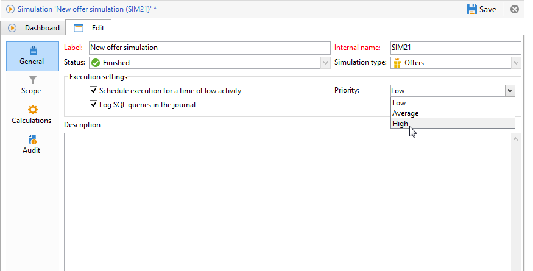

# 执行设置{#execution-settings}

在创建模拟时，您可以根据需要指定执行设置。 通过这些设置，您可以根据模拟的优先级在活动不足时执行模拟，或在日志中记录SQL查询。 此阶段是可选的。

这些设置稍后可以在 **[!UICONTROL General]** 选项卡。

* **[!UICONTROL Schedule execution for a time of low activity]** :允许您根据所选的优先级（低、平均或高）计划模拟，以优化Adobe Campaign性能。
* **[!UICONTROL Priority]** :这是用于模拟以计划该事件的级别。 当 **[!UICONTROL Schedule execution for a time of low activity]** 选项时，营销活动处理工作流会选择活动时间较短的时间来启动营销活动。
* **[!UICONTROL Log SQL queries in the journal]** :此功能仅适用于专家用户。 它允许您在显示SQL查询的日志中添加一个选项卡，以在模拟结束时出现错误时检测可能的故障。
