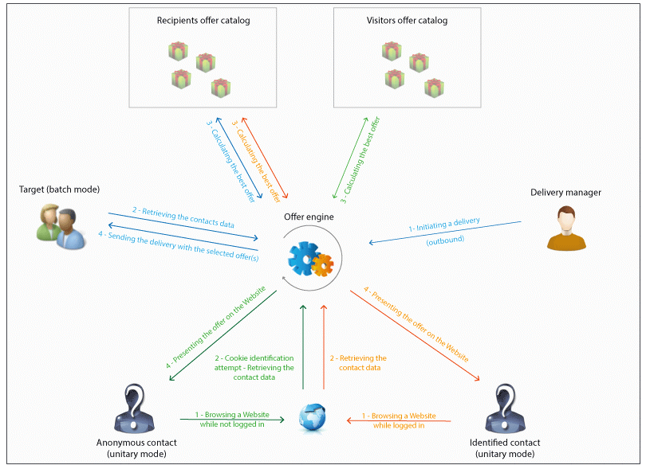

# 基本原则{#fundamental-principles}

## 部署环境 {#deploying-environments}

管理选件时，每个定向维度都使用两个环境：

* 选件管理器负责创建和分类选件、编辑选件，以及启动审批流程以供使用的设计环境。 此环境中还定义了每个类别的规则、可在其中显示选件的选件空间以及用于定义选件资格的预定义过滤器。

   还可以在在线环境中手动发布类别。

   有关批准优惠的详细过程，请参见 [批准和激活优惠](../../interaction/using/approving-and-activating-an-offer.md) 中。

* 在实时环境中，可以找到设计环境中已批准的选件，以及设计环境中配置的各种选件空间、过滤器、类别和规则。 在调用选件引擎期间，引擎将始终使用实时环境中的选件。

选件仅部署在批准过程中选择的选件空间上。 因此，选件可能处于实时状态，但在同样处于实时状态的选件空间上不可用。

## 交互类型和联系方法 {#interaction-types-and-contact-methods}

交互有两种可能类型：集客交互（由联系人发起）和出站交互（由选件制作者发起）。

这两种交互可以在统一模式（为单个联系人计算选件）或批量模式（为一组联系人计算选件）中执行。 通常，集客交互以统一模式进行，出站交互以批处理模式进行。 但是，对于事务型消息，例如，可能存在某些例外，即叫客交互以统一模式进行(请参阅 [此部分](../../message-center/using/about-transactional-messaging.md))。

一旦能够或必须显示选件（根据执行的配置），选件引擎就会发挥中介作用：它通过组合收到的关于联系人的数据和应用程序中指定的可应用的不同规则，自动计算可用联系人的最佳可能选件。

