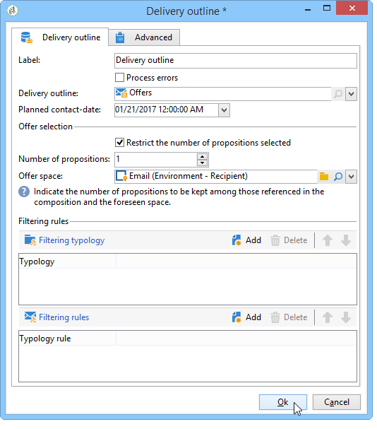
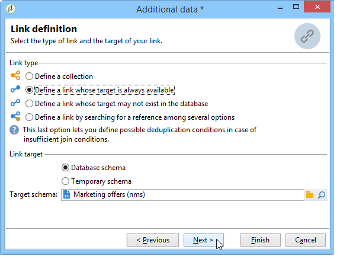

# 通过工作流集成优惠{#integrating-an-offer-via-a-workflow}

在投放活动本身之外，有多个工作流活动可让您定义优惠的显示方式：

* 投放概要
* 扩充
* 优惠引擎
* 单元格优惠

## 投放概要 {#delivery-outline}

利用活动工作流中提供的投放概要活动，可显示当前正在进行的活动中的投放概要所引用的优惠。

1. 在工作流中，添加投放概要活动，然后再添加投放活动。
1. 在投放大纲活动中，指定要使用的大纲。

   有关指定投放概要的更多信息，请参阅 [营销活动 — MRM](../../campaign/using/marketing-campaign-deliveries.md#associating-and-structuring-resources-linked-via-a-delivery-outline) 指南。

1. 根据投放完成可用的字段。
1. 可能存在两种情况：

   * 如果要调用优惠引擎，请检查 **[!UICONTROL Restrict the number of propositions selected]** 盒子。 指定优惠空间和将在投放中显示的建议数。

     优惠引擎将考虑优惠权重和资格规则。

   * 如果不选中此框，则将显示投放概要中的所有选件，而不调用选件引擎。

   >[!NOTE]
   >
   >预览会考虑投放中指定的优惠数量。 执行工作流时，将考虑投放大纲中指定的数字。

   

## 扩充 {#enrichment}

通过扩充活动，您可以将优惠或链接添加到投放收件人的优惠。

>[!NOTE]
>
>有关扩充活动的更多信息，请参阅 [工作流指南](../../workflow/using/enrichment.md).

例如，您可以在投放之前扩充收件人查询的数据。

指定优惠建议的方法有两种。

* 指定优惠或优惠引擎调用。
* 引用优惠的链接。

### 指定优惠或调用优惠引擎 {#specifying-an-offer-or-a-call-to-the-offer-engine}

配置查询后(请参阅 [工作流指南](../../workflow/using/query.md))：

1. 添加并打开扩充活动。
1. 在 **[!UICONTROL Enrichment]** 选项卡，选择 **[!UICONTROL Add data]**.
1. 选择 **[!UICONTROL An offer proposition]** 在要添加的数据类型中。

   

1. 指定要添加的建议标识符和标签。
1. 指定选件选择。 对此有两种可能的选项：

   * **[!UICONTROL Search for the best offer in a category]** ：选中此选项并指定选件引擎调用参数（选件空间、类别或主题、联系日期、要保留的选件数）。 引擎将根据这些参数自动计算要添加的选件。 我们建议您完成 **[!UICONTROL Category]** 或 **[!UICONTROL Theme]** 字段，而不是同时执行两者。

     

   * **[!UICONTROL A predefined offer]** ：选中此选项并指定选件空间、特定选件和联系日期，以直接配置要添加的选件，而无需调用选件引擎。

     

1. 然后，配置与您选择的渠道对应的投放活动。 有关详细信息，请参见 [在投放中插入优惠建议](../../interaction/using/integrating-an-offer-via-the-wizard.md#inserting-an-offer-proposition-into-a-delivery) 部分。

   >[!NOTE]
   >
   >可用于预览的建议数量取决于在扩充活动中执行的配置，而不是直接在投放中执行的任何可能的配置。

### 引用优惠的链接 {#referencing-a-link-to-an-offer}

您还可以在扩充活动中引用指向优惠的链接。

为此，请使用以下流程：

1. 选择 **[!UICONTROL Add data]** 在活动的 **[!UICONTROL Enrichment]** 选项卡。
1. 在选择要添加的数据类型的窗口中，选择 **[!UICONTROL A link]**.
1. 选择要建立的链接类型及其目标。 在本例中，目标是选件架构。

   

1. 指定扩充活动（此处为收件人表）中的集客表数据与选件表之间的联接。 例如，您可以将优惠代码链接到收件人。

   

1. 然后，配置与您选择的渠道对应的投放活动。 有关详细信息，请参见 [在投放中插入优惠建议](../../interaction/using/integrating-an-offer-via-the-wizard.md#inserting-an-offer-proposition-into-a-delivery) 部分。

   >[!NOTE]
   >
   >可用于预览的建议数量取决于投放中执行的配置。

### 存储优惠排名和权重 {#storing-offer-rankings-and-weights}

默认情况下，当 **扩充** 活动用于提供优惠，其排名和权重不会存储在建议表中。

>[!NOTE]
>
>请记住： **[!UICONTROL Offer engine]** 默认情况下，活动会存储此信息。

但是，您可以按如下方式存储此信息：

1. 在置于查询之后和投放活动之前的扩充活动中创建对优惠引擎的调用。 请参阅 [指定优惠或调用优惠引擎](../../interaction/using/integrating-an-offer-via-a-workflow.md#specifying-an-offer-or-a-call-to-the-offer-engine) 部分。
1. 在活动的主窗口中，选择 **[!UICONTROL Edit additional data...]**.

   

1. 添加 **[!UICONTROL @rank]** 排名和列 **[!UICONTROL @weight]** 选件权重。

   

1. 确认添加并保存工作流。

投放会自动存储优惠的排名和权重。 此信息在投放的 **[!UICONTROL Offers]** 选项卡。

## 优惠引擎 {#offer-engine}

此 **[!UICONTROL Offer engine]** 利用活动，您还可在投放之前指定对选件引擎的调用。

此活动的原理与通过引擎调用的扩充活动相同，即在投放前使用引擎计算的优惠扩充集客群体数据。

配置查询后(请参阅 [工作流指南](../../workflow/using/query.md))：

1. 添加并打开 **[!UICONTROL Offer engine]** 活动。
1. 填写各种可用字段以指定调用选件引擎参数（选件空间、类别或主题、联系日期、要保留的选件数）。 引擎将根据这些参数自动计算要添加的选件。

   >[!NOTE]
   >
   >警告：如果您使用此活动，则只存储投放中使用的优惠建议。

   

1. 然后，配置与您选择的渠道对应的投放活动。 有关详细信息，请参见 [在投放中插入优惠建议](../../interaction/using/integrating-an-offer-via-the-wizard.md#inserting-an-offer-proposition-into-a-delivery) 部分。

## 单元格优惠 {#offers-by-cell}

此 **[!UICONTROL Offers by cell]** 利用活动，可将集客群体（例如从查询）分配到多个区段，并指定要为每个区段呈现的选件。

为此，请使用以下流程：

1. 添加 **[!UICONTROL Offers by cell]** 指定目标群体后，请打开该群体。
1. 在 **[!UICONTROL General]** 选项卡上，选择要显示选件的选件空间。
1. 在 **[!UICONTROL Cells]** 选项卡，使用 **[!UICONTROL Add]** 按钮：

   * 使用可用的筛选和限制规则指定子集群体。
   * 然后，选择要提供给子集的选件。 可用的优惠是在上一步骤中选择的优惠环境中符合条件的优惠。

     

1. 然后，配置与您选择的渠道对应的投放活动。 有关详细信息，请参见 [在投放中插入优惠建议](../../interaction/using/integrating-an-offer-via-the-wizard.md#inserting-an-offer-proposition-into-a-delivery) 部分。
