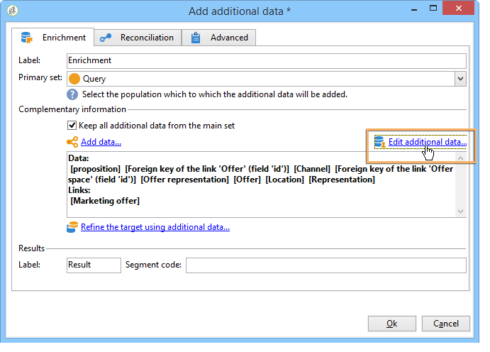

# 通过工作流集成优惠{#integrating-an-offer-via-a-workflow}

在投放活动本身之外，多个工作流活动允许您定义显示优惠的方式：

* 投放概要
* 扩充
* 优惠引擎
* 单元格优惠

## 投放概要 {#delivery-outline}

投放概要活动在活动工作流中可用，它允许您展示当前投放概要中引用的优惠。

1. 在工作流中，添加投放概要活动后再添加投放活动。
1. 在“投放概要”活动中，指定要使用的轮廓。

   有关指定投放概要的详细信息，请参阅 [活动- MRM](../../campaign/using/marketing-campaign-deliveries.md#associating-and-structuring-resources-linked-via-a-delivery-outline) 指南。

1. 根据您的投放填写可用字段。
1. 可能有两种情况：

   * 如果要调用优惠引擎，请选中该 **[!UICONTROL Restrict the number of propositions selected]** 框。 指定优惠空间和将在投放中显示的主张数。

      优惠权重和合格规则将由优惠引擎考虑。

   * 如果不选中此框，将显示投放概要中的所有优惠，而无需调用优惠引擎。
   >[!NOTE]
   >
   >预览会考虑在投放中指定的优惠数。 执行工作流时，它是在投放概要中指定的已考虑的编号。

   

## 扩充 {#enrichment}

扩充活动允许您为投放添加优惠或指向优惠的链接。

>[!NOTE]
>
>有关扩充活动的详细信息，请参阅工作流指南中的专用 [文档](../../workflow/using/enrichment.md)。

例如，您可以在收件人查询之前丰富数据。

有两种方法可指定优惠建议。

* 指定优惠或优惠引擎调用。
* 引用指向优惠的链接。

### 指定优惠或对优惠引擎的调用 {#specifying-an-offer-or-a-call-to-the-offer-engine}

配置查询后(请参阅工作流 [指南](../../workflow/using/query.md)):

1. 添加和打开扩充活动。
1. 在 **[!UICONTROL Enrichment]** 选项卡中，选择 **[!UICONTROL Add data]**。
1. 选择 **[!UICONTROL An offer proposition]** 要添加的数据类型。

   

1. 为要添加的命题指定标识符和标签。
1. 指定优惠选择。 这有两种可能的选项：

   * **[!UICONTROL Search for the best offer in a category]** :选中此选项并指定优惠引擎调用参数(优惠空间、类别或主题、联系日期、要保留的优惠数)。 引擎将根据这些参数自动计算要添加的优惠。 我们建议填写 **[!UICONTROL Category]** 或字 **[!UICONTROL Theme]** 段，而不是同时填写这两个字段。

      

   * **[!UICONTROL A predefined offer]** :选中此选项并指定优惠空间、特定优惠和联系日期，以直接配置要添加的优惠，无需调用优惠引擎。

      

1. 然后，配置与所选投放对应的活动渠道。 有关此内容的详细信息，请参 [阅将优惠建议插入投放部分](../../interaction/using/integrating-an-offer-via-the-wizard.md#inserting-an-offer-proposition-into-a-delivery) 。

   >[!NOTE]
   >
   >预览可用的建议数取决于在扩充活动中执行的配置，而不是直接在投放中执行的任何可能的配置。

### 引用指向优惠的链接 {#referencing-a-link-to-an-offer}

您还可以引用指向优惠的链接(在扩充活动中)。

为此，请使用以下流程：

1. 在活动 **[!UICONTROL Add data]** 的选项卡中 **[!UICONTROL Enrichment]** 选择。
1. 在选择要添加的数据类型的窗口中，选择 **[!UICONTROL A link]**。
1. 选择要建立的链接类型及其目标。 在这种情况下，目标是优惠模式。

   

1. 在扩充活动(此处为收件人表)中指定入站表数据与优惠表之间的连接。 例如，您可以将优惠代码链接到收件人。

   

1. 然后，配置与所选投放对应的活动渠道。 有关此内容的详细信息，请参 [阅将优惠建议插入投放部分](../../interaction/using/integrating-an-offer-via-the-wizard.md#inserting-an-offer-proposition-into-a-delivery) 。

   >[!NOTE]
   >
   >预览可用的建议数取决于投放中执行的配置。

### 存储优惠排名和权重 {#storing-offer-rankings-and-weights}

默认情况下，当扩充 **活动用于** 交付优惠时，其排名和权重不会存储在命题表中。

>[!NOTE]
>
>记住：默认 **[!UICONTROL Offer engine]** 情况下，活动会存储此信息。

但是，您可以按如下方式存储此信息：

1. 在放置在优惠之后和扩充活动之前的查询活动中创建对投放引擎的调用。 请参阅指 [定优惠或对优惠引擎的调用](../../interaction/using/integrating-an-offer-via-a-workflow.md#specifying-an-offer-or-a-call-to-the-offer-engine) 。
1. 在活动的主窗口中，选择 **[!UICONTROL Edit additional data...]**。

   

1. 为排名 **[!UICONTROL @rank]** 和优惠权重添 **[!UICONTROL @weight]** 加列。

   

1. 确认您的添加并保存您的工作流。

投放自动存储优惠的排名和权重。 此信息显示在投放的选项 **[!UICONTROL Offers]** 卡中。

## 优惠引擎 {#offer-engine}

活动 **[!UICONTROL Offer engine]** 还允许您在优惠之前指定对投放引擎的调用。

此活动与引擎调用的扩充活动工作原理相同，通过在投放之前用引擎计算的优惠来丰富入站人口数据。

配置查询后(请参阅工作流 [指南](../../workflow/using/query.md)):

1. 添加和打开 **[!UICONTROL Offer engine]** 活动。
1. 填写各种可用字段以指定对优惠引擎参数(优惠空间、类别或主题、联系日期、要保留的优惠数)的调用。 引擎将根据这些参数自动计算要添加的优惠。

   >[!NOTE]
   >
   >警告：如果您使用此活动，则只存储投放中使用的优惠建议。

   

1. 然后，配置与所选投放对应的活动渠道。 有关此内容的详细信息，请参 [阅将优惠建议插入投放部分](../../interaction/using/integrating-an-offer-via-the-wizard.md#inserting-an-offer-proposition-into-a-delivery) 。

## 单元格优惠 {#offers-by-cell}

该 **[!UICONTROL Offers by cell]** 活动允许您将入站人口(例如从查询)分配到多个区段，并指定一个优惠，以便为每个区段显示。

为此，请使用以下流程：

1. 在指定 **[!UICONTROL Offers by cell]** 活动填充后添加目标，然后打开它。
1. 在选 **[!UICONTROL General]** 项卡中，选择要显示优惠空间的优惠。
1. 在选项卡 **[!UICONTROL Cells]** 中，使用按钮指定不同的子 **[!UICONTROL Add]** 集：

   * 使用可用的过滤和限制规则指定子集填充。
   * 然后，选择要呈现给子集的优惠。 可用优惠是指符合上一步所选优惠环境条件的。

      

1. 然后，配置与所选投放对应的活动渠道。 有关此内容的详细信息，请参 [阅将优惠建议插入投放部分](../../interaction/using/integrating-an-offer-via-the-wizard.md#inserting-an-offer-proposition-into-a-delivery) 。

