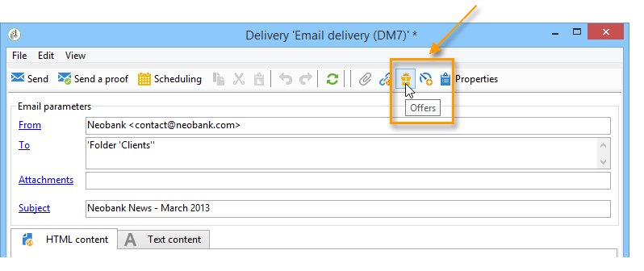
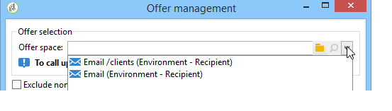
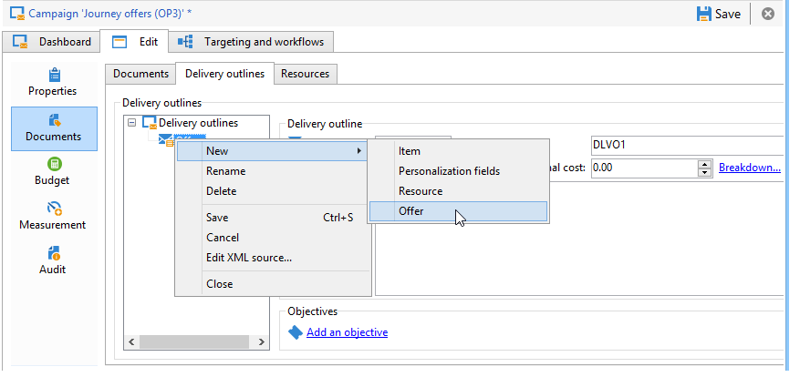
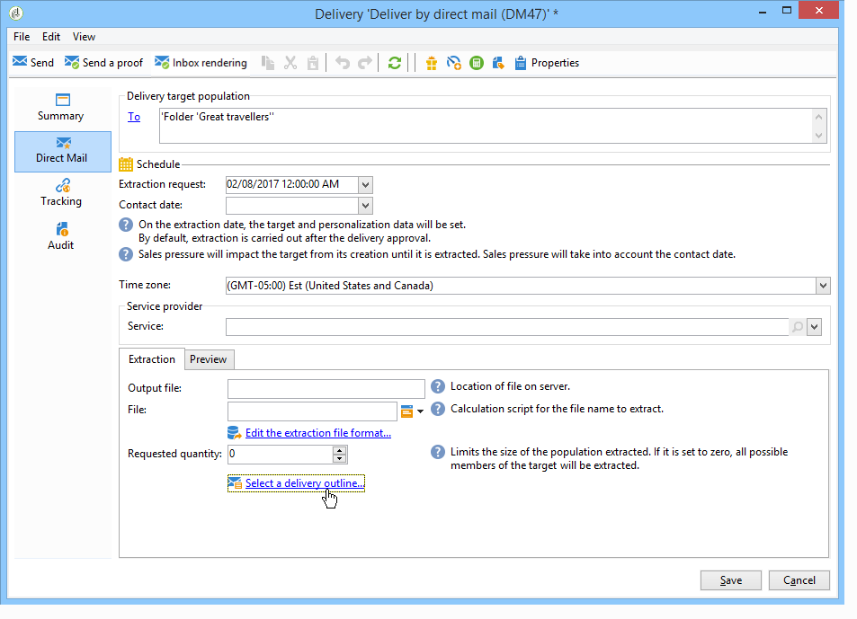

# 通过助理集成优惠{#integrating-an-offer-via-the-assistant}

创建投放时，可通过两种方法来集成选件：

* 在投放正文中调用优惠引擎。
* 通过营销活动的投放大纲引用优惠。 此方法通常用于纸张营销活动。

## 通过调用优惠引擎进行交付 {#delivering-with-a-call-to-the-offer-engine}

要在营销活动期间提供优惠，只需根据所选渠道创建经典投放操作即可。 定义投放内容后，通过单击工具栏中可用的&#x200B;**[!UICONTROL Offers]**&#x200B;图标，调用优惠引擎。

在本节](../../delivery/using/about-direct-mail-channel.md)中了解有关直邮投放[的更多信息。 在此部分](../../campaign/using/setting-up-marketing-campaigns.md)中了解有关营销活动[的更多信息。

### 将选件插入投放的主要步骤 {#main-steps-for-inserting-an-offer-into-a-delivery}

要在投放中插入优惠建议，请应用以下步骤：

1. 在投放窗口中，单击选件图标。

   

1. 选择与优惠环境匹配的空间。

   

1. 要优化引擎的选件选择，请选择要显示的选件所属类别或一个/多个主题。 我们建议一次只使用这些字段之一，以避免超出限制。

   

   

1. 指定要插入到投放主体中的选件数。

   

1. 根据需要选择&#x200B;**[!UICONTROL Exclude non-eligible recipients]**&#x200B;选项。 有关详细信息，请参阅用于调用优惠引擎](#parameters-for-calling-offer-engine)的[参数。

   

1. 如有必要，请选择&#x200B;**[!UICONTROL Do not display anything if no offers are selected]**&#x200B;选项。 有关详细信息，请参阅用于调用优惠引擎](#parameters-for-calling-offer-engine)的[参数。

   

1. 使用合并字段将属性插入投放内容。 可用建议的数目取决于引擎调用的配置方式，其顺序取决于优惠的优先级。

   

1. 按常规方式完成内容并发送投放。

   

### 用于调用优惠引擎的参数 {#parameters-for-calling-offer-engine}

* **[!UICONTROL Space]** ：必须选择优惠环境的空间才能激活优惠引擎。
* **[!UICONTROL Category]** ：用于对优惠进行排序的特定文件夹。 如果未指定类别，则除非选择了主题，否则选件引擎将会考虑环境中包含的所有选件。
* **[!UICONTROL Themes]** ：在类别中上游定义的关键字。 这些功能用作过滤器，允许您通过在一组类别中选择选件来优化要呈现的选件数量。
* **[!UICONTROL Number of propositions]** ：引擎返回的可插入到投放主体的选件数。 如果未将选件插入到消息中，则仍会生成选件，但不会显示选件。
* **[!UICONTROL Exclude non-eligible recipients]** ：通过此选项，您可以激活或取消激活对没有足够的合格优惠的收件人的排除。 合格建议的数目可能低于请求的建议数目。 如果选中此框，则将从投放中排除没有足够建议的收件人。 如果不选择此选项，则不会排除这些收件人，但他们不会具有所请求的建议数量。
* **[!UICONTROL Do not display anything if no offer is selected]** ：利用此选项可选择在某个建议不存在时如何处理消息。 选中此框后，将不显示缺少的建议的表示形式，并且此建议的消息中不会出现任何内容。 如果未选中该框，则在发送期间将取消邮件本身，收件人将不再收到任何邮件。

### 在投放中插入优惠建议 {#inserting-an-offer-proposition-into-a-delivery}

要呈现的优惠表示形式通过合并字段插入到投放的正文中。 建议的数目在优惠引擎调用的参数中定义。

可使用优惠的字段或呈现函数（如果是电子邮件）对投放进行个性化。

## 使用投放大纲投放 {#delivering-with-delivery-outlines}

您还可以使用投放大纲在投放中显示选件。

有关投放概要的更多信息，请参阅[Campaign - MRM](../../campaign/using/marketing-campaign-deliveries.md#associating-and-structuring-resources-linked-via-a-delivery-outline)指南。

1. 创建新营销活动或访问现有营销活动。
1. 通过营销活动的&#x200B;**[!UICONTROL Edit]** > **[!UICONTROL Documents]**&#x200B;选项卡访问投放概要。
1. 添加大纲，然后根据需要插入任意数量的选件，方法是：右键单击大纲并选择&#x200B;**[!UICONTROL New]** > **[!UICONTROL Offer]**，然后保存营销活动。

   

1. 创建投放概要（如直邮投放）可访问的投放。
1. 编辑投放时，单击&#x200B;**[!UICONTROL Select a delivery outline]**。

   >[!NOTE]
   >
   >根据投放类型，此选项可在&#x200B;**[!UICONTROL Properties]** > **[!UICONTROL Advanced]**&#x200B;菜单（例如，电子邮件投放）中找到。

   

1. 使用&#x200B;**[!UICONTROL Offers]**&#x200B;按钮，您可以配置投放中的优惠空间以及要呈现的优惠数量。

   

1. 使用个性化字段将建议添加到投放正文中（有关更多信息，请参阅[将优惠建议插入投放](#inserting-an-offer-proposition-into-a-delivery)部分），如果是直邮投放，则可通过编辑提取文件格式来进行。

   将从投放概要中引用的优惠中选择建议。

   >[!NOTE]
   >
   >仅当优惠直接在投放中生成时，有关优惠排名和权重的信息才会保存在建议表中。
