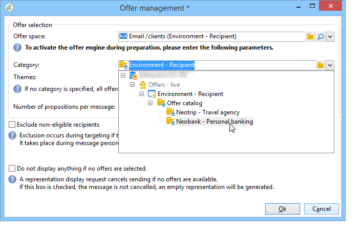

# 通过向导集成优惠{#integrating-an-offer-via-the-wizard}

创建投放时，有两种可能的方法可用于集成优惠:

* 在优惠主体中调用投放引擎。
* 通过优惠的投放概要引用活动。 该方法一般用于纸张活动。

## 通过调用交付到优惠引擎{#delivering-with-a-call-to-the-offer-engine}

要在营销活动中展示优惠，只需根据所选渠道创建经典投放操作。 定义优惠内容时，单击工具栏中的&#x200B;**[!UICONTROL Offers]**&#x200B;图标将调用投放引擎。

了解有关直邮投放[的更多信息，请参阅本节](../../delivery/using/about-direct-mail-channel.md)。 了解有关营销活动[的更多信息，请参阅本节](../../campaign/using/setting-up-marketing-campaigns.md)。

### 将优惠插入投放{#main-steps-for-inserting-an-offer-into-a-delivery}的主要步骤

要将优惠建议插入投放，请应用以下步骤：

1. 在“投放”窗口中，单击“优惠”图标。

   

1. 选择与您的优惠环境匹配的空间。

   

1. 要优化引擎选择的优惠，请选择要显示的优惠是其一部分的类别，或者选择一个/多个主题。 我们建议一次仅使用其中一个字段以避免超载限制。

   

   

1. 指定要插入优惠主体的投放数。

   

1. 根据需要选择&#x200B;**[!UICONTROL Exclude non-eligible recipients]**&#x200B;选项。 有关详细信息，请参阅[调用优惠引擎的参数](#parameters-for-calling-offer-engine)。

   

1. 如有必要，请选择&#x200B;**[!UICONTROL Do not display anything if no offers are selected]**&#x200B;选项。 有关详细信息，请参阅[调用优惠引擎的参数](#parameters-for-calling-offer-engine)。

   

1. 使用合并字段将属性插入投放内容。 可用建议的数量取决于引擎调用的配置方式，其顺序取决于优惠的优先级。

   

1. 完成内容并照常发送投放。

   

### 调用优惠引擎{#parameters-for-calling-offer-engine}的参数

* **[!UICONTROL Space]** :优惠环境的空间，必须选择该空间才能激活优惠引擎。
* **[!UICONTROL Category]** :优惠排序的特定文件夹。如果未指定类别，则优惠引擎将考虑环境中包含的所有优惠，除非选择了主题。
* **[!UICONTROL Themes]** :在类别中定义的关键字。这些优惠用作过滤器，通过在一组类别中选择它们，您可以优化要显示的数。
* **[!UICONTROL Number of propositions]** :引擎返回的可插入优惠主体的投放数。如果未将优惠插入消息中，则仍将生成，但不显示。
* **[!UICONTROL Exclude non-eligible recipients]** :通过此选项，可以激活或取消激活排除收件人的选项，这些优惠的合格用户数量不足。符合条件的建议的数目可能低于请求的建议的数目。 如果选中此框，则收件人将从该投放中排除没有足够建议的用户。 如果您不选择此选项，这些收件人将不会被排除，但它们将没有请求的建议数。
* **[!UICONTROL Do not display anything if no offer is selected]** :此选项允许您选择在其中一项主张不存在时如何处理消息。选中此框后，将不显示缺少命题的表示，并且此命题的消息中不显示任何内容。 如果未选中该框，则消息本身在发送过程中会被取消，收件人将不再接收任何消息。

### 将优惠建议插入投放{#inserting-an-offer-proposition-into-a-delivery}

将要呈现的优惠的表示通过合并字段插入投放主体。 在优惠引擎调用的参数中定义命题数。

可以使用投放的字段或呈现功能对优惠进行个性化。

## 使用投放概要{#delivering-with-delivery-outlines}交付

您还可以使用优惠在投放中展示投放概要。

有关投放概要的详细信息，请参阅[活动- MRM](../../campaign/using/marketing-campaign-deliveries.md#associating-and-structuring-resources-linked-via-a-delivery-outline)指南。

1. 创建新活动或访问现有活动。
1. 通过活动的&#x200B;**[!UICONTROL Edit]** > **[!UICONTROL Documents]**&#x200B;选项卡访问投放概要。
1. 添加大纲，然后在大纲中插入任意数量的优惠，方法是右键单击该大纲并选择&#x200B;**[!UICONTROL New]** > **[!UICONTROL Offer]**，然后保存该活动。

   

1. 创建您有权访问其投放概要的投放(例如，直邮投放)。
1. 编辑投放时，单击&#x200B;**[!UICONTROL Select a delivery outline]**。

   >[!NOTE]
   >
   >根据投放的类型，此选项可在&#x200B;**[!UICONTROL Properties]** > **[!UICONTROL Advanced]**&#x200B;菜单中找到(例如，对于电子邮件投放)。

   

1. 然后，使用&#x200B;**[!UICONTROL Offers]**&#x200B;按钮可以配置优惠空间以及要在投放中显示的优惠数。

   

1. 使用个性化字段将建议添加到投放正文中(有关详细信息，请参阅[将优惠建议插入投放](#inserting-an-offer-proposition-into-a-delivery)部分)，或者对于直接邮件投放，编辑提取文件格式。

   将从投放概要中引用的优惠中选择建议。

   >[!NOTE]
   >
   >只有在优惠中直接生成优惠时，有关投放排名和权重的信息才保存在命题表中。

