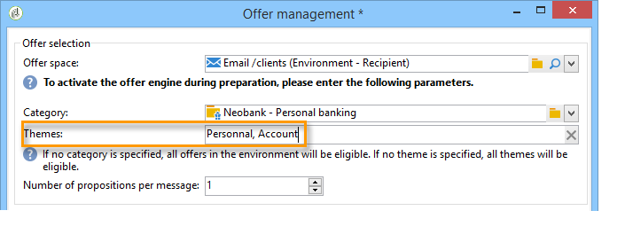

# 通过向导集成选件{#integrating-an-offer-via-the-wizard}

创建分发时，有两种可能的方法可集成选件：

* 在交货正文中调用优惠引擎。
* 通过营销活动的分发大纲引用选件。 此方法通常用于纸张营销活动。

## 通过调用提供引擎进行交付 {#delivering-with-a-call-to-the-offer-engine}

要在营销活动期间展示选件，只需根据所选渠道创建经典的投放操作。 定义交付内容时，通过单击工具栏中的可用图标 **[!UICONTROL Offers]** 调用选件引擎。

有关分发和营销活动的详细信息，请参阅 [分发](../../delivery/using/about-direct-mail-channel.md) 和 [营销活动](../../campaign/using/setting-up-marketing-campaigns.md)。

### 将选件插入分发的主要步骤 {#main-steps-for-inserting-an-offer-into-a-delivery}

要在分发中插入优惠建议，请应用以下步骤：

1. 在分发窗口中，单击选件图标。

   

1. 选择与选件环境匹配的空间。

   

1. 要优化引擎的选件选择，请选择要展示的选件所属的类别，或选择一个／多个主题。 我们建议一次仅使用其中一个字段以避免超载限制。

   

   

1. 指定要插入到分发正文的选件数量。

   

1. 如有必要， **[!UICONTROL Exclude non-eligible recipients]** 请选择此选项。 有关详细信息，请参阅调 [用选件引擎的参数](#parameters-for-calling-offer-engine)。

   

1. 如有必要，请选择 **[!UICONTROL Do not display anything if no offers are selected]** 选项。 有关详细信息，请参阅调 [用选件引擎的参数](#parameters-for-calling-offer-engine)。

   

1. 使用合并字段将属性插入分发内容。 可用的建议数量取决于引擎调用的配置方式，其顺序取决于选件的优先级。

   

1. 最终确定内容并照常发送您的交付。

   

### 调用选件引擎的参数 {#parameters-for-calling-offer-engine}

* **[!UICONTROL Space]** :激活选件引擎时必须选择的选件环境空间。
* **[!UICONTROL Category]** :在其中对选件进行排序的特定文件夹。 如果未指定类别，则环境中包含的所有选件都将由选件引擎考虑，除非选择了一个主题。
* **[!UICONTROL Themes]** :类别中定义的上游关键词。 这些选项用作过滤器，允许您通过在一组类别中选择选件来优化要显示的选件数量。
* **[!UICONTROL Number of propositions]** :引擎返回的可插入到交付体中的选件数量。 如果未将其插入消息中，则仍将生成选件，但不会显示选件。
* **[!UICONTROL Exclude non-eligible recipients]** :通过此选项，可以激活或取消激活排除合格选件不足的收件人的操作。 合格命题的数量可能低于所请求的命题的数量。 如果选中此框，则没有足够建议的收件人将被排除在发送之外。 如果您未选择此选项，则不会排除这些收件人，但他们将没有所请求数目的建议。
* **[!UICONTROL Do not display anything if no offer is selected]** :此选项允许您选择在其中一个命题不存在时如何处理消息。 选中此框后，将不显示缺少命题的表示，并且此命题的消息中不显示任何内容。 如果未选中该框，则消息本身在发送过程中将被取消，收件人将不再收到任何消息。

### 在分发中插入选件建议 {#inserting-an-offer-proposition-into-a-delivery}

将要呈现的选件的表示通过合并字段插入到传送的主体中。 在选件引擎调用的参数中定义了命题的数量。

可以使用选件的字段或呈现功能个性化交付。

## 提供交付大纲 {#delivering-with-delivery-outlines}

您还可以使用交付大纲在交付中展示选件。

有关交付大纲的详细信息，请参阅 [Campaign - MRM指南](../../campaign/using/marketing-campaign-deliveries.md#associating-and-structuring-resources-linked-via-a-delivery-outline) 。

1. 创建新营销活动或访问现有营销活动。
1. 通过营销活动的 **[!UICONTROL Edit]** >选项卡访问交付 **[!UICONTROL Documents]** 大纲。
1. 添加大纲，然后在其中插入任意数量的选件，方法是右键单击大纲并选择 **[!UICONTROL New]** > **[!UICONTROL Offer]**，然后保存营销活动。

   

1. 创建您有权访问其分发大纲的分发（例如，直邮分发）。
1. 编辑分发时，单击 **[!UICONTROL Select a delivery outline]**。

   >[!NOTE]
   >
   >根据传送类型，此选项可在 **[!UICONTROL Properties]** >菜单中找到( **[!UICONTROL Advanced]** 例如，电子邮件传送)。

   

1. 然后， **[!UICONTROL Offers]** 使用该按钮，您可以配置选件空间以及要在分发中显示的选件数量。

   

1. 使用个性化字段将建议添加到提交主体中(有关详细信息，请参阅将优惠建议插入到分发部分  )，或者对于直接邮寄，则通过编辑提取文件格式。

   将从交付大纲中引用的选件中选择建议。

   >[!NOTE]
   >
   >只有在交付中直接生成选件时，有关选件排名和权重的信息才会保存在命题表中。

