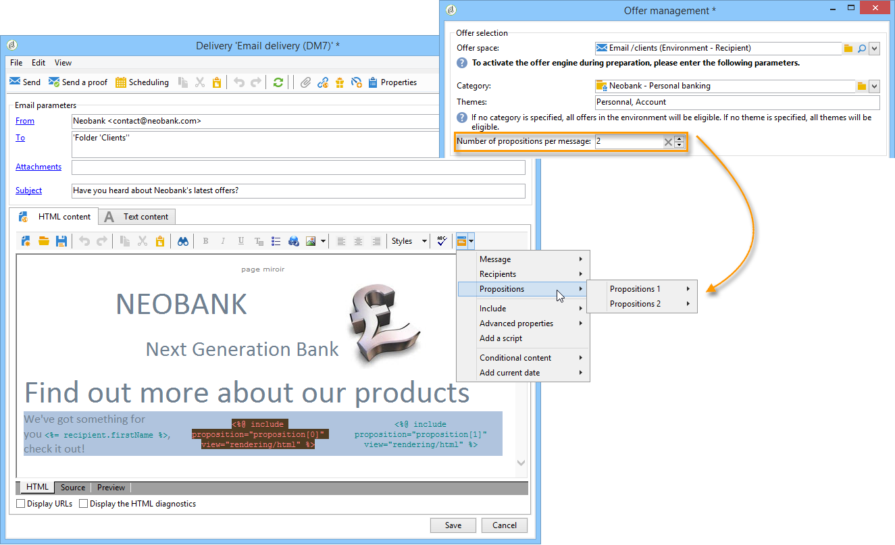

# 通过向导集成优惠{#integrating-an-offer-via-the-wizard}

创建投放时，可以使用两种方法来集成选件：

* 在投放正文中调用优惠引擎。
* 通过促销活动的投放大纲引用选件。 此方法通常用于纸面营销活动。

## 通过调用优惠引擎进行投放 {#delivering-with-a-call-to-the-offer-engine}

要在营销活动期间展示选件，只需根据所选渠道创建经典的投放操作即可。 定义投放内容后，单击工具栏中提供的&#x200B;**[!UICONTROL Offers]**&#x200B;图标，即会调用选件引擎。

在此部分](../../delivery/using/about-direct-mail-channel.md)中了解有关直邮投放的更多信息。 [在此部分](../../campaign/using/setting-up-marketing-campaigns.md)中了解有关营销活动[的更多信息。

### 将选件插入投放的主要步骤 {#main-steps-for-inserting-an-offer-into-a-delivery}

要在投放中插入优惠建议，请应用以下步骤：

1. 在投放窗口中，单击选件图标。

   

1. 选择与您的选件环境匹配的空间。

   

1. 要优化引擎的选件选择，请选择要显示的选件所属的类别，或选择一个/多个主题。 我们建议一次只使用其中一个字段，以避免超出限制。

   

   

1. 指定要插入投放正文的选件数量。

   

1. 根据需要选择&#x200B;**[!UICONTROL Exclude non-eligible recipients]**&#x200B;选项。 有关更多信息，请参阅[调用优惠引擎的参数](#parameters-for-calling-offer-engine)。

   

1. 如有必要，请选择&#x200B;**[!UICONTROL Do not display anything if no offers are selected]**&#x200B;选项。 有关更多信息，请参阅[调用选件引擎的参数](#parameters-for-calling-offer-engine)。

   

1. 使用合并字段将属性插入投放内容。 可用的建议数取决于引擎调用的配置方式，其顺序取决于选件的优先级。

   

1. 完成内容并照常发送投放。

   

### 用于调用优惠引擎的参数 {#parameters-for-calling-offer-engine}

* **[!UICONTROL Space]** :选件环境的空间，必须选择该空间才能激活选件引擎。
* **[!UICONTROL Category]** :选件排序的特定文件夹。如果未指定类别，则选件引擎将考虑环境中包含的所有选件，除非选择了主题。
* **[!UICONTROL Themes]** :类别中上游定义的关键词。这些选件用作过滤器，允许您通过在一组类别中选择选件来优化要显示的选件数量。
* **[!UICONTROL Number of propositions]** :引擎返回的可插入到投放主体中的选件数。如果未将选件插入到消息中，则仍会生成选件，但不会显示选件。
* **[!UICONTROL Exclude non-eligible recipients]** :利用此选项，可激活或取消激活排除符合条件的选件不足的收件人。合格建议的数目可能低于所要求的建议数目。 如果选中此框，则投放中将排除没有足够建议的收件人。 如果不选择此选项，则不会排除这些收件人，但他们将没有请求的建议数。
* **[!UICONTROL Do not display anything if no offer is selected]** :此选项允许您选择在其中一个命题不存在时如何处理消息。选中此框后，将不显示缺少命题的表示，并且此命题的消息中将不显示任何内容。 如果未勾选方框，则在发送期间将取消消息本身，收件人将不再收到任何消息。

### 在投放中插入优惠建议 {#inserting-an-offer-proposition-into-a-delivery}

要呈现的选件的表示形式通过合并字段插入到投放的正文中。 在优惠引擎调用的参数中定义建议的数量。

可以使用选件的字段或（如果是电子邮件）渲染功能对投放进行个性化。

## 使用投放提交大纲 {#delivering-with-delivery-outlines}

您还可以使用投放大纲在投放中显示选件。

有关投放大纲的更多信息，请参阅[Campaign - MRM](../../campaign/using/marketing-campaign-deliveries.md#associating-and-structuring-resources-linked-via-a-delivery-outline)指南。

1. 创建新营销活动或访问现有营销活动。
1. 通过营销活动的&#x200B;**[!UICONTROL Edit]** > **[!UICONTROL Documents]**&#x200B;选项卡访问投放大纲。
1. 添加大纲，然后在其中插入所需数量的选件，方法是右键单击该大纲并选择&#x200B;**[!UICONTROL New]** > **[!UICONTROL Offer]**，然后保存营销活动。

   

1. 创建投放，其投放大纲将您有权访问（例如直邮投放）。
1. 编辑投放时，单击&#x200B;**[!UICONTROL Select a delivery outline]**。

   >[!NOTE]
   >
   >根据投放类型，此选项可在&#x200B;**[!UICONTROL Properties]** > **[!UICONTROL Advanced]**&#x200B;菜单中找到（例如，电子邮件投放）。

   

1. 然后，使用&#x200B;**[!UICONTROL Offers]**&#x200B;按钮，可以配置选件空间以及要在投放中显示的选件数量。

   

1. 使用个性化字段将建议添加到投放正文中（有关更多信息，请参阅[将优惠建议插入投放](#inserting-an-offer-proposition-into-a-delivery)章节），或者对于直邮投放，请通过编辑提取文件格式。

   将从投放大纲中引用的选件中选择建议。

   >[!NOTE]
   >
   >仅当选件直接在投放中生成时，有关选件排名和权重的信息才会保存在建议表中。
