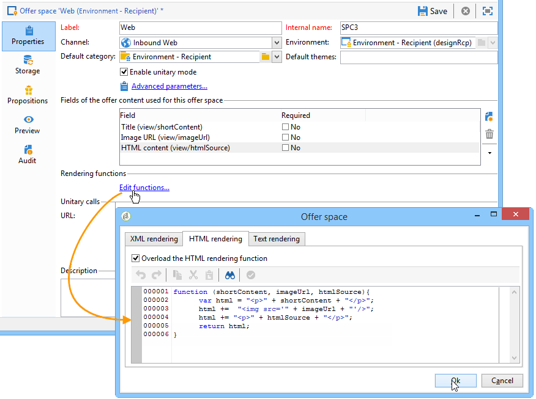
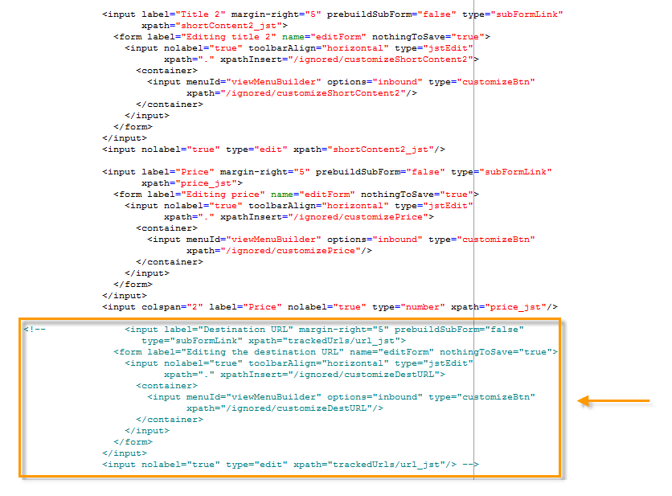

# 通过 JavaScript 集成（客户端）{#integration-via-javascript-client-side}


要在网页中调用交互引擎，请直接在页面中插入对JavaScript代码的调用。 此调用会返回目标中的选件内容

元素。

Adobe建议使用JavaScript集成方法。

脚本调用URL如下所示：

```
<script id="interactionProposalScript" src="https://<SERVER_URL>/nl/interactionProposal.js?env=" type="text/javascript"></script>
```

“**环境**”参数接收专用于匿名交互的实时环境的内部名称。

要呈现选件，我们需要在Adobe Campaign中创建环境和选件空间，然后配置“HTML”页面。

以下用例详细说明了通过JavaScript集成选件的可能选项。

## HTML模式 {#html-mode}

### 提交匿名优惠 {#presenting-an-anonymous-offer}

1. **准备交互引擎**

   打开Adobe Campaign界面并准备匿名环境。

   创建链接到匿名环境的优惠空间。

   创建优惠及其链接到优惠空间的表示形式。

1. **HTML页面的内容**

   HTML页必须包含

   元素的@id属性，其值为创建的选件空间的内部名称（“i_internal名称空间”）。 选件将由Interaction插入此元素中。

   在我们的示例中，@id属性接收“i_SPC12”值，其中“SPC12”是之前创建的选件空间的内部名称：

   ```
   <div id="i_SPC12"></div>
   ```

   在我们的示例中，用于调用脚本的URL如下所示（“OE3”是实时环境的内部名称）：

   ```
   <script id="interactionProposalScript" src="https://instance.adobe.org:8080/nl/interactionProposal.js?env=OE3" type="text/javascript"></script>
   ```

   >[!IMPORTANT]
   >
   >此 `<script>` 标记不能为自结束。

   此静态调用将自动生成一个动态调用，其中包含交互引擎所需的所有参数。

   通过此行为，您可以在同一页面上使用多个选件空间，以便通过调用引擎来管理。

1. **“HTML”页中的结果**

   选件呈现的内容由交互引擎返回到“HTML”页面：

   ```
   <div id="banner_header">
     <div id="i_SPC12">
       <table>
         <tbody>
           <tr>
             <td><h3>Fly to Japan!</h3></td>
           </tr>
           <tr>
             <td></td>
             <td>
               <p>Discover Japan for 2 weeks at an unbelievable price!!</p>
               <p><b>2345 Dollars - All inclusive</b></p>
             </td>
           </tr>
         </tbody>
       </table>
     </div>
     <script src="https://instance.adobe.org:8080/nl/interactionProposal.js?env=OE3" id="interactionProposalScript" type="text/javascript"></script>
   </div>
   ```

### 呈现已识别的优惠 {#presenting-an-identified-offer}

要向已识别的联系人提供选件，请按照此处详述的流程进行操作： [提交匿名优惠](#presenting-an-anonymous-offer). 在网页的内容中，您需要添加以下脚本，以在调用引擎期间识别联系人：

```
<script type="text/javascript">
  interactionTarget = <contact_identifier>;
</script>
```

1. 转到网页将调用的选件空间，然后单击 **[!UICONTROL Advanced parameters]** 和添加一个或多个标识键。

   

   在此示例中，标识键是复合键，因为它同时基于电子邮件和收件人名称。

1. 在网页显示期间，通过脚本评估，您可以将收件人ID传递到优惠引擎。 如果ID是复合的，则键的显示顺序与高级设置中使用的顺序相同，并且用 |。

   在以下示例中，联系人已登录到网站，并在致电交互引擎时被识别为使用他们的电子邮件和姓名。

   ```
   <script type="text/javascript">
     interactionTarget = myEmail|myName;
   </script>
   ```

### 使用HTML渲染函数 {#using-an-html-rendering-function}

要自动生成HTML选件表示，可以使用渲染功能。

1. 转到选件空间，然后单击 **[!UICONTROL Edit functions]** 链接。
1. 选择 **[!UICONTROL Overload the HTML rendering function]**。
1. 转到 **[!UICONTROL HTML rendering]** 制表符，并将与为选件内容定义的字段匹配的变量插入选件空间。

   

   在此示例中，选件以横幅的形式显示在网页中，并且由可单击的图像和与选件内容中定义的字段匹配的标题组成。

## XML模式 {#xml-mode}

### 呈现优惠 {#presenting-an-offer}

通过交互，您可以将XML节点返回到调用优惠引擎的HTML页。 该XML节点可以通过客户端开发的函数进行处理。

对交互引擎的调用如下所示：

```
<script type="text/javascript" id="interactionProposalScript" src="https://<SERVER_URL>/nl/interactionProposal.js?env=&cb="></script>
```

“**环境**”参数接收实时环境的内部名称。

“**cb**”参数接收将读取包含（回调）建议的引擎返回的XML节点的函数的名称。 此参数是可选的。

“**t**”参数仅接收已标识交互的目标的值。 此参数也可以通过 **interactiontarget** 变量。 此参数是可选的。

“**c**“ ”参数接收类别的内部名称列表。 此参数是可选的。

“**th**”参数接收主题列表。 此参数是可选的。

“**gctx**”参数接收整个页面的全局调用数据（上下文）。 此参数是可选的。

返回的XML节点如下所示：

```
<propositions>
 <proposition id="" offer-id="" weight="" rank="" space="" div=""> //proposition identifiers
   ...XML content defined in Adobe Campaign...
 </proposition>
 ...
</propositions>
```

以下用例详细说明了要在Adobe Campaign中执行以启用XML模式的配置，然后在“HTML”页面中显示调用引擎的结果。

1. **创建环境和优惠空间**

   有关创建环境的更多信息，请参阅 [实时/设计环境](../../interaction/using/live-design-environments.md).

   有关创建选件空间的更多信息，请参阅 [创建优惠空间](../../interaction/using/creating-offer-spaces.md).

1. **扩展优惠模式以添加新字段**

   此架构将定义以下字段：标题编号2和价格。

   示例中的架构名称为 **cus：offer**

   ```
   <srcSchema _cs="Marketing offers (cus)" created="2013-01-18 17:14:20.762Z" createdBy-id="0"
              desc="" entitySchema="xtk:srcSchema" extendedSchema="nms:offer" img="nms:offer.png"
              label="Marketing offers" labelSingular="Marketing offers" lastModified="2013-01-18 15:20:18.373Z"
              mappingType="sql" md5="F14A7AA009AE1FCE31B0611E72866AC3" modifiedBy-id="0"
              name="offer" namespace="cus" xtkschema="xtk:srcSchema">
     <createdBy _cs="Administrator (admin)"/>
     <modifiedBy _cs="Administrator (admin)"/>
     <element img="nms:offer.png" label="Marketing offers" labelSingular="Marketing offer"
              name="offer">
       <element label="Content" name="view">
         <element label="Price" name="price" type="long" xml="true"/>
         <element label="Title 2" name="title2" type="string" xml="true"/>
   
         <element advanced="true" desc="Price calculation script." label="Script price"
                  name="price_jst" type="CDATA" xml="true"/>
         <element advanced="true" desc="Title calculation script." label="Script title"
                  name="title2_jst" type="CDATA" xml="true"/>
       </element>
     </element>
   </srcSchema>
   ```

   >[!IMPORTANT]
   >
   >每个元素需要定义两次。 CDATA (“_jst”)类型元素可以包含个性化字段。
   >
   >不要忘记更新数据库结构。 如需详细信息，请参阅[此小节](../../configuration/using/updating-the-database-structure.md)。

   >[!NOTE]
   >
   >您可以扩展选件架构，以批处理模式和单一模式以及任何格式(文本、HTML和XML)添加新字段。

1. **扩展优惠公式以编辑新字段并修改现有字段**

   编辑 **选件(nsm)** 输入表单。

   在“视图”部分中，插入两个包含以下内容的新字段：

   ```
   <input label="Title 2" margin-right="5" prebuildSubForm="false" type="subFormLink"
                        xpath="title2_jst">
                   <form label="Edit title 2" name="editForm" nothingToSave="true">
                     <input nolabel="true" toolbarAlign="horizontal" type="jstEdit"
                            xpath="." xpathInsert="/ignored/customizeTitle2">
                       <container>
                         <input menuId="viewMenuBuilder" options="inbound" type="customizeBtn"
                                xpath="/ignored/customizeTitle2"/>
                       </container>
                     </input>
                   </form>
                 </input>
                 <input nolabel="true" type="edit" xpath="title2_jst"/>
   
                 <input label="Price" margin-right="5" prebuildSubForm="false" type="subFormLink"
                        xpath="price_jst">
                   <form label="Edit price" name="editForm" nothingToSave="true">
                     <input nolabel="true" toolbarAlign="horizontal" type="jstEdit"
                            xpath="." xpathInsert="/ignored/customizePrice">
                       <container>
                         <input menuId="viewMenuBuilder" options="inbound" type="customizeBtn"
                                xpath="/ignored/customizePrice"/>
                       </container>
                     </input>
                   </form>
                 </input>
                 <input colspan="2" label="Prix" nolabel="true" type="number" xpath="price_jst"/>
   ```

   注释掉目标URL字段：

   

   >[!IMPORTANT]
   >
   >( `<input>`)表单必须指向所创建架构中定义的CDATA类型元素。

   优惠呈现形式中的呈现如下所示：

   

   此 **[!UICONTROL Title 2]** 和 **[!UICONTROL Price]** 已添加字段，并且 **[!UICONTROL Destination URL]** 字段不再显示。

1. **创建优惠**

   有关创建选件的更多信息，请参阅 [创建优惠](../../interaction/using/creating-an-offer.md).

   在以下用例中，输入选件如下：

   

1. 批准优惠或由其他人批准优惠，然后在最后一步创建的优惠空间上激活它，以便它在链接的实时环境中可用。
1. **“HTML”页面上的引擎调用和结果**

   对HTML页面中交互引擎的调用如下所示：

   ```
   <script id="interactionProposalScript" src="https://<SERVER_URL>/nl/interactionProposal.js?env=OE7&cb=alert" type="text/javascript">
   ```

   “”的值&#x200B;**环境**“ parameter是实时环境的内部名称。

   “”的值&#x200B;**cb**“ parameter是函数的名称，该函数需要解释引擎返回的XML节点。 在我们的示例中，调用的函数会打开一个模式窗口(alert()函数)。

   交互引擎返回的XML节点如下所示：

   ```
   <propositions>
    <proposition id="a28002" offer-id="10322005" weight="1" rank="1" space="SPC14" div="i_SPC14">
     <xmlOfferView>
      <title>Travel to Russia</title>
      <price>3456</price>
      <description>Discover this vacation package!INCLUDES 10 nights. FEATURES buffet breakfast daily. BONUS 5th night free.</description>
      <image>
       <path>https://myinstance.com/res/Track/ae1d2113ed732d58a3beb441084e5960.jpg</path>
       <alt>Travel to Russia</alt>
      </image>
     </xmlOfferView>
    </proposition>
   </propositions>
   ```

### 使用渲染函数 {#using-a-rendering-function-}

可以使用XML渲染函数来创建优惠演示。 此函数将修改在调用引擎期间返回到HTML页的XML节点。

1. 转到选件空间，然后单击 **[!UICONTROL Edit functions]** 链接。
1. 选择 **[!UICONTROL Overload the XML rendering function]**。
1. 转到 **[!UICONTROL XML rendering]** 制表符并插入所需的函数。

   该函数可以如下所示：

   ```
   function (proposition) {
     delete proposition.@id;
     proposition.@newAttribute = "newValue";
   } 
   ```


