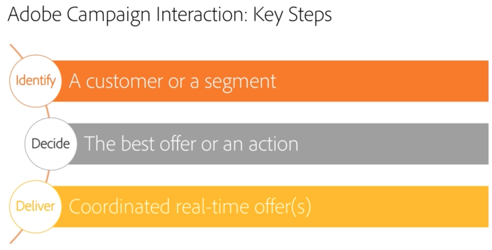

# 互动和优惠管理{#interaction-and-offer-management}

互动让您能够在与给定联系人（客户或目标）的交互过程中，通过使其成为单个或多个自适应选件进行实时响应。 例如，这些可以是简单的通信消息、针对一个或多个产品或服务的特惠。

选件会通过集客（网站或呼叫中心）或出站（电子邮件投放、直邮或营销活动中的短信）联系人发送给联系人。

您可以创建一个选件目录，该目录将与入站和出站渠道进行接口，以选择要在给定上下文中发送给联系人的最佳选件。 根据资格规则定义收件人的选件相关性。 使用优先级规则确定从一组相关选件中选择的选件。 选件演示规则考虑了联系人的交换历史记录，并有助于避免他们多次收到相同的选件。

通过交互，您可以创建和管理优惠目录，并配置资格规则和与其关联的应用程序主题。 根据所选的渠道，由于各种渲染功能，选件内容可以进行个性化。 最后，您可以使用模拟模块计算选件演示的影响。

 要熟悉Campaign交互中使用的交互功能和术语，请观看 [此视频](https://helpx.adobe.com/campaign/classic/how-to/acs-overview.html?playlist=/ccx/v1/collection/product/campaign/classic/segment/digital-marketers/explevel/intermediate/applaunch/get-started/collection.ccx.js&amp;ref=helpx.adobe.com)。

## 相关主题

| 有用页面 | 其他资源 |
|---|---|
| [交互实施步骤](../../interaction/using/implementation-steps.md) | [测试优惠分发](../../interaction/using/about-offers-simulation.md) |
| [实时/设计环境](../../interaction/using/live-design-environments.md) | [在电子邮件中添加选件](../../interaction/using/integrating-an-offer-via-the-wizard.md) |
| [创建优惠空间](../../interaction/using/creating-offer-spaces.md) | [用例：在网站中添加选件](../../interaction/using/offers-on-an-inbound-channel.md) |
