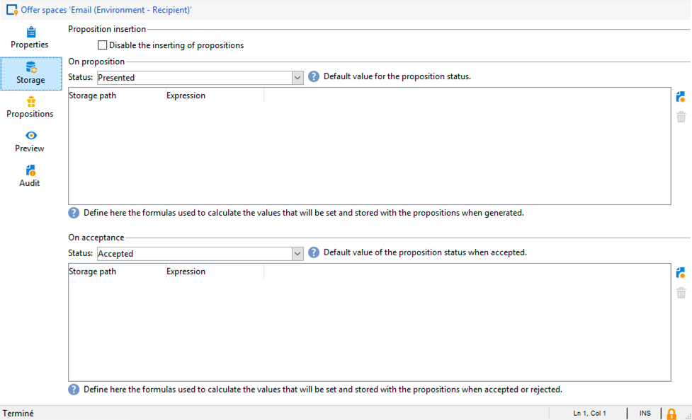

# 互动最佳实践{#interaction-best-practices}


## 一般建议 {#general-recommendations}

本节介绍在Adobe Campaign Classic中管理“交互”模块的最佳实践方法，包括资格规则、预定义过滤器、工作流活动和数据库选项。

Adobe Campaign中的交互需要仔细管理才能高效运行。 您必须在联系人数量与优惠类别和优惠数量之间找到平衡。 如果不仔细处理这些因素，您的Adobe Campaign实例可能会遇到问题。

### 实现 {#implementation}

下面列出了实施和配置交互时应牢记的重要元素。

* 对于批处理引擎（通常用于电子邮件等出站通信），吞吐量是主要问题，因为可以同时处理多个联系人。 典型的瓶颈是数据库性能。
* 单一引擎（通常用于入站通信，如网站上的横幅）的主要限制是延迟，因为有人需要答案。 典型的瓶颈是CPU性能。
* 优惠目录设计对Adobe Campaign Classic性能有着巨大影响。
* 当存在许多选件时，将它们拆分为多个选件目录。

### 资格规则 {#eligibility-rules}

下面列出了有关资格规则的一些最佳实践。

* 简化规则。 规则复杂性会因扩展查找而影响性能。 复杂规则是指具有五个以上条件的任何规则。
* 为了提高性能，可以在多个选件之间共享的不同预定义过滤器中划分规则。
* 将限制最严格的选件类别规则放在树中尽可能高的位置。 这样做时，他们将首先过滤掉大多数联系人，从而减少目标数量，并防止进一步的规则处理这些联系人。
* 将时间或处理成本最高的规则放在树的底部。 这样做后，这些规则将只对其余目标受众运行。
* 从特定类别开始，避免扫描整个树。
* 为了节省处理时间，请预先计算聚合，而不是使用连接构建复杂的规则。 为此，请尝试将客户数据存储在可在资格规则中查找的参考表中。
* 使用最小权重来限制查询次数。
* 建议每个选件空间的选件数量有限。 这可确保更快地检索任何给定空间中的选件。
* 使用索引，尤其是在常用查找列上。

### 建议表 {#proposition-table}

下面列出了有关建议表的几个最佳实践。

* 使用最少的规则以使处理尽可能快。
* 限制建议表中的记录数：仅保留跟踪其状态更新以及规则所需的记录，然后将它们存档到另一个系统中。
* 对建议表执行密集数据库维护，如重建索引或重新创建表。
* 限制每个目标请求的建议数。 不要设置超过您实际要使用的内容。
* 在规则条件中尽可能避免联接。

## 管理优惠的提示和技巧 {#tips-managing-offers}

本节包含有关管理优惠和使用Adobe Campaign Classic中的交互模块的更详细建议。

### 在电子邮件投放中使用多个选件空间 {#multiple-offer-spaces}

在投放中包含优惠时，通常会在营销活动工作流中的上游通过扩充活动（或其他类似活动）选择优惠。

在扩充活动中选择选件时，您可以选择要使用的选件空间。 但是，无论所选优惠空间如何，投放自定义菜单都取决于投放中设置的优惠空间。

在以下示例中，投放中选择的优惠空间为 **[!UICONTROL Email (Environment - Recipient)]**：


如果您在投放中选择的选件空间未设置HTML渲染功能，则您将不会在投放菜单中看到该选件，并且将无法选择它。 同样，这与在扩充活动中选择的优惠空间无关。

在下面的示例中，HTML渲染函数在下拉列表中可用，因为投放中选择的选件空间具有渲染函数：


此函数插入代码，例如： `<%@ include proposition="targetData.proposition" view="rendering/html" %>`.

当您选择建议时， **[!UICONTROL view]** 属性如下所示：
* &quot;rendering/html&quot;： html rendering. 它使用HTML渲染函数。
* &quot;offer/view/html&quot;： html内容。 它不使用HTML渲染函数。 它仅包括HTML字段。

当您在单个电子邮件投放中包含多个选件空间时，如果其中某些选件具有渲染功能，而另一些选件没有该功能，则必须记住哪些选件使用了哪些选件空间，以及哪些选件空间具有渲染功能。

因此，为了避免出现任何问题，建议定义所有选件空间的HTML渲染函数，即使您的选件空间只需要HTML内容也是如此。

### 在建议日志表中设置排名 {#rank-proposition-log-table}

当生成或接受建议时，优惠空间能够在建议表中存储数据：



但是，这仅适用于集客交互。

在使用叫客交互时，以及在使用不带交互模块的叫客选件时，也可以在建议表中存储其他数据。

工作流临时表中的任何字段（其名称与建议表中的字段名称匹配）都会复制到建议表中的同一字段中。

例如，在扩充中手动选择优惠（无交互）时，标准字段的定义如下：


可以添加其他字段，例如@rank字段：


由于建议表中有一个名为@rank的字段，因此将复制工作流临时表中的值。

有关在建议表中存储其他字段的更多信息，请参见 [通过工作流集成优惠](../../interaction/using/integrating-an-offer-via-a-workflow.md#storing-offer-rankings-and-weights).

对于具有交互功能的叫客优惠，在选择了多个优惠且希望记录它们在电子邮件中的显示顺序时，此功能非常有用。

您还可以直接在建议表中存储其他元数据（如当前支出级别），以保留有关生成优惠时支出的历史记录。

在使用出站交往时，您可以添加@rank字段（如上面的示例所示），但系统会根据交往返回的订单自动设置其值。 例如，如果您使用“交互”选择三个选件，则@rank字段将返回值1、2和3。

在使用交互和手动选择选件时，用户可以同时使用这两种方法。 例如，对于手动选择的选件，用户可手动将@rank字段设置为1，并对交互返回的选件使用诸如“1 + @rank”的表达式。 假设交互选择三个选件，则这两种方法返回的选件将排名第1-4：


### 扩展nms：offer模式 {#extending-nms-offer-schema}

扩展nms：offer模式时，请确保遵循已设置的现成结构：
* 为下的内容存储定义任何新字段 `<element name="view">`.
* 每个新字段需要定义两次。 一次作为常规XML字段，一次作为CDATA XML字段，并在名称后附加“_jst”。 例如：

  ```
  <element label="Price" name="price" type="long" xml="true"/>
  <element advanced="true" label="Script price" name="price_jst" type="CDATA" xml="true"/>
  ```

* 包含要跟踪的URL的任何字段都必须放在 `<element name="trackedUrls">` ，位于 `<element name="view" >`.
