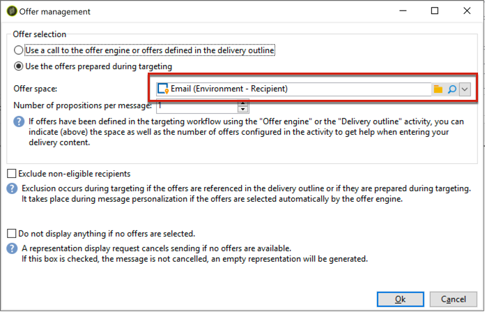

# 互动最佳实践{#interaction-best-practices}

## 一般建议 {#general-recommendations}

本节介绍了在Adobe Campaign Classic中管理交互模块的最佳实践方法，包括合格规则、预定义过滤器、工作流活动和数据库选项。

Adobe Campaign中的互动需要谨慎的管理才能高效运作。 您必须在联系人数和优惠类别和优惠数之间找到平衡。 如果未认真处理这些因素，您的Adobe Campaign实例可能会遇到问题。

### 实现{#implementation}

下面列出了实施和配置交互时应牢记的重要元素。

* 对于批处理引擎（通常用于出站通信，如电子邮件），吞吐量是主要问题，因为可以同时处理多个联系人。 典型的瓶颈是数据库性能。
* 统一引擎（通常用于入站通信，如网站上的横幅）的主要约束是延迟，因为某人正在等待答案。 CPU性能是典型的瓶颈。
* 优惠目录设计对Adobe Campaign Classic性能有着巨大影响。
* 当有许多优惠时，将它们拆分为多个优惠目录。

### 合格规则{#eligibility-rules}

下面列出了有关合格规则的一些最佳实践。

* 简化规则。 规则复杂性会影响性能，因为它扩展了查找。 复杂规则是任何具有5个以上条件的规则。
* 为了提高性能，可以在跨多个优惠共享的不同预定义过滤器中划分规则。
* 将限制最严格的优惠类别规则放在树中最高的位置。 这样，他们会首先过滤掉最多的联系人，减少目标数，并阻止他们被更多规则处理。
* 在时间或处理方面将最昂贵的规则放在树的底部。 这样，这些规则将仅在剩余的目标受众上运行。
* 开始特定类别，避免扫描整个树。
* 要节省处理时间，请预计聚合，而不是使用连接构建复杂规则。 为此，请尝试将客户数据存储在可在合格规则中查找的参考表中。
* 使用最少的权重来限制查询数。
* 建议每个优惠空间优惠数量有限。 这可确保在任何给定空间中更快地检索优惠。
* 使用索引，尤其是常用查找列。

### 命题表{#proposition-table}

下面列出了有关建议表的一些最佳实践。

* 使用最少的规则来尽可能快地进行处理。
* 限制命题表中的记录数：只保留跟踪其状态更新所需的记录和规则需要的记录，然后将它们存档到另一个系统中。
* 对命题表执行密集型数据库维护，如重建索引或重新创建表。
* 限制每个目标请求的建议数。 请勿设置超出您实际将使用的设置。
* 在规则条件中尽可能避免连接。

## 有关管理优惠{#tips-managing-offers}的提示与技巧

本节包含有关管理优惠和使用Adobe Campaign Classic中的“交互”模块的更详细建议。

### 在电子邮件投放{#multiple-offer-spaces}中使用多个优惠空间

当将优惠包含在投放中时，通常通过扩充活动(或其他类似活动)在活动工作流的上游选择优惠。

在扩充活动中选择优惠时，您可以选择要使用的优惠空间。 但是，无论选择何种优惠空间,投放自定义菜单都取决于在投放中设置的优惠空间。

在以下示例中，在投放中选择的优惠空间为&#x200B;**[!UICONTROL Email (Environment - Recipient)]**:



如果您在投放中选择的优惠空间未设置HTML渲染功能，您将不会在投放菜单中看到它，并且它将不可供选择。 同样，这与在扩充活动中选择的优惠空间无关。

在以下示例中，HTML渲染功能在下拉列表中可用，因为在投放中选择的优惠空间具有渲染功能：


此函数插入代码，如：`<%@ include proposition="targetData.proposition" view="rendering/html" %>`。

选择命题时，**[!UICONTROL view]**&#x200B;属性的值如下所示：
* &quot;rendering/html&quot;:html渲染。 它使用HTML渲染功能。
* &quot;优惠/视图/html&quot;:html内容。 它不使用HTML渲染功能。 它仅包含HTML字段。

当您在单个电子邮件投放中包含多个优惠空间，并且其中某些优惠具有渲染功能，而某些优惠空间没有渲染功能时，您必须记住哪些优惠空间使用了哪些，以及哪些具有渲染功能。

因此，为避免任何问题，建议所有优惠空间都定义HTML渲染函数，即使您的优惠空间仅需要HTML内容也是如此。

### 设置命题日志表{#rank-proposition-log-table}中的排名

优惠空间能够在生成或接受建议时将数据存储在命题表中：


但是，这仅适用于入站交互。

在使用出站交互时，以及在不使用“交互”模块使用出站优惠时，也可以在命题表中存储其他数据。

工作流临时表中名称与命题表中的字段名称匹配的任何字段都将复制到命题表中的同一字段中。

例如，在扩充中手动选择优惠（不使用交互）时，标准字段定义如下：


可以添加其他字段，如@rank字段：


由于命题表中有一个名为@rank的字段，因此将复制工作流临时表中的值。

有关在命题表中存储其他字段的详细信息，请参阅[通过工作流](../../interaction/using/integrating-an-offer-via-a-workflow.md#storing-offer-rankings-and-weights)集成优惠。

对于具有“交互”的出站优惠，当选择了多个优惠并且您希望记录它们在电子邮件中显示的顺序时，此选项非常有用。

您还可以直接在建议表中存储其他元数据，如当前支出级别，以保留有关生成优惠时支出的历史记录。

使用出站交互时，可以添加@rank字段，如上例所示，但其值会根据交互返回的顺序自动设置。 例如，如果您使用“交互”选择三个优惠，则@rank字段将返回值1、2和3。

使用“交互”和手动选择优惠时，用户可以组合这两种方法。 例如，用户可以手动将@rank字段设置为1，以便手动选择优惠，并对Interaction返回的优惠使用“1 + @rank”等表达式。 假设“交互”选择三个优惠，则两种方法返回的优惠将排名1-4:


### 扩展nms:优惠模式{#extending-nms-offer-schema}

在扩展nms:优惠模式时，请确保遵循现成的结构已设置：
* 为`<element name="view">`下的内容存储定义任何新字段。
* 每个新字段需要定义两次。 一次是常规XML字段，一次是CDATA XML字段，名称后面附加“_jst”。 例如：

   ```
   <element label="Price" name="price" type="long" xml="true"/>
   <element advanced="true" label="Script price" name="price_jst" type="CDATA" xml="true"/>
   ```

* 任何包含要跟踪的URL的字段都必须放在`<element name="trackedUrls">`下，该位置位于`<element name="view" >`下。