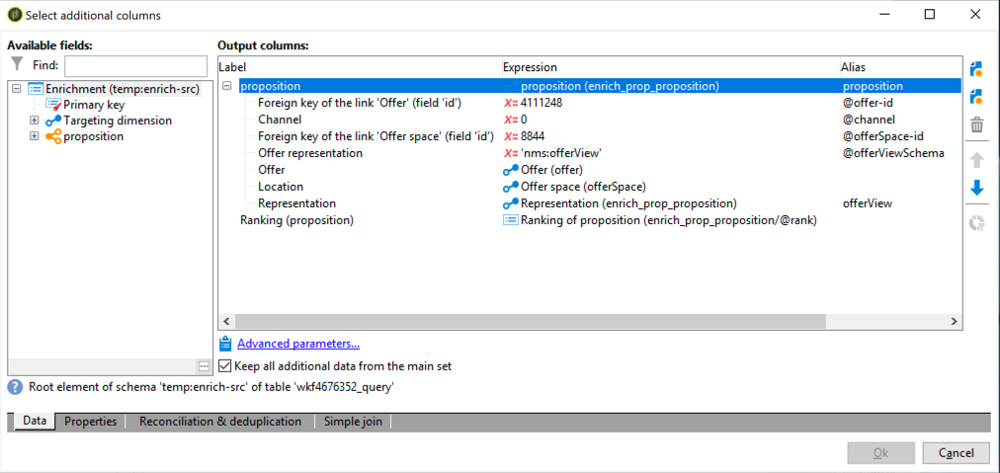

# 互动最佳实践{#interaction-best-practices}


## 一般建议 {#general-recommendations}

本节介绍在Adobe Campaign Classic中管理交互模块的最佳实践方法，包括资格规则、预定义过滤器、工作流活动和数据库选项。

Adobe Campaign的互动需要谨慎管理，才能高效运行。 您必须在联系人数量与选件类别和选件数量之间找到平衡。 如果这些因素未得到仔细处理，您的Adobe Campaign实例可能会遇到问题。

### 实施 {#implementation}

下面列出了在实施和配置交互时应牢记的重要元素。

* 对于批处理引擎（通常用于出站通信，如电子邮件），吞吐量是主要考虑的问题，因为可以同时处理多个联系人。 典型的瓶颈是数据库性能。
* 单一引擎（通常用于入站通信，如网站上的横幅）的主要约束是延迟，因为某人期望得到答案。 典型的瓶颈是CPU性能。
* 选件目录设计对Adobe Campaign Classic性能有巨大影响。
* 当有多个选件时，将它们拆分为多个选件目录。

### 资格规则 {#eligibility-rules}

下面列出了有关资格规则的一些最佳实践。

* 简化规则。 规则复杂性会随着查询的扩展而影响性能。 复杂规则是指包含5个以上条件的任何规则。
* 为了提高性能，可以在跨多个选件共享的不同预定义过滤器中划分规则。
* 将限制最严格的选件类别规则放在树中尽可能高的位置。 这样，他们将首先过滤掉最多的联系人，从而减少目标数量并阻止进一步规则处理他们。
* 在树的底部放置时间或处理方面最昂贵的规则。 这样，这些规则将仅在其余目标受众上运行。
* 从特定类别开始，以避免扫描整个树。
* 为了节省处理时间，请预先计算聚合，而不是使用连接构建复杂规则。 要实现此目的，请尝试将客户数据存储在可在资格规则中查找的参考表中。
* 使用最小数量的权重来限制查询的数量。
* 建议每个选件空间具有有限数量的选件。 这可确保在任何给定空间中更快地检索选件。
* 使用索引，尤其是常用的查找列。

### 命题表 {#proposition-table}

下面列出了有关建议表的一些最佳实践。

* 使用最少数量的规则来尽可能快速地进行处理。
* 限制建议表中的记录数：只保留跟踪其状态更新所需的记录以及规则所需的内容，然后将它们存档到另一个系统中。
* 对建议表执行密集的数据库维护，如重建索引或重新创建表。
* 限制每个目标要求的建议数。 请勿设置超出您实际要使用的设置。
* 尽量避免在规则条件中加入连接。

## 有关管理优惠的提示和技巧 {#tips-managing-offers}

本节包含有关管理优惠和使用Adobe Campaign Classic中的交互模块的更多详细信息。

### 在电子邮件投放中使用多个选件空间 {#multiple-offer-spaces}

在投放中包含选件时，通常会通过扩充活动（或其他类似活动）在营销活动工作流的上游位置选择选件。

在扩充活动中选择选件时，您可以选择要使用的选件空间。 但是，无论选择哪个选件空间，投放自定义菜单都取决于投放中设置的选件空间。

在以下示例中，投放中选择的选件空间为&#x200B;**[!UICONTROL Email (Environment - Recipient)]**:


如果您在投放中选择的选件空间未设置HTML渲染功能，则您将不会在投放菜单中看到该选件空间，并且它将无法进行选择。 同样，这与扩充活动中选择的选件空间无关。

在以下示例中，HTML渲染函数在下拉列表中可用，因为投放中选择的选件空间具有渲染函数：


此函数插入代码，例如：`<%@ include proposition="targetData.proposition" view="rendering/html" %>`。

选择命题时，**[!UICONTROL view]**&#x200B;属性的值如下：
* &quot;rendering/html&quot;:html渲染。 它使用HTML渲染函数。
* &quot;offer/view/html&quot;:html内容。 它不使用HTML渲染函数。 它仅包含HTML字段。

当您在单个电子邮件投放中包含多个选件空间，并且其中某些选件空间具有渲染功能而某些选件空间没有该功能时，您必须记住哪些选件使用了哪些选件空间，哪些选件空间具有渲染功能。

因此，为避免出现任何问题，建议所有选件空间都定义HTML渲染函数，即使您的选件空间仅需要HTML内容也是如此。

### 在命题日志表中设置排名 {#rank-proposition-log-table}

在生成或接受建议时，选件空间能够将数据存储在建议表中：


但是，这仅适用于集客交互。

在使用叫客交互时以及在不使用交互模块的情况下使用叫客选件时，还可以在建议表中存储其他数据。

工作流临时表中名称与建议表中的字段名称匹配的任何字段，都将复制到建议表中的相同字段。

例如，在扩充中手动选择选件（不进行交互）时，标准字段的定义如下：


可以添加其他字段，如@rank字段：



由于命题表中有一个名为@rank的字段，因此将复制工作流临时表中的值。

有关在建议表中存储其他字段的更多信息，请参阅[通过工作流集成选件](../../interaction/using/integrating-an-offer-via-a-workflow.md#storing-offer-rankings-and-weights)。

对于具有交互的出站选件，当选择了多个选件并且您想要记录它们在电子邮件中的显示顺序时，此功能非常有用。

您还可以直接在建议表中存储其他元数据（如当前支出级别），以在生成选件时保留有关支出的历史记录。

使用叫客互动时，可以添加@rank字段（如上面的示例所示），但其值会根据交互返回的顺序自动设置。 例如，如果您使用交互选择三个选件，则@rank字段将返回值1、2和3。

使用交互和手动选择选件时，用户可以将这两种方法结合使用。 例如，用户可以手动将手动选@rank的字段设置为1，并对交互返回的选件使用“1 + @rank”等表达式。 假定交互选择三个选件，则两种方法返回的选件将排名1-4:


### 扩展nms:offer模式 {#extending-nms-offer-schema}

扩展nms:offer模式时，请确保遵循已设置的现成结构：
* 在`<element name="view">`下为内容存储定义任何新字段。
* 每个新字段需要定义两次。 一次作为常规XML字段，一次作为附加了“_jst”的CDATA XML字段。 例如：

   ```
   <element label="Price" name="price" type="long" xml="true"/>
   <element advanced="true" label="Script price" name="price_jst" type="CDATA" xml="true"/>
   ```

* 任何包含要跟踪的URL的字段都必须置于`<element name="trackedUrls">`下，位于`<element name="view" >`下。
