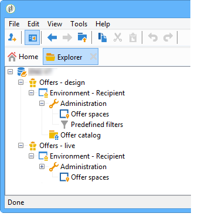

# 实时/设计环境{#live-design-environments}

## 操作原则 {#operating-principle}

交互操作有两种类型的选件环境：

* **[!UICONTROL Design]** 优惠环境，其中包含正在编辑且可以更改的优惠。 这些选件尚未经过批准周期，不会发送给联系人。
* **[!UICONTROL Live]** 优惠环境，其中包含向联系人展示的已批准优惠。 此环境中的选件处于只读状态。

每个 **[!UICONTROL Design]** 环境已链接到 **[!UICONTROL Live]** 环境。 选件完成后，其内容和资格规则需要经过批准周期。 完成此周期后，相关选件将自动部署到 **[!UICONTROL Live]** 环境。 从现在开始，它将可供交付。

默认情况下，交互附带 **[!UICONTROL Design]** 环境和 **[!UICONTROL Live]** 链接到它的环境。 这两个环境都已预配置为定位内置的收件人表。

>[!NOTE]
>
>要定位其他表（匿名选件的访客表或特定的收件人表），您需要使用目标映射向导创建环境。 有关详细信息，请参见 [创建优惠环境](#creating-an-offer-environment).

优惠经理和投放经理可以访问环境的不同视图。 投放经理只能查看 **[!UICONTROL Live]** 优惠环境并使用优惠进行交付。 选件经理可以查看和更改 **[!UICONTROL Design]** 环境和查看 **[!UICONTROL Live]** 环境。 有关详细信息，请参见 [操作员用户档案](../../interaction/using/operator-profiles.md).

## 创建优惠环境 {#creating-an-offer-environment}

默认情况下，交互附带预配置的环境，以定向收件人表（已识别的选件）。 如果要定位另一个表（匿名选件的访客表或特定的收件人表），则需要应用以下配置：

1. 将光标放在 **[!UICONTROL Administration]** > **[!UICONTROL Campaign management]** > **[!UICONTROL Delivery mappings]** 节点。 右键单击要使用的投放映射(**[!UICONTROL Visitors]** （如果要使用匿名优惠），然后选择 **[!UICONTROL Actions]** > **[!UICONTROL Modify the options of the targeting dimension]**.

   

1. 单击 **[!UICONTROL Next]** 要继续向导中的下一个屏幕，请检查 **[!UICONTROL Generate a storage schema for propositions]** 框并单击 **[!UICONTROL Save]**.

   

   >[!NOTE]
   >
   >如果该框已被选中，请取消选中，然后重新选中。

1. Adobe Campaign创建两个环境(**[!UICONTROL Design]** 和 **[!UICONTROL Live]** )，其中包含之前启用的目标映射中的定位信息。 环境已预先配置了定位信息。

   如果您已激活 **[!UICONTROL Visitor]** 映射， **[!UICONTROL Environment dedicated to incoming anonymous interactions]** 框会在环境的 **[!UICONTROL General]** 选项卡。

   此选项允许您激活特定于匿名交互的功能，尤其是在配置环境优惠空间时。 您还可以配置相应的选项，以便从“已识别”环境切换到“匿名”环境。

   例如，您可以将收件人环境选件空间（已识别的联系人）链接到与访客环境（未识别的联系人）匹配的选件空间。 这样，根据此联系人是否识别，将向联系人提供不同的选件。 有关详细信息，请参见 [创建优惠空间](../../interaction/using/creating-offer-spaces.md).

   

>[!NOTE]
>
>有关入站渠道匿名交互的详细信息，请参阅 [匿名互动](../../interaction/using/anonymous-interactions.md).
