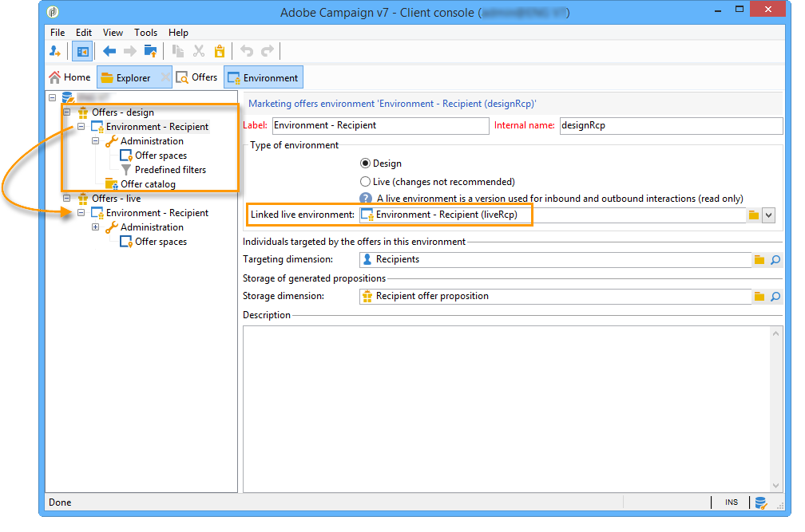

# 实时/设计环境{#live-design-environments}

## 操作原则 {#operating-principle}

交互可与两种类型的选件环境进行操作：

* **[!UICONTROL Design]** 包含正在编辑且可更改的选件的选件环境。 这些选件尚未通过批准周期，也未交付给联系人。
* **[!UICONTROL Live]** 在向联系人显示已批准选件时包含这些选件的选件环境。 此环境中的选件为只读选件。

每个 **[!UICONTROL Design]** 环境已链接到 **[!UICONTROL Live]** 环境。 选件完成后，其内容和资格规则将受到批准周期的约束。 完成此周期后，相关选件会自动部署到 **[!UICONTROL Live]** 环境。 从此刻起，它将可供投放。

默认情况下，交互会 **[!UICONTROL Design]** 环境和 **[!UICONTROL Live]** 链接到该环境。 这两个环境都已预配置为定向即装即用的收件人表。

>[!NOTE]
>
>要定位另一个表（匿名选件的访客表或特定的收件人表），您需要使用目标映射向导来创建环境。 有关更多信息，请参阅 [创建优惠环境](#creating-an-offer-environment).

选件管理器和交付管理器可以访问环境的不同视图。 投放管理器只能查看 **[!UICONTROL Live]** 选件环境，并使用选件来交付它们。 选件管理器可以查看和更改 **[!UICONTROL Design]** 环境和查看 **[!UICONTROL Live]** 环境。 有关更多信息，请参阅 [操作员用户档案](../../interaction/using/operator-profiles.md).

## 创建优惠环境 {#creating-an-offer-environment}

默认情况下，交互会附带一个预配置的环境，以定位收件人表（已识别的选件）。 如果您希望定位其他表（匿名选件的访客表或特定收件人表），则需要应用以下配置：

1. 将光标放在 **[!UICONTROL Administration]** > **[!UICONTROL Campaign management]** > **[!UICONTROL Delivery mappings]** 节点。 右键单击要使用的投放映射(**[!UICONTROL Visitors]** 如果要使用匿名选件，请选择 **[!UICONTROL Actions]** > **[!UICONTROL Modify the options of the targeting dimension]**.

   

1. 单击 **[!UICONTROL Next]** 要继续进入向导的下一个屏幕，请检查 **[!UICONTROL Generate a storage schema for propositions]** 框，单击 **[!UICONTROL Save]**.

   

   >[!NOTE]
   >
   >如果复选框已选中，请取消选中该框，然后重新选中该框。

1. Adobe Campaign创建两个环境(**[!UICONTROL Design]** 和 **[!UICONTROL Live]** )，以及先前启用的目标映射中的目标信息。 环境已预配置了定位信息。

   如果已激活 **[!UICONTROL Visitor]** 映射， **[!UICONTROL Environment dedicated to incoming anonymous interactions]** 框中，此复选框将被自动选中 **[!UICONTROL General]** 选项卡。

   利用此选项，可激活特定于匿名交互的函数，尤其是在配置环境选件空间时。 您还可以配置选项，以便从“已识别”环境切换到“匿名”环境。

   例如，您可以将收件人环境选件空间（已识别的联系人）与与访客环境（未识别的联系人）匹配的选件空间链接起来。 这样，联系人就可以获得不同的选件，具体取决于此联系人是否被识别。 有关更多信息，请参阅 [创建优惠空间](../../interaction/using/creating-offer-spaces.md).

   

>[!NOTE]
>
>有关入站渠道上匿名交互的更多信息，请参阅 [匿名互动](../../interaction/using/anonymous-interactions.md).
