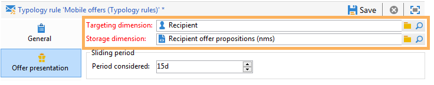
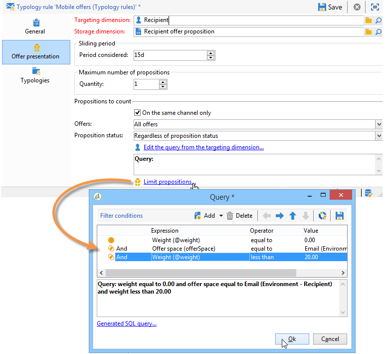

# 管理优惠演示{#managing-offer-presentation}

## 呈现规则概述 {#presentation-rules-overview}

交互允许您使用呈现规则控制优惠建议的流程。 这些特定于交互的规则是类型规则。 它们允许您根据向收件人发出的建议历史记录排除优惠。 它们在环境中被引用

## 创建和引用优惠呈现规则 {#creating-and-referencing-an-offer-presentation-rule}

1. 转到 **[!UICONTROL Administration]** > **[!UICONTROL Campaign management]** > **[!UICONTROL Typology management]** > **[!UICONTROL Typology rules]** 节点。
1. 创建分类规则并选择 **[!UICONTROL Offer presentation]** 类型。

   

1. 指定应用规则的渠道。

   

1. 配置规则的应用程序条件。 有关更多信息，请参阅 [演示规则设置](#presentation-rule-settings).
1. 转到 **[!UICONTROL Administration]** > **[!UICONTROL Campaign execution]** > **[!UICONTROL Typology management]** > **[!UICONTROL Typologies]** 节点，并创建将分组所有 **[!UICONTROL Offer presentation]** 键入规则。

   

1. 创建分类后，将光标放在分类规则上，并在刚刚创建的分类中进行分组。

   

1. 在您的优惠环境中，使用下拉列表引用分类。

   

## 演示规则设置 {#presentation-rule-settings}

### 应用条件 {#application-criteria-}

中可用的应用程序条件 **[!UICONTROL General]** 选项卡用于指定演示规则将应用于的选件。 为此，您需要创建一个查询并选择相关选件，如下所述。

1. 在分类规则中，单击 **[!UICONTROL Edit the rule application conditions...]** 链接以创建您的查询。

   

1. 在查询窗口中，您可以对要应用分类规则的选件应用过滤器。

   例如，您可以选择优惠类别。

   

### 优惠维度 {#offer-dimensions}

在 **[!UICONTROL Offer presentation]** 选项卡，您必须为展示规则指定与在环境中配置的维度相同的维度。

此 **[!UICONTROL Targeting dimension]** 与将接收优惠建议的收件人表（默认为nms：recipients）一致。 此 **[!UICONTROL Storage dimension]** 与包含链接到定向维度的建议历史记录（默认情况下）的表一致:nms:propositionRcp)。

>[!NOTE]
>
>您也可以使用非标准表。 如果要使用特定的定向维度，则需要使用目标映射创建表以及专用环境。 有关更多信息，请参阅 [创建优惠环境](../../interaction/using/live-design-environments.md#creating-an-offer-environment).

### 期间 {#period}

这是一个从优惠呈现日期开始的滑动时段。 它设置优惠建议的有效性时限。 该规则不适用于在此期限之后提出的优惠建议。

期间开始 **n** 建议日期和结束日期前的天数 **n** 几天后，其中 **n** 对应于在 **[!UICONTROL Period considered]** 字段：

* 对于入站空间，建议日期是优惠展示日期。
* 对于出站空间，建议日期是投放联系日期（例如，在定位工作流中输入的投放日期）。

使用箭头更改天数或直接输入句点（例如“2d 6h”）。

### 建议的数量 {#number-of-propositions}

可以在排除相关选件之前设置可提出的最大数量的建议。

使用箭头可更改优惠建议的数量。

## 定义建议和收件人 {#defining-propositions-and-recipients}

此 **[!UICONTROL Propositions to count]** 部分允许您指定接收者和建议，这会导致排除中定义的优惠。 **[!UICONTROL General]** 选项卡（如果他们在建议历史记录中出现特定次数）。

### 筛选建议 {#filtering-propositions}

您可以选择筛选条件，以根据渠道、相关优惠或之前分配的建议状态排除建议。

这些标准代表呈现规则最常见的应用。 要使用其他标准，您可以使用以下内容创建查询： **[!UICONTROL Limit propositions...]** 链接。 有关详情，请参阅 [创建建议查询](#creating-a-query-on-propositions) 部分。

* **在渠道上筛选**

   **[!UICONTROL On the same channel only]** ：用于排除中指定渠道的优惠建议 **[!UICONTROL General]** 选项卡。

   例如，在中为规则指定的渠道 **[!UICONTROL General]** 选项卡为电子邮件。 如果迄今为止规则适用的优惠仅在Web渠道中提供，则交互引擎可以在电子邮件投放中显示优惠。 但是，一旦通过电子邮件显示优惠，交互引擎将选择其他渠道来显示优惠。

   >[!NOTE]
   >
   >我们谈论的是频道，而不是空间。 如果规则必须排除Web渠道上的选件，则原本要显示在网站上的选件（例如显示在横幅和页面正文中）在两个空格中，但是如果以前已经显示，则不会在网站上显示该选件。
   >
   >对于涉及优惠呈现的工作流，只有在配置规则时才会正确考虑这些规则 **[!UICONTROL All channels]**.

* **在选件上筛选**

   通过此筛选器，您可以将要计数的选件建议限制为一组特定的选件。

   **[!UICONTROL All offers]** ：默认值。 没有过滤器应用于选件。

   **[!UICONTROL Offer being presented]** ：中指定的选件 **[!UICONTROL General]** 选项卡会被排除（如果已显示）。

   **[!UICONTROL Offers from the same category]** ：如果已提供同一类别中的选件，则会排除该选件。

   **[!UICONTROL The offers which the rule applies to]** ：在中定义多个选件时 **[!UICONTROL General]** 选项卡，将考虑此优惠集中的每个优惠建议，如果达到建议阈值，则以排除所有优惠结束。

   例如，选件2、3和5定义于 **[!UICONTROL General]** 选项卡。 建议的最大数量设置为2。 如果选件2和5均呈现一次，则计算出的建议数量将为2。 因此，绝不会显示选件3。

* **根据建议状态进行筛选**

   通过此过滤器，可选择在建议历史记录中考虑的优惠建议的最常见状态。

   **[!UICONTROL Regardless of the proposition status]** ：默认值。 没有过滤器应用于建议状态。

   **[!UICONTROL Accepted or rejected propositions]** ：用于排除之前显示的、已接受或已拒绝的优惠。

   **[!UICONTROL Accepted propositions]** ：用于排除先前提供的已获接受的优惠。

   **[!UICONTROL Rejected propositions]** ：用于排除之前显示且已被拒绝的选件。

### 定义收件人 {#defining-recipients}

要指定收件人，请单击 **[!UICONTROL Edit the query from the targeting dimension...]** 链接并选择规则关注的收件人。

### 创建建议查询 {#creating-a-query-on-propositions}

要通过查询指定要计数的建议，请单击 **[!UICONTROL Limit propositions...]** 链接并指定要考虑的标准。

在以下示例中，两个演示之后要计数的建议是 **特别优惠** 类别，用于 **呼叫中心** 空格，重量在下 **20**.

