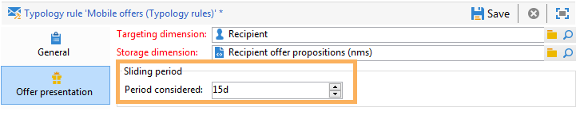

# 管理选件演示文稿{#managing-offer-presentation}

## 演示文稿规则概述 {#presentation-rules-overview}

通过交互，您可以使用表示规则控制优惠信息的流。 这些规则是特定于“交互”的类型学规则。 它们允许您根据已向收件人提出的建议的历史记录排除优惠。 它们在环境中被引用

## 创建和引用选件演示规则 {#creating-and-referencing-an-offer-presentation-rule}

1. 转到 **[!UICONTROL Administration]** > **[!UICONTROL Campaign management]** > **[!UICONTROL Typology management]** >节 **[!UICONTROL Typology rules]** 点。
1. 创建排版规则并选择类 **[!UICONTROL Offer presentation]** 型。

   

1. 指定应用规则的渠道。

   

1. 配置规则的应用程序条件。 有关此功能的详细信息，请参阅演 [示规则设置](#presentation-rule-settings)。
1. 转到 **[!UICONTROL Administration]** > **[!UICONTROL Campaign execution]** > **[!UICONTROL Typology management]** >节点并创 **[!UICONTROL Typologies]** 建一个类型学，它将对所有类型规则 **[!UICONTROL Offer presentation]** 进行分组。

   

1. 创建字体后，将光标放在字体规则上，并将其分组到您刚刚创建的字体规则中。

   

1. 在您的选件环境中，使用下拉列表引用类型学。

   

## 演示文稿规则设置 {#presentation-rule-settings}

### 应用程序条件 {#application-criteria-}

通过选项卡中可用的应 **[!UICONTROL General]** 用程序条件，您可以指定演示文稿规则将应用到的选件。 为此，您需要创建查询并选择相关的选件，如下所述。

1. 在您的排版规则中，单击 **[!UICONTROL Edit the rule application conditions...]** 链接以创建查询。

   

1. 在查询窗口中，您可以对要应用排版规则的选件应用过滤器。

   例如，您可以选择选件类别。

   

### 选件维度 {#offer-dimensions}

在选项卡 **[!UICONTROL Offer presentation]** 中，必须为表示规则指定与在环境中配置的维相同的维。

该 **[!UICONTROL Targeting dimension]** 值与收件人表(默认情况下：nms:recipients)，将接收选件建议。 该 **[!UICONTROL Storage dimension]** 表与包含链接到定位维的命题历史记录（默认情况下：nms:postitionRcp）的表一致。

>[!NOTE]
>
>您还可以使用非标准表。 如果要使用特定定位维，您需要创建表以及使用目标映射的专用环境。 有关详细信息，请参阅 [创建选件环境](../../interaction/using/live-design-environments.md#creating-an-offer-environment)。

### 期间 {#period}

这是一个滑动期，从优惠的演示日期开始。 它为优惠建议的有效性设置了时间限制。 该规则不适用于在此期间之后提出的建议。

期间从提 **案日期** n天开始，到提案日期后 **n天结束，其中** n **与在字段中输入的数****[!UICONTROL Period considered]** 字相对应：

* 对于入站空间，建议日期是选件演示日期。
* 对于出站空间，建议日期是交货联系日期（例如，在定位工作流中输入的交货日期）。

使用箭头更改天数或直接输入句点（例如“2d 6h”）。

### 命题数 {#number-of-propositions}

可以设置在排除相关优惠之前可以提出的最高数目的建议。

使用箭头可更改选件的数量。

## 定义主张和收件人 {#defining-propositions-and-recipients}

在该 **[!UICONTROL Propositions to count]** 部分中，您可以指定收件人和主张，如果这些收件人和主张在主张历史记录中出现特定次数，则这些主张将导致排除在选项卡中定义的 **[!UICONTROL General]** 选件。

### 筛选命题 {#filtering-propositions}

您可以根据渠道、相关选件或先前分配的命题的状态选择筛选条件以排除命题。

这些标准表示表示表示规则的最频繁应用。 要使用其他条件，您可以使用链接创建查 **[!UICONTROL Limit propositions...]** 询。 有关详细信息，请参阅创建 [有关命题的查询一节](#creating-a-query-on-propositions) 。

* **通道上的过滤器**

   **[!UICONTROL On the same channel only]** :允许您排除选项卡中指定的渠道上的选件 **[!UICONTROL General]** 建议。

   例如，为选项卡中的规则指定的渠道 **[!UICONTROL General]** 是电子邮件。 如果规则所适用的选件到目前为止仅在Web渠道上提供，则交互引擎可以通过电子邮件发送来提供选件。 但是，一旦通过电子邮件显示了选件，交互引擎将选择其他渠道来显示选件。

   >[!NOTE]
   >
   >我们说的是频道，而不是空间。 如果规则必须排除Web渠道上的选件，则该选件将以两个空间（例如，在横幅中和页面正文中）显示在网站上，如果之前已经提供过该选件，则该选件将不会显示在站点上。
   >
   >对于涉及选件演示的工作流，只有在上配置了规则，才能正确考虑这些规则 **[!UICONTROL All channels]**。

* **选件过滤**

   通过此过滤器，您可以将选件命题限制为计入特定的选件集。

   **[!UICONTROL All offers]** :默认值。 不会对选件应用任何过滤器。

   **[!UICONTROL Offer being presented]** :如果选项卡中指 **[!UICONTROL General]** 定的选件已呈现，则将排除该选件。

   **[!UICONTROL Offers from the same category]** :如果已经显示同一类别的选件，则该选件将被排除。

   **[!UICONTROL The offers which the rule applies to]** :在标签中定义了多个选件时，将考虑这组选件中的每个选件命题，并在达到命题阈值时排除所有选件。 **[!UICONTROL General]**

   例如，选件2、3和5在选项卡中定 **[!UICONTROL General]** 义。 最大命题数设置为2。 如果每个选件2和5都显示一次，则计数的命题数将为2。 因此，优惠3永远不会提供。

* **对命题状态进行筛选**

   通过此筛选器，您可以选择最频繁的状态，以便在命题历史记录中考虑选件命题。

   **[!UICONTROL Regardless of the proposition status]** :默认值。 没有对命题状态应用任何过滤器。

   **[!UICONTROL Accepted or rejected propositions]** :允许您排除之前已接受或拒绝的提供的选件。

   **[!UICONTROL Accepted propositions]** :允许您排除之前已接受的提供的选件。

   **[!UICONTROL Rejected propositions]** :允许您排除先前呈现的已被拒绝的选件。

### 定义收件人 {#defining-recipients}

要指定收件人，请单击链 **[!UICONTROL Edit the query from the targeting dimension...]** 接，然后选择规则所涉及的收件人。

### 创建命题查询 {#creating-a-query-on-propositions}

要指定要通过查询计数的主张，请单击链 **[!UICONTROL Limit propositions...]** 接并指定要考虑的条件。

在以下示例中，两个演示后要计数的命题是“特价优惠”类别中的主题， **Call Center** （呼叫中心）空间的权重低于 **20******。

