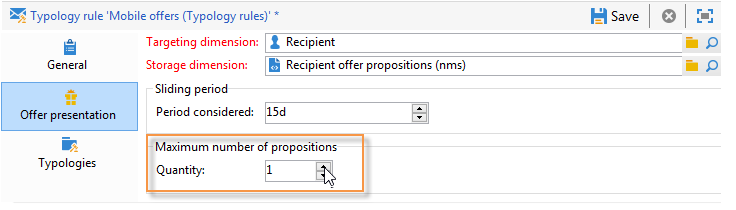

# 管理优惠演示{#managing-offer-presentation}

## 推荐规则概述{#presentation-rules-overview}

通过交互，您可以使用推荐规则控制优惠建议流。 这些规则是特定于交互的类型规则。 它们允许您根据已向优惠提出的建议的历史来排除收件人。 它们在环境中引用

## 创建和引用优惠推荐规则{#creating-and-referencing-an-offer-presentation-rule}

1. 转到&#x200B;**[!UICONTROL Administration]** > **[!UICONTROL Campaign management]** > **[!UICONTROL Typology management]** > **[!UICONTROL Typology rules]**&#x200B;节点。
1. 创建类型规则并选择&#x200B;**[!UICONTROL Offer presentation]**&#x200B;类型。

   

1. 指定应用规则的渠道。

   

1. 配置规则的应用程序条件。 有关详细信息，请参阅[推荐规则设置](#presentation-rule-settings)。
1. 转到&#x200B;**[!UICONTROL Administration]** > **[!UICONTROL Campaign execution]** > **[!UICONTROL Typology management]** > **[!UICONTROL Typologies]**&#x200B;节点并创建一个类型学，它将对所有&#x200B;**[!UICONTROL Offer presentation]**&#x200B;类型规则进行分组。

   

1. 创建字体后，将光标放在类型规则上，并在刚刚创建的字体中对它们进行分组。

   

1. 在您的优惠环境中，使用下拉式列表引用类型学。

   

## 推荐规则设置{#presentation-rule-settings}

### 应用程序条件{#application-criteria-}

**[!UICONTROL General]**&#x200B;选项卡中可用的应用程序条件允许您指定推荐规则将应用到的优惠。 为此，您需要创建一个查询并选择相应的优惠，如下所述。

1. 在类型规则中，单击&#x200B;**[!UICONTROL Edit the rule application conditions...]**&#x200B;链接以创建查询。

   

1. 在“查询”窗口中，可以对要应用类型规则的优惠应用过滤器。

   例如，您可以选择优惠类别。

   

### 优惠维度{#offer-dimensions}

在&#x200B;**[!UICONTROL Offer presentation]**&#x200B;选项卡中，必须为推荐规则指定与在环境中配置的相同尺寸。

**[!UICONTROL Targeting dimension]**&#x200B;与收件人表重合(默认情况下：nms:收件人)。 **[!UICONTROL Storage dimension]**&#x200B;与包含链接到定位维度（默认情况下：nms:postitionRcp）的命题历史记录的表重合。

>[!NOTE]
>
>您还可以使用非标准表。 如果要使用特定定位维度，您需要创建表以及使用目标映射的专用环境。 有关详细信息，请参阅[创建优惠环境](../../interaction/using/live-design-environments.md#creating-an-offer-environment)。

### 期间{#period}

这是一个滑动期，开始在优惠演示日期。 它为优惠建议的有效性设定了时限。 该规则不适用于在此期间之后创建的优惠建议。

期间开始&#x200B;**n**&#x200B;天，然后结束&#x200B;**n**&#x200B;天，其中&#x200B;**n**&#x200B;对应于在&#x200B;**[!UICONTROL Period considered]**&#x200B;字段中输入的数字：

* 对于入站空间，提案日期是优惠演示日期。
* 对于出站空间，提案日期是投放联系日期(例如在定位工作流中输入的投放日期)。

使用箭头更改天数或直接输入句点（例如“2d 6h”）。

### 命题数{#number-of-propositions}

可以设置在排除相关优惠之前可以提出的最多建议数。

使用箭头可更改优惠建议数。

## 定义命题和收件人{#defining-propositions-and-recipients}

在&#x200B;**[!UICONTROL Propositions to count]**&#x200B;部分中，您可以指定收件人和主张，如果这些优惠在主张历史记录中出现一定次数，则它们将导致排除在&#x200B;**[!UICONTROL General]**&#x200B;选项卡中定义的。

### 筛选命题{#filtering-propositions}

您可以根据渠道、相关优惠或先前已分配建议的状态选择过滤条件来排除建议。

这些标准代表最频繁的推荐规则应用。 要使用其他条件，您可以使用&#x200B;**[!UICONTROL Limit propositions...]**&#x200B;链接创建查询。 有关详细信息，请参阅[创建对建议](#creating-a-query-on-propositions)的查询一节。

* **渠道**

   **[!UICONTROL On the same channel only]** :允许您排除优惠建议在选项卡中指定的 **[!UICONTROL General]** 渠道。

   例如，为&#x200B;**[!UICONTROL General]**&#x200B;选项卡中的规则指定的渠道是电子邮件。 如果规则所适用的优惠到目前为止仅在Web渠道上提供，则交互引擎可以在电子邮件投放中显示优惠。 但是，一旦通过电子邮件呈现优惠，交互引擎将选择其他渠道来呈现优惠。

   >[!NOTE]
   >
   >我们说的是渠道，而不是空间。 如果规则必须排除Web渠道上的优惠，则指定在网站上以两个空间（例如，在横幅和页面正文中）显示的优惠将不会显示在网站上（如果之前已经显示过）。
   >
   >对于涉及优惠演示的工作流，只有在&#x200B;**[!UICONTROL All channels]**&#x200B;上配置规则时，才正确考虑这些规则。

* **优惠**

   通过此过滤器，可以将优惠建议计为特定优惠集。

   **[!UICONTROL All offers]** :默认值。未对优惠应用过滤器。

   **[!UICONTROL Offer being presented]** :如果选项卡中 **[!UICONTROL General]** 指定的优惠已经显示，则它将被排除。

   **[!UICONTROL Offers from the same category]** :如果已显示来自同一优惠的优惠，则排除类别。

   **[!UICONTROL The offers which the rule applies to]** :当在标签中定义了多 **[!UICONTROL General]** 个优惠时，将考虑这组优惠中的每个优惠建议，并在达到命题阈值时排除所有优惠。

   例如，优惠2、3和5在&#x200B;**[!UICONTROL General]**&#x200B;选项卡中定义。 最大命题数设置为2。 如果优惠2和5各呈示一次，则计数的建议数为2。 因此，优惠 3永远不会出现。

* **对命题状态进行筛选**

   通过此过滤器，您可以选择在命题历史记录中考虑的优惠建议最频繁的状态。

   **[!UICONTROL Regardless of the proposition status]** :默认值。没有对命题状态应用任何过滤器。

   **[!UICONTROL Accepted or rejected propositions]** :允许您排除之前已接受或拒绝的优惠。

   **[!UICONTROL Accepted propositions]** :允许您排除之前已接受的呈现优惠。

   **[!UICONTROL Rejected propositions]** :允许您排除之前呈现的已被拒绝的优惠。

### 定义收件人{#defining-recipients}

要指定收件人，请单击&#x200B;**[!UICONTROL Edit the query from the targeting dimension...]**&#x200B;链接，然后选择规则所涉及的收件人。

### 创建关于{#creating-a-query-on-propositions}的建议的查询

要指定要通过查询计数的命题，请单击&#x200B;**[!UICONTROL Limit propositions...]**&#x200B;链接并指定要考虑的条件。

在以下示例中，两个演示之后要计算的建议是&#x200B;**特殊优惠**&#x200B;类别中&#x200B;**呼叫中心**&#x200B;空间的建议，权重低于&#x200B;**20**。

