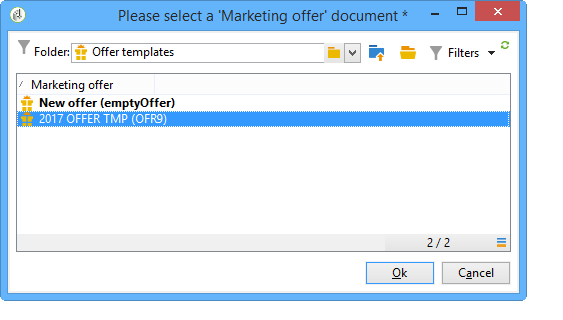

# 管理优惠模板{#managing-offer-templates}

Adobe Campaign中提供了现成的选件模板。 您可以在创建选件、复制选件或调整其配置以满足您的需求之后使用它们。 您还可以创建自己的模板。 模板选件存储在文件夹中 **资源** > **模板** > **优惠模板**.

## 创建优惠模板 {#creating-an-offer-template}

要创建模板选件，请执行以下步骤：

1. 转到 **资源** > **模板** > **优惠模板**.
1. 单击 **新** 图标。

   

1. 通过应用与常规选件相同的流程来配置模板，然后单击以保存该模板 **保存**.

## 复制现有模板 {#duplicate-an-existing-template}

要复制选件模板（无论是否为现成），请执行以下步骤：

1. 转到 **资源>模板>优惠模板**.
1. 使用鼠标，右键单击要复制的模板并选择 **复制** 下拉菜单中。

   

1. 如有必要，请配置您希望显示在模板中的设置，然后单击以保存模板 **保存**.

现在，创建选件时将提供此模板。

