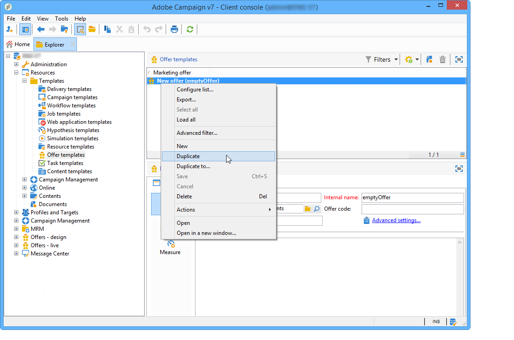

# 管理优惠模板{#managing-offer-templates}

Adobe Campaign中提供了现成的选件模板。 您可以在创建选件、复制选件或调整其配置以满足您的需求之后使用它们。 您还可以创建自己的模板。 模板选件存储在文件夹&#x200B;**资源** > **模板** > **选件模板**&#x200B;中。

## 创建优惠模板 {#creating-an-offer-template}

要创建模板选件，请执行以下步骤：

1. 转到&#x200B;**资源** > **模板** > **优惠模板**。
1. 单击&#x200B;**新建**&#x200B;图标。

   

1. 通过应用与普通选件相同的流程来配置模板，然后单击&#x200B;**保存**&#x200B;以保存模板。

## 复制现有模板 {#duplicate-an-existing-template}

要复制选件模板（无论是否为现成可用的），请执行以下步骤：

1. 转到&#x200B;**资源>模板>选件模板**。
1. 使用鼠标右键单击要复制的模板，然后从下拉菜单中选择&#x200B;**复制**。

   

1. 如有必要，请配置您希望该模板中显示的设置，然后单击&#x200B;**保存**&#x200B;保存该模板。

现在，创建选件时将提供此模板。

