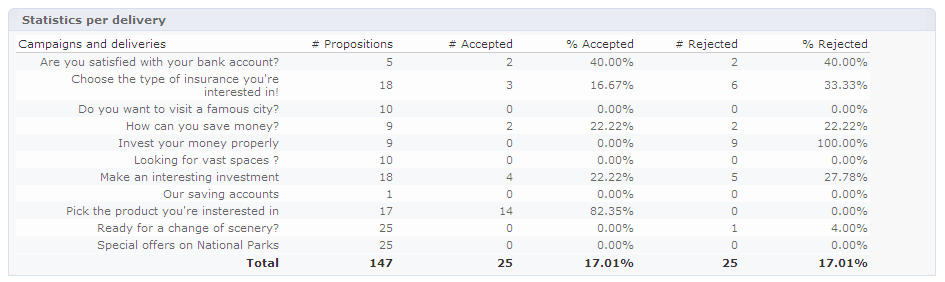

# 产品建议分析报告{#offer-analysis-report}

**[!UICONTROL Offer analysis]**&#x200B;报告提供了已接受或已拒绝建议数量的概览。

>[!NOTE]
>
>此功能仅在线可见，并且仅对投放管理器可见。

统计信息基于三个标准排序：

* 按日期：

  

* 按空间：

  

* 按投放：

  

可基于报表上半部分提供的各种标准筛选数据。 选择所需的标准后，单击&#x200B;**[!UICONTROL Refresh]**&#x200B;链接以将其应用于报表。

