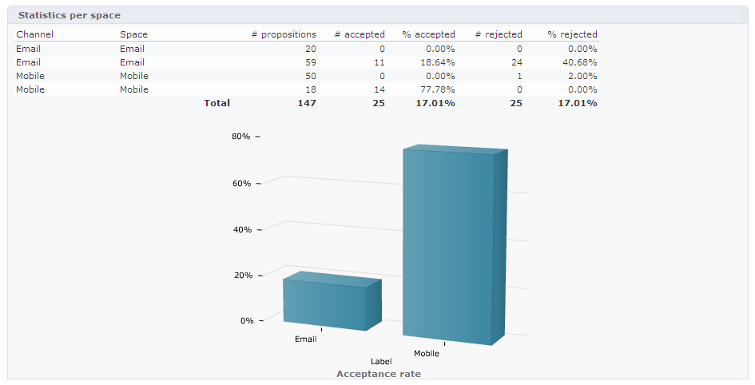

# 优惠分析报告{#offer-analysis-report}

的 **[!UICONTROL Offer analysis]** 报表为您提供已接受或已拒绝建议的数量的概述。

>[!NOTE]
>
>此功能仅在线可见，且仅对投放管理器可见。

统计信息按以下三个条件排序：

* 按日期：

   

* 按空格：

   

* 按投放：

   

数据可以根据报表上半部分提供的各种条件进行过滤。 选择所需的标准后，单击 **[!UICONTROL Refresh]** 链接，以将其应用到报表。

