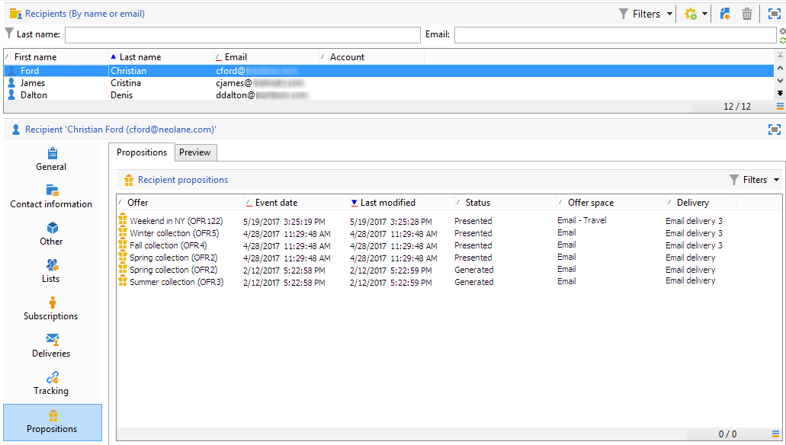

# 优惠建议历史{#offer-proposition-history}

创建优惠建议后，即可视图演示文稿历史记录。

>[!NOTE]
>
>此功能仅在线显示，且仅对投放管理器可见。

* 在优惠级别的&#x200B;**[!UICONTROL Edit]**&#x200B;选项卡中，单击&#x200B;**[!UICONTROL Propositions]**。

   

* 在收件人的用户档案中，单击&#x200B;**[!UICONTROL Propositions]**&#x200B;选项卡。

   

* 在优惠空间级别，单击&#x200B;**[!UICONTROL Propositions]**&#x200B;选项卡。

   

