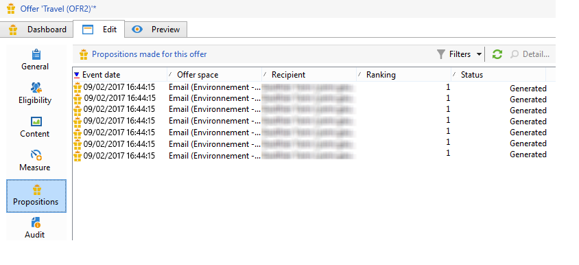
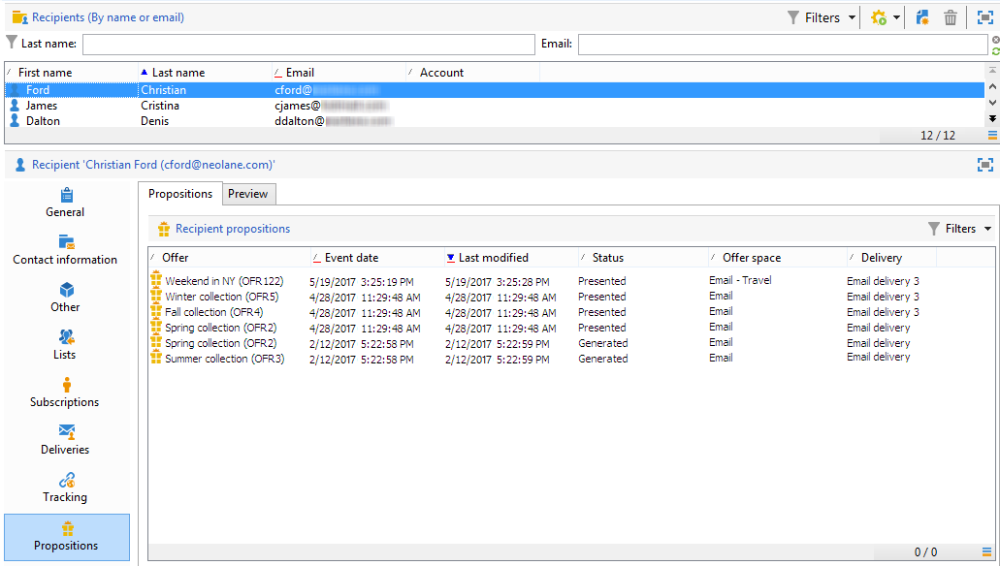

# 产品建议提议历史{#offer-proposition-history}

提出优惠建议后，即可查看演示文稿历史记录。

>[!NOTE]
>
>此功能仅在线可见，并且仅对投放管理器可见。

* 在选件级别的&#x200B;**[!UICONTROL Edit]**&#x200B;选项卡中，单击&#x200B;**[!UICONTROL Propositions]**。

  

* 在收件人的配置文件中，单击&#x200B;**[!UICONTROL Propositions]**&#x200B;选项卡。

  

* 在选件空间级别，单击&#x200B;**[!UICONTROL Propositions]**&#x200B;选项卡。

  
