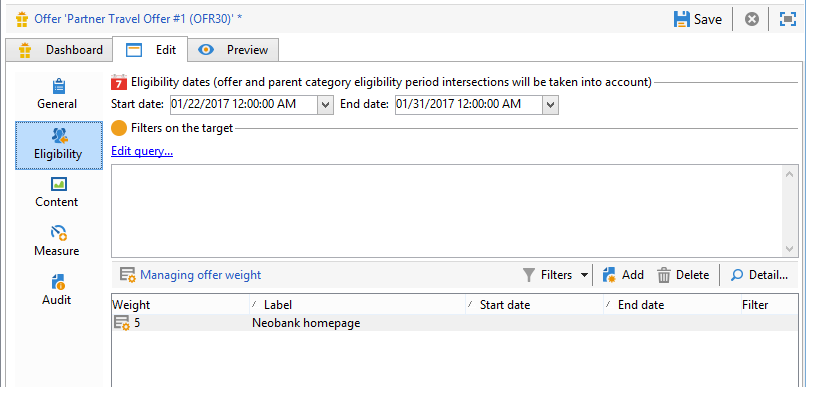
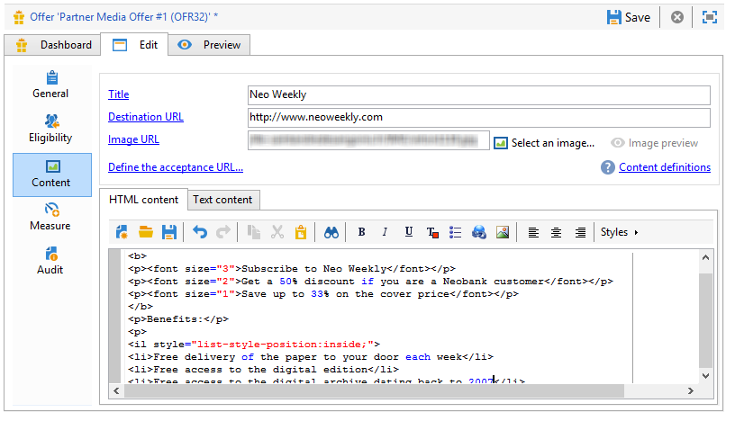

# 入站渠道优惠{#offers-on-an-inbound-channel}

## 向匿名访客{#presenting-an-offer-to-an-anonymous-visitor}演示优惠

Neobank网站希望在其网站上显示一个优惠，目标是浏览页面的身份不明的访客。

要设置此交互，我们将：

1. [创建匿名环境](#creating-an-anonymous-environment)
1. [创建匿名优惠空间](#creating-anonymous-offer-spaces)
1. [创建优惠类别和主题](#creating-an-offer-category-and-a-theme)
1. [创建匿名优惠。](#creating-anonymous-offers)
1. [在网站上配置Web优惠空间](#configure-the-web-offer-space-on-the-website)

### 创建匿名环境{#creating-an-anonymous-environment}

按照[创建优惠环境](../../interaction/using/live-design-environments.md#creating-an-offer-environment)中详细的步骤，根据&#x200B;**访客**&#x200B;的维度创建匿名环境。

您将获得一个包含新环境的树结构：


### 创建匿名优惠空间{#creating-anonymous-offer-spaces}

1. 在您的匿名环境(**访客**)中，转到&#x200B;**[!UICONTROL Administration]** > **[!UICONTROL Spaces]**&#x200B;节点。
1. 单击&#x200B;**[!UICONTROL New]**&#x200B;以创建呼叫渠道。

   

   >[!NOTE]
   >
   >该空间会自动链接到匿名环境。

1. 更改标签并选择&#x200B;**[!UICONTROL Inbound Web]**&#x200B;渠道。 您还必须选中&#x200B;**[!UICONTROL Enable unitary mode]**&#x200B;框。

   

1. 选择用于空间的优惠内容字段，并选中相关框以根据需要指定它们。

   这样，任何缺少以下元素之一的优惠将不能获得此空间：

   * 标题
   * HTML内容
   * 图像URL
   * 目标URL

   

1. 编辑HTML渲染函数，例如：

   ```
   function (imageUrl, targetUrl, shortContent, htmlSource){
         var html = "<p><b>" + shortContent + "</b></p>";
         html += "<p>" + htmlSource + "</p>";
         html += "<a _urlType='11' href='" + targetUrl + "'></a>";
         return html;
       }   
   ```

   >[!IMPORTANT]
   >
   >渲染函数必须按照之前选择的顺序命名用于空间的字段，以便正确显示优惠。

   

1. 保存优惠空间。

### 创建优惠类别和主题{#creating-an-offer-category-and-a-theme}

1. 转到刚刚创建的环境中的&#x200B;**[!UICONTROL Offer catalog]**&#x200B;节点。
1. 右键单击&#x200B;**[!UICONTROL Offer catalog]**&#x200B;节点，然后选择&#x200B;**[!UICONTROL Create a new 'Offer category' folder]**。

   将新类别命名为&#x200B;**Financial products**。

1. 转到类别的&#x200B;**[!UICONTROL Eligibility]**&#x200B;选项卡，并输入&#x200B;**financing**&#x200B;作为主题，然后保存更改。

   

### 创建匿名优惠{#creating-anonymous-offers}

1. 转到刚刚创建的类别。
1. 单击 **[!UICONTROL New]**.

   

1. 选择现成的匿名优惠模板或先前创建的模板。

   

1. 更改标签并保存优惠。

   

1. 转到&#x200B;**[!UICONTROL Eligibility]**&#x200B;选项卡，并根据优惠的上下文指定权重。

   在此示例中，优惠配置为在站点的主页上显示为优先级，直到年底。

   

1. 转到&#x200B;**[!UICONTROL Content]**&#x200B;选项卡并定义优惠的内容。

   >[!NOTE]
   >
   >可选择&#x200B;**[!UICONTROL Content definitions]**&#x200B;以显示Web空间所需元素的列表。

   

1. 创建第二个优惠。

   

1. 转到&#x200B;**[!UICONTROL Eligibility]**&#x200B;选项卡并应用与第一个权重相同的优惠。
1. 为每个优惠运行批准周期，以便在线环境中提供这些优惠空间及其批准的。

### 在网站{#configure-the-web-offer-space-on-the-website}上配置Web优惠空间

要使您刚配置的优惠在网站上可见，请将JavaScript代码插入站点的HTML页面以调用交互引擎(有关详细信息，请参阅[关于入站渠道](../../interaction/using/about-inbound-channels.md))。

1. 转到HTML页并插入@id属性，其值与之前创建的匿名优惠空间的内部名称相匹配(请参阅[创建匿名优惠空间](#creating-anonymous-offer-spaces))，前面有&#x200B;**i_**。

   

1. 插入呼叫URL。

   

   上面的蓝色URL框与实例名称、环境的内部名称(参阅[创建匿名环境](#creating-an-anonymous-environment))和链接到类别的主题([创建优惠类别和主题](#creating-an-offer-category-and-a-theme))相对应。 后者是可选的。

当访客访问网站的主页时，具有&#x200B;**financing**&#x200B;主题的优惠将按HTML页面上的配置显示。


多次访问页面的用户将在类别中看到一个或其他优惠，因为他们都被分配了相同的权重。

## 在未确认联系人{#switching-to-an-anonymous-environment-in-case-of-unidentified-contacts}时切换为匿名环境

Neobank公司希望为两个不同的目标创建营销优惠。 它希望为其匿名网站浏览器显示通用优惠。 如果这些用户中的一个是Neobank提供的标识符的客户，公司希望他们一登录就收到个性化的优惠。

此案例研究基于以下情形：

1. 访客无需登录即可浏览Neobank网站。

   

   页面上会显示三个匿名优惠:Neobank产品有两个&#x200B;**最佳优惠**&#x200B;优惠,Neobank合作伙伴有一个优惠。

   

1. Neobank客户用其凭据登录。

   

   展示了三个个性化优惠。

   

要实施此案例研究，您需要具有两个优惠环境:一个用于匿名交互，一个用于优惠，专门针对已识别的联系人进行配置。 标识的优惠环境将配置为在联系人未登录且因此未标识时自动切换到匿名优惠环境。

应用以下步骤：

* 使用以下步骤创建特定于匿名入站交互的优惠目录：

   1. [为匿名联系人创建环境](#creating-an-environment-for-anonymous-contacts)
   1. [为匿名优惠空间配置环境](#configuring-offer-spaces-for-the-anonymous-environment)
   1. [在匿名优惠中创建类别环境](#creating-offer-categories-in-an-anonymous-environment)
   1. [为匿名优惠创建访客](#creating-offers-for-anonymous-visitors)

* 使用以下步骤创建特定于已识别入站交互的优惠目录：

   1. [在标识的优惠空间中配置环境](#configure-the-offer-spaces-in-the-identified-environment)
   1. [在已识别的优惠中创建类别环境](#creating-offer-categories-in-an-identified-environment)
   1. [创建个性化优惠](#creating-personalized-offers)

* 配置对优惠引擎的调用：

   1. [在网页上配置优惠空间](#configuring-offer-spaces-on-the-web-page)
   1. [指定已标识优惠空间的高级设置](#specifying-the-advanced-settings-of-the-identified-offer-spaces)

### 为匿名联系人{#creating-an-environment-for-anonymous-contacts}创建环境

1. 通过投放映射向导(**访客**&#x200B;映射)为匿名入站交互创建优惠环境。 有关详细信息，请参阅[创建优惠环境](../../interaction/using/live-design-environments.md#creating-an-offer-environment)。

   

### 配置匿名环境{#configuring-offer-spaces-for-the-anonymous-environment}的优惠空间

网站上必须显示的优惠属于两个不同的类别:**最佳优惠**&#x200B;和&#x200B;**合作伙伴**。 在此示例中，我们将为每个类别创建一个特定优惠空间。

要创建与&#x200B;**最佳优惠空间**&#x200B;类别匹配的优惠，请应用以下过程：

1. 在Adobe Campaign树中，转到刚刚创建的匿名环境并添加优惠空间。

   

1. 新建一个&#x200B;**[!UICONTROL Inbound web]**&#x200B;类型空间。

   

1. 输入标签：例如&#x200B;**Web最佳匿名优惠**。
1. 添加用于此优惠的优惠空间内容字段并配置渲染功能。

   

   >[!IMPORTANT]
   >
   >渲染函数必须按照之前选择的顺序命名用于空间的字段，以便正确显示优惠。

1. 使用相同的进程创建入站Web渠道优惠空间，以匹配&#x200B;**Partner**&#x200B;类别。

   

### 在匿名环境{#creating-offer-categories-in-an-anonymous-environment}中创建优惠类别

开始：创建两个优惠类别:**最佳优惠**&#x200B;类别和&#x200B;**合作伙伴**&#x200B;类别。 每个类别将包含两个匿名联系人优惠。

1. 转到您刚刚创建的匿名环境中的&#x200B;**[!UICONTROL Offer catalog]**。
1. 添加一个&#x200B;**[!UICONTROL Offer category]**&#x200B;文件夹，其中&#x200B;**最佳优惠**&#x200B;为标签。

   

1. 创建第二个类别，将&#x200B;**Partner**&#x200B;用作标签。

   

### 为匿名访客{#creating-offers-for-anonymous-visitors}创建优惠

现在，我们将在上面创建的每个类别中创建两个优惠。

1. 转到&#x200B;**最佳优惠**&#x200B;类别并创建匿名优惠。

   

1. 转到&#x200B;**[!UICONTROL Eligibility]**&#x200B;选项卡，并根据优惠的上下文指定权重。

   

1. 转到&#x200B;**[!UICONTROL Content]**&#x200B;选项卡并定义优惠的内容。

   

1. 在&#x200B;**最佳优惠**&#x200B;类别中创建第二个优惠。

   

1. 转到&#x200B;**Partner**&#x200B;类别并创建匿名优惠。
1. 转到&#x200B;**[!UICONTROL Content]**&#x200B;选项卡并定义优惠的内容。

   

1. 转到&#x200B;**[!UICONTROL Eligibility]**&#x200B;选项卡，并根据优惠的上下文指定权重。

   

1. 为&#x200B;**Partner**&#x200B;优惠创建第二个类别。

   

1. 转到&#x200B;**[!UICONTROL Eligibility]**&#x200B;选项卡并应用您应用到此类别中第一个权重的同一优惠，以便在网站上连续显示这些优惠。

   

1. 运行每个优惠的审批周期，开始使其生效。 批准内容时，请根据优惠激活&#x200B;**Partner**&#x200B;或&#x200B;**最佳优惠**&#x200B;优惠空间。

### 在标识的环境{#configure-the-offer-spaces-in-the-identified-environment}中配置优惠空间

您将在网站上展示的优惠来自两个不同的类别:**最佳优惠**&#x200B;和&#x200B;**合作伙伴**。 在此示例中，我们要为每个类别创建一个特定空间。

要创建两个优惠空间，请应用与匿名优惠空间相同的过程。 请参阅[配置匿名环境的优惠空间](#configuring-offer-spaces-for-the-anonymous-environment)。

1. 在Adobe Campaign树中，转到您刚刚创建的环境并添加&#x200B;**最佳优惠**&#x200B;和&#x200B;**合作伙伴**&#x200B;优惠空间。
1. 应用[配置匿名环境](#configuring-offer-spaces-for-the-anonymous-environment)的优惠空间中详述的过程。

   

1. 选择&#x200B;**[!UICONTROL Fall back on an anonymous environment if no individuals were identified]**&#x200B;选项。

   

1. 使用下拉列表，选择之前创建的匿名Web优惠空间(请参阅[为匿名环境](#configuring-offer-spaces-for-the-anonymous-environment)配置优惠空间)。

   

### 指定已标识优惠空间{#specifying-the-advanced-settings-of-the-identified-offer-spaces}的高级设置

在此示例中，联系人标识由于Adobe Campaign数据库中的电子邮件地址而发生。 要将收件人电子邮件添加到空间，请应用以下过程：

1. 在标识的环境中，转到优惠空间文件夹。
1. 选择&#x200B;**最佳优惠**&#x200B;优惠空间，然后单击&#x200B;**[!UICONTROL Advanced parameters]**。

   

1. 在 **[!UICONTROL Target identification]** 选项卡中，单击 **[!UICONTROL Add]**。

   

1. 单击&#x200B;**[!UICONTROL Edit expression]**，转到收件人表并选择&#x200B;**[!UICONTROL Email]**&#x200B;字段。

   

1. 单击&#x200B;**[!UICONTROL OK]**&#x200B;关闭&#x200B;**[!UICONTROL Advanced parameters]**&#x200B;窗口并完成&#x200B;**最佳优惠**&#x200B;优惠空间的配置。
1. 对&#x200B;**Partner**&#x200B;优惠空间应用相同的进程。

   

### 在标识的环境{#creating-offer-categories-in-an-identified-environment}中创建优惠类别

我们将创建两个单独的类别:**最佳优惠**&#x200B;类别和&#x200B;**合作伙伴**&#x200B;类别，每个都有两个个性化优惠。

1. 转到已标识环境中的&#x200B;**[!UICONTROL Offer catalogs]**&#x200B;节点。
1. 与在匿名环境中一样，添加两个&#x200B;**[!UICONTROL Offer category]**&#x200B;文件夹，其中&#x200B;**最佳优惠**&#x200B;和&#x200B;**合作伙伴**&#x200B;为标签。

   

### 创建个性化优惠{#creating-personalized-offers}

我们希望为每个类别创建两个个性化优惠，即四个优惠。

1. 转到&#x200B;**最佳优惠**&#x200B;类别并创建第一个个性化优惠。

   

1. 转到&#x200B;**[!UICONTROL Eligibility]**&#x200B;选项卡，并根据优惠的上下文指定权重。

   

1. 转到&#x200B;**[!UICONTROL Content]**&#x200B;选项卡并定义优惠的内容。

   

1. 在&#x200B;**最佳优惠**&#x200B;类别中创建第二个优惠。

   

1. 转到&#x200B;**合作伙伴**&#x200B;类别并创建个性化优惠。

   

1. 转到&#x200B;**[!UICONTROL Eligibility]**&#x200B;选项卡，并根据优惠的上下文指定权重。

   

1. 为&#x200B;**Partner**&#x200B;优惠创建第二个类别。

   

1. 转到&#x200B;**[!UICONTROL Eligibility]**&#x200B;选项卡并应用您应用到此类别中第一个权重的同一优惠，以便在网站上连续显示这些优惠。
1. 运行每个优惠的审批周期以开始更新它们。 在内容批准过程中，激活&#x200B;**Partner**&#x200B;或&#x200B;**最佳优惠**&#x200B;优惠空间。

### 在网页{#configuring-offer-spaces-on-the-web-page}上配置优惠空间

Neobank公司的网站有三个优惠空间：两个用于&#x200B;**最佳优惠**&#x200B;类别的银行相关优惠，一个用于&#x200B;**合作伙伴**&#x200B;类别的优惠。


要在网站的HTML页面上配置这些优惠空间，请应用以下过程：

1. 在HTML页面的内容中，插入三个

   元素具有@id属性，其值将允许我们在网站的各个优惠空间中调用优惠。

   

1. 然后插入用于定义属性值的脚本。

   

   在此示例中，**ContBO1**&#x200B;和&#x200B;**ContBO2**&#x200B;接收值&#x200B;**OsWebBestOfferIntified**，即之前在标识的环境中创建的&#x200B;**最佳优惠**&#x200B;优惠空间的内部名称…… **CatBestOffer**&#x200B;和&#x200B;**CatBestOfferAnonym**&#x200B;值与&#x200B;**最佳优惠**&#x200B;类别的内部名称匹配，用于匿名和已识别环境。

   

   同样，**ContPtn**&#x200B;接收&#x200B;**OSWebPartnerIndifed**&#x200B;值，该值与在标识的环境中创建的&#x200B;**Partner**&#x200B;优惠空间的内部名称相匹配。 **CatPartner** 和CatPartnerAnonym **** 匹配匿名和已识别环境 **** 的Partnercategories的内部名称。

   

1. 为&#x200B;**interactionTarget**&#x200B;变量指定让您能够识别登录到Neobank站点的人员的信息。

   

   人的标识可以基于浏览器cookie、URL、电子邮件或人的标识符中的读取参数。 如果使用了除主键之外的收件人表字段，则需要在空间的高级参数中定义该字段(请参阅[指定所标识优惠空间的高级设置](#specifying-the-advanced-settings-of-the-identified-offer-spaces))。

1. 插入呼叫URL。

   

   该URL包含&#x200B;**EnvNebankRecip**，标识环境的内部名称。

打开网页时；脚本允许您调用交互引擎，以在网页的相关空间中显示优惠的内容。 在对Adobe Campaign服务器的一次调用中，引擎确定要选择的环境、优惠空间和类别。

在此示例中，引擎识别标识的环境(**EnvNebankIdnRecip**)。 它标识网页上第一和第二优惠空间的优惠空间(**OSWebBestOfferIntified**)和&#x200B;**最佳优惠**&#x200B;类别(**CatBestOffer**)，以及(**OSWebPartnerIndified**)优惠空间和站点上第三个优惠空间的&#x200B;**Partner**&#x200B;类别(**CatPartner**)。

如果引擎无法识别收件人，则它会切换到已识别优惠空间中引用的匿名优惠空间，并切换到脚本中指定的匿名类别（**CatPartner**&#x200B;和&#x200B;**CatPartnerAnonym**）。
