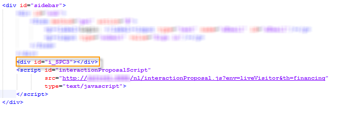
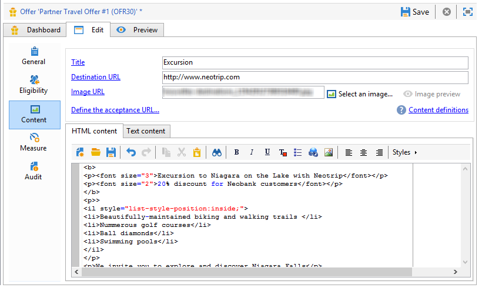

# 入站渠道优惠{#offers-on-an-inbound-channel}


## 向匿名访客展示优惠 {#presenting-an-offer-to-an-anonymous-visitor}

Neobank网站希望在其网站上显示选件，以定向浏览页面的未识别访客。

要设置此交互，我们将：

1. [创建匿名环境](#creating-an-anonymous-environment)
1. [创建匿名优惠空间](#creating-anonymous-offer-spaces)
1. [创建优惠类别和主题](#creating-an-offer-category-and-a-theme)
1. [创建匿名优惠。](#creating-anonymous-offers)
1. [在网站上配置Web选件空间](#configure-the-web-offer-space-on-the-website)

### 创建匿名环境 {#creating-an-anonymous-environment}

按照[创建优惠环境](../../interaction/using/live-design-environments.md#creating-an-offer-environment)中详述的过程创建基于&#x200B;**访客**&#39;维度的匿名环境。

您将获得一个包含新环境的树结构：


### 创建匿名优惠空间 {#creating-anonymous-offer-spaces}

1. 在匿名环境中（**访客**）转到&#x200B;**[!UICONTROL Administration]** > **[!UICONTROL Spaces]**&#x200B;节点。
1. 单击&#x200B;**[!UICONTROL New]**&#x200B;以创建呼叫渠道。

   

   >[!NOTE]
   >
   >空间会自动链接到匿名环境。

1. 更改标签并选择&#x200B;**[!UICONTROL Inbound Web]**&#x200B;渠道。 您还必须选中&#x200B;**[!UICONTROL Enable unitary mode]**&#x200B;框。

   

1. 选择用于空间的选件内容字段，并通过选中相关框根据需要指定这些字段。

   这样，任何缺少以下元素之一的选件都将不符合此空间的条件：

   * 标题
   * HTML 内容
   * 图像 URL
   * 目标 URL

   

1. 编辑HTML渲染函数，例如，如下所示：

   ```
   function (imageUrl, targetUrl, shortContent, htmlSource){
         var html = "<p><b>" + shortContent + "</b></p>";
         html += "<p>" + htmlSource + "</p>";
         html += "<a _urlType='11' href='" + targetUrl + "'></a>";
         return html;
       }   
   ```

   >[!IMPORTANT]
   >
   >渲染函数必须按照之前选择的顺序命名用于空间的字段，以便正确显示选件。

   

1. 保存优惠空间。

### 创建优惠类别和主题 {#creating-an-offer-category-and-a-theme}

1. 转到刚刚创建的环境中的&#x200B;**[!UICONTROL Offer catalog]**&#x200B;节点。
1. 右键单击&#x200B;**[!UICONTROL Offer catalog]**&#x200B;节点并选择&#x200B;**[!UICONTROL Create a new 'Offer category' folder]**。

   为新类别命名&#x200B;**金融产品**。

1. 转到类别的&#x200B;**[!UICONTROL Eligibility]**&#x200B;选项卡并输入&#x200B;**融资**&#x200B;作为主题，然后保存更改。

   

### 创建匿名优惠 {#creating-anonymous-offers}

1. 转到您刚刚创建的类别。
1. 单击 **[!UICONTROL New]**。

   

1. 选择现成的匿名优惠模板或之前创建的模板。

   

1. 更改标签并保存选件。

   

1. 转到&#x200B;**[!UICONTROL Eligibility]**&#x200B;选项卡，并根据其应用程序上下文指定优惠的权重。

   在本例中，选件配置为在年底之前优先显示在站点的主页上。

   

1. 转到&#x200B;**[!UICONTROL Content]**&#x200B;选项卡并定义选件的内容。

   >[!NOTE]
   >
   >您可以选择&#x200B;**[!UICONTROL Content definitions]**&#x200B;以显示Web空间所需的元素列表。

   

1. 创建第二个选件。

   

1. 转到&#x200B;**[!UICONTROL Eligibility]**&#x200B;选项卡并应用与第一个选件相同的权重。
1. 运行每个选件的批准周期，以便在在线环境中提供这些选件及其批准的选件空间。

### 在网站上配置Web选件空间 {#configure-the-web-offer-space-on-the-website}

要使您刚刚配置的选件在网站上可见，请在网站的HTML页面中插入JavaScript代码以调用交互引擎（有关更多信息，请参阅[关于入站渠道](../../interaction/using/about-inbound-channels.md)）。

1. 转到HTML页面并插入一个@id属性，该属性的值与以前创建的匿名优惠空间的内部名称匹配（请参阅[创建匿名优惠空间](#creating-anonymous-offer-spaces)），前面有&#x200B;**i_**。

   

1. 插入调用URL。

   

   上面的蓝色URL框对应于实例名称、环境的内部名称（请参阅[创建匿名环境](#creating-an-anonymous-environment)）以及链接到类别的主题（[创建优惠类别和主题](#creating-an-offer-category-and-a-theme)）。 后者是可选的。

当访客访问网站的主页时，带有&#x200B;**融资**&#x200B;主题的选件将按HTML页面上的配置显示。


多次访问页面的用户将看到类别中的一个选件或其他选件，因为它们都被分配了相同的权重。

## 在无法识别联系人的情况下切换到匿名环境 {#switching-to-an-anonymous-environment-in-case-of-unidentified-contacts}

Neobank公司希望为两个不同的目标创建营销选件。 它希望为其匿名网站浏览器显示通用选件。 如果其中一位用户是具有Neobank提供的标识符的客户，公司希望他们在登录后立即收到个性化优惠。

此案例研究基于以下情景：

1. 访客无需登录即可浏览Neobank网站。

   

   页面上显示了三个匿名选件：两个用于Neobank产品的&#x200B;**最佳选件**&#x200B;选件和一个来自Neobank合作伙伴的选件。

   

1. 该用户是Neobank客户，使用其凭据登录。

   

   将显示三个个性化优惠。

   

要实施此案例研究，您需要具有两个选件环境：一个用于匿名交互，另一个具有专门为已识别联系人配置的选件。 如果联系人未登录并因此未被识别，则识别的选件环境将配置为自动切换到匿名选件环境。

应用以下步骤：

* 使用以下步骤创建特定于匿名入站交互的优惠目录：

   1. [为匿名联系人创建环境](#creating-an-environment-for-anonymous-contacts)
   1. [为匿名环境配置优惠空间](#configuring-offer-spaces-for-the-anonymous-environment)
   1. [在匿名环境中创建优惠类别](#creating-offer-categories-in-an-anonymous-environment)
   1. [创建匿名访客优惠](#creating-offers-for-anonymous-visitors)

* 使用以下步骤创建特定于已识别集客交互的优惠目录：

   1. [在标识的环境中配置优惠空间](#configure-the-offer-spaces-in-the-identified-environment)
   1. [在已识别的环境中创建优惠类别](#creating-offer-categories-in-an-identified-environment)
   1. [创建个性化优惠](#creating-personalized-offers)

* 配置对优惠引擎的调用：

   1. [在网页上配置优惠空间](#configuring-offer-spaces-on-the-web-page)
   1. [指定已标识的选件空间的高级设置](#specifying-the-advanced-settings-of-the-identified-offer-spaces)

### 为匿名联系人创建环境 {#creating-an-environment-for-anonymous-contacts}

1. 通过投放映射向导（**访客**&#x200B;映射）为匿名入站交互创建优惠环境。 有关详细信息，请参阅[创建优惠环境](../../interaction/using/live-design-environments.md#creating-an-offer-environment)。

   

### 为匿名环境配置优惠空间 {#configuring-offer-spaces-for-the-anonymous-environment}

网站上必须呈现的选件属于两个不同的类别： **最佳选件**&#x200B;和&#x200B;**合作伙伴**。 在本例中，我们将为每个类别创建特定的优惠空间。

要创建优惠空间以匹配&#x200B;**最佳优惠**&#x200B;类别，请应用以下流程：

1. 在Adobe Campaign树中，转到您刚刚创建的匿名环境并添加优惠空间。

   

1. 创建新的&#x200B;**[!UICONTROL Inbound web]**&#x200B;类型空间。

   

1. 为它输入一个标签： **Web最佳匿名优惠**&#x200B;用于实例。
1. 添加用于此选件空间的选件内容字段并配置渲染函数。

   

   >[!IMPORTANT]
   >
   >渲染函数必须按照之前选择的顺序命名用于空间的字段，以便正确显示选件。

1. 使用同一进程创建入站Web渠道优惠空间以匹配&#x200B;**合作伙伴**&#x200B;类别。

   

### 在匿名环境中创建优惠类别 {#creating-offer-categories-in-an-anonymous-environment}

首先，创建两个优惠类别：**最佳优惠**&#x200B;类别和&#x200B;**合作伙伴**&#x200B;类别。 每个类别将包含两个匿名联系人的选件。

1. 转到刚刚创建的匿名环境中的&#x200B;**[!UICONTROL Offer catalog]**。
1. 添加具有&#x200B;**最佳选件**&#x200B;的&#x200B;**[!UICONTROL Offer category]**&#x200B;文件夹作为标签。

   

1. 创建第二个类别，并将&#x200B;**合作伙伴**&#x200B;作为标签。

   

### 创建匿名访客优惠 {#creating-offers-for-anonymous-visitors}

现在，我们将在上面创建的每个类别中创建两个选件。

1. 转到&#x200B;**最佳优惠**&#x200B;类别并创建匿名优惠。

   

1. 转到&#x200B;**[!UICONTROL Eligibility]**&#x200B;选项卡，并根据其应用程序上下文指定优惠的权重。

   

1. 转到&#x200B;**[!UICONTROL Content]**&#x200B;选项卡并定义选件的内容。

   

1. 在&#x200B;**最佳优惠**&#x200B;类别中创建第二个优惠。

   

1. 转到&#x200B;**合作伙伴**&#x200B;类别并创建匿名优惠。
1. 转到&#x200B;**[!UICONTROL Content]**&#x200B;选项卡并定义选件的内容。

   

1. 转到&#x200B;**[!UICONTROL Eligibility]**&#x200B;选项卡，并根据其应用程序上下文指定优惠的权重。

   

1. 为&#x200B;**合作伙伴**&#x200B;类别创建第二个选件。

   

1. 转到&#x200B;**[!UICONTROL Eligibility]**&#x200B;选项卡，应用与应用于此类别中第一个选件的权重相同的权重，以便这些选件在网站上连续显示。

   

1. 运行每个选件的批准周期以开始使其上线。 批准内容时，根据优惠激活&#x200B;**合作伙伴**&#x200B;或&#x200B;**最佳优惠**&#x200B;优惠空间。

### 在标识的环境中配置优惠空间 {#configure-the-offer-spaces-in-the-identified-environment}

您将在网站上展示的选件来自两个不同的类别：**最佳选件**&#x200B;和&#x200B;**合作伙伴**。 在本例中，我们希望为每个类别创建一个特定的空间。

要创建两个优惠空间，请应用与匿名优惠空间相同的过程。 请参阅[为匿名环境配置优惠空间](#configuring-offer-spaces-for-the-anonymous-environment)。

1. 在Adobe Campaign树中，转到您刚刚创建的环境，并添加&#x200B;**最佳选件**&#x200B;和&#x200B;**合作伙伴**&#x200B;选件空间。
1. 应用[为匿名环境配置优惠空间](#configuring-offer-spaces-for-the-anonymous-environment)中详述的进程。

   

1. 选择&#x200B;**[!UICONTROL Fall back on an anonymous environment if no individuals were identified]**&#x200B;选项。

   

1. 使用下拉列表，选择之前创建的匿名Web优惠空间（请参阅[为匿名环境配置优惠空间](#configuring-offer-spaces-for-the-anonymous-environment)）。

   

### 指定已标识的选件空间的高级设置 {#specifying-the-advanced-settings-of-the-identified-offer-spaces}

在此示例中，联系人识别是根据Adobe Campaign数据库中的电子邮件地址进行的。 要将收件人电子邮件添加到空间，请应用以下流程：

1. 在已识别的环境中，转到选件空间文件夹。
1. 选择&#x200B;**最佳选件**&#x200B;选件空间，然后单击&#x200B;**[!UICONTROL Advanced parameters]**。

   

1. 在 **[!UICONTROL Target identification]** 选项卡中，单击 **[!UICONTROL Add]**。

   

1. 单击&#x200B;**[!UICONTROL Edit expression]**，转到收件人表并选择&#x200B;**[!UICONTROL Email]**&#x200B;字段。

   

1. 单击&#x200B;**[!UICONTROL OK]**&#x200B;以关闭&#x200B;**[!UICONTROL Advanced parameters]**&#x200B;窗口并完成配置&#x200B;**最佳选件**&#x200B;选件空间。
1. 对&#x200B;**合作伙伴**&#x200B;优惠空间应用相同的进程。

   

### 在已识别的环境中创建优惠类别 {#creating-offer-categories-in-an-identified-environment}

我们将创建两个单独的类别：**最佳优惠**&#x200B;类别和&#x200B;**合作伙伴**&#x200B;类别，每个类别具有两个个性化优惠。

1. 转到已识别环境中的&#x200B;**[!UICONTROL Offer catalogs]**&#x200B;节点。
1. 与匿名环境中一样，添加两个包含&#x200B;**最佳选件**&#x200B;和&#x200B;**合作伙伴**&#x200B;的&#x200B;**[!UICONTROL Offer category]**&#x200B;文件夹作为标签。

   

### 创建个性化优惠 {#creating-personalized-offers}

我们希望为每个类别创建两个个性化选件，即四个选件。

1. 转到&#x200B;**最佳优惠**&#x200B;类别并创建第一个个性化优惠。

   

1. 转到&#x200B;**[!UICONTROL Eligibility]**&#x200B;选项卡，并根据其应用程序上下文指定优惠的权重。

   

1. 转到&#x200B;**[!UICONTROL Content]**&#x200B;选项卡并定义选件的内容。

   

1. 在&#x200B;**最佳优惠**&#x200B;类别中创建第二个优惠。

   

1. 转到&#x200B;**合作伙伴**&#x200B;类别并创建个性化优惠。

   

1. 转到&#x200B;**[!UICONTROL Eligibility]**&#x200B;选项卡，并根据其应用程序上下文指定优惠的权重。

   

1. 为&#x200B;**合作伙伴**&#x200B;类别创建第二个选件。

   

1. 转到&#x200B;**[!UICONTROL Eligibility]**&#x200B;选项卡，应用与应用于此类别中第一个选件的权重相同的权重，以便这些选件在网站上连续显示。
1. 运行每个优惠的审批周期以开始更新它们。 在内容审批期间，激活&#x200B;**合作伙伴**&#x200B;或&#x200B;**最佳优惠**&#x200B;优惠空间。

### 在网页上配置优惠空间 {#configuring-offer-spaces-on-the-web-page}

Neobank公司的网站有三个优惠空间：两个用于&#x200B;**最佳优惠**&#x200B;类别中与银行相关的优惠，另一个用于&#x200B;**合作伙伴**&#x200B;类别中的优惠。


要在网站的“HTML”页面上配置这些选件空间，请应用以下流程：

1. 在HTML页的内容中，插入三个

   具有@id属性的元素，其值允许我们在网站的各种选件空间中调用选件。

   

1. 然后插入用于定义属性值的脚本。

   

   在此示例中，**ContBO1**&#x200B;和&#x200B;**ContBO2**&#x200B;接收值&#x200B;**OsWebBestOfferIdentified**，即先前在已识别环境中创建的&#x200B;**最佳选件**&#x200B;选件空间的内部名称。 **CatBestOffer**&#x200B;和&#x200B;**CatBestOfferAnonym**&#x200B;值与匿名环境和已识别环境的&#x200B;**最佳优惠**&#x200B;类别的内部名称匹配。

   

   同样，**ContPtn**&#x200B;接收&#x200B;**OSWebPartnerIdentified**&#x200B;值，该值与在已识别环境中创建的&#x200B;**Partner**&#x200B;优惠空间的内部名称匹配。 **CatPartner**&#x200B;和&#x200B;**CatPartnerAnonym**&#x200B;与匿名环境和已识别环境的&#x200B;**Partner**&#x200B;类别的内部名称匹配。

   

1. 将可让您识别登录到Neobank网站的用户的信息分配给&#x200B;**interactionTarget**&#x200B;变量。

   

   人员的身份可以基于浏览器Cookie、URL中的阅读参数、电子邮件或人员的标识符。 如果使用主键以外的收件人表字段，则需要在空间的高级参数中定义该字段（请参阅[指定已识别优惠空间的高级设置](#specifying-the-advanced-settings-of-the-identified-offer-spaces)）。

1. 插入调用URL。

   

   URL包含&#x200B;**EnvNeobankRecip**，已识别环境的内部名称。

打开网页时，脚本允许您调用交互引擎，以在网页的相关空间中显示选件的内容。 在对Adobe Campaign服务器的单个调用中，引擎会确定环境、选件空间和要选择的类别。

在此示例中，引擎识别了已识别的环境(**EnvNeobankIdnRecip**)。 它标识了网页上第一个和第二个优惠空间的优惠空间(**OSWebBestOfferIdentified**)和&#x200B;**最佳优惠**&#x200B;类别(**CatBestOffer**)，以及网站上第三个优惠空间的(**OSWebPartnerIdentified**)优惠空间和&#x200B;**Partner**&#x200B;类别(**CatPartner**)。

如果引擎无法识别收件人，则它会切换到已识别优惠空间中引用的匿名优惠空间，并切换到脚本中指定的匿名类别（**CatPartner**&#x200B;和&#x200B;**CatPartnerAnonym**）。
