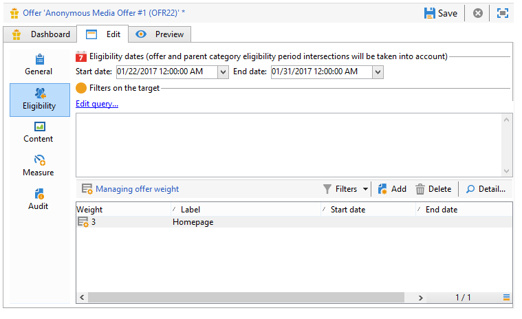

# 入站渠道优惠{#offers-on-an-inbound-channel}


## 向匿名访客展示优惠 {#presenting-an-offer-to-an-anonymous-visitor}

Neobank网站希望在其网站上显示一个选件，该选件针对的是浏览该页面的身份不明的访客。

要设置此互动，我们将：

1. [创建匿名环境](#creating-an-anonymous-environment)
1. [创建匿名选件空间](#creating-anonymous-offer-spaces)
1. [创建优惠类别和主题](#creating-an-offer-category-and-a-theme)
1. [创建匿名选件。](#creating-anonymous-offers)
1. [在网站上配置Web选件空间](#configure-the-web-offer-space-on-the-website)

### 创建匿名环境 {#creating-an-anonymous-environment}

按照 [创建优惠环境](../../interaction/using/live-design-environments.md#creating-an-offer-environment) 创建基于 **访客**“维度。

您将获得一个包含新环境的树结构：


### 创建匿名选件空间 {#creating-anonymous-offer-spaces}

1. 在您的匿名环境中(**访客**)转到 **[!UICONTROL Administration]** > **[!UICONTROL Spaces]** 节点。
1. 单击 **[!UICONTROL New]** 创建调用渠道。

   

   >[!NOTE]
   >
   >该空间会自动链接到匿名环境。

1. 更改标签并选择 **[!UICONTROL Inbound Web]** 渠道。 您还必须检查 **[!UICONTROL Enable unitary mode]** 框中。

   

1. 选择用于该空间的选件内容字段，并通过勾选相关框根据需要指定它们。

   这样，任何缺少以下元素之一的选件都将不符合此空间的条件：

   * 标题
   * HTML内容
   * 图像URL
   * 目标URL

   

1. 编辑HTML渲染函数，例如，如下所示：

   ```
   function (imageUrl, targetUrl, shortContent, htmlSource){
         var html = "<p><b>" + shortContent + "</b></p>";
         html += "<p>" + htmlSource + "</p>";
         html += "<a _urlType='11' href='" + targetUrl + "'></a>";
         return html;
       }   
   ```

   >[!IMPORTANT]
   >
   >渲染函数必须按先前选择的顺序命名用于空间的字段，以便选件能够正确显示。

   

1. 保存选件空间。

### 创建优惠类别和主题 {#creating-an-offer-category-and-a-theme}

1. 转到 **[!UICONTROL Offer catalog]** 节点。
1. 右键单击 **[!UICONTROL Offer catalog]** 节点和选择 **[!UICONTROL Create a new 'Offer category' folder]**.

   命名新类别， **金融产品** 例如。

1. 转到类别的 **[!UICONTROL Eligibility]** 选项卡，输入 **融资** 作为主题，然后保存更改。

   

### 创建匿名选件 {#creating-anonymous-offers}

1. 转到刚刚创建的类别。
1. 单击 **[!UICONTROL New]**。

   

1. 选择现成的匿名选件模板或之前创建的模板。

   

1. 更改标签并保存选件。

   

1. 转到 **[!UICONTROL Eligibility]** 选项卡，并根据其应用程序上下文指定选件的权重。

   在本例中，选件配置为在年底之前优先显示在网站的主页上。

   

1. 转到 **[!UICONTROL Content]** 选项卡，并定义选件的内容。

   >[!NOTE]
   >
   >您可以选择 **[!UICONTROL Content definitions]** 以显示Web空间所需的元素列表。

   

1. 创建第二个选件。

   

1. 转到 **[!UICONTROL Eligibility]** 选项卡，并应用与第一个选件相同的权重。
1. 运行每个选件的批准周期，以便在在线环境中提供这些选件及其批准的选件空间。

### 在网站上配置Web选件空间 {#configure-the-web-offer-space-on-the-website}

要使您刚刚配置的选件在网站上可见，请在网站的HTML页面中插入JavaScript代码以调用交互引擎(有关更多信息，请参阅 [关于入站渠道](../../interaction/using/about-inbound-channels.md))。

1. 转到HTML页面，并插入一个@id属性，该属性的值与之前创建的匿名选件空间的内部名称匹配(请参阅 [创建匿名选件空间](#creating-anonymous-offer-spaces))，前面是 **i_**.

   

1. 插入调用URL。

   

   上方的蓝色URL框与实例名称、环境的内部名称相对应(请参阅 [创建匿名环境](#creating-an-anonymous-environment))和链接到类别的主题([创建优惠类别和主题](#creating-an-offer-category-and-a-theme))。 后者是可选的。

当访客访问网站的主页时，会使用 **融资** 主题将按照在“HTML”页面上配置的方式显示。


对页面进行多次访问的用户将在类别中看到其中一个选件或其他选件，因为这两个选件的权重都相同。

## 在未识别联系人的情况下切换到匿名环境 {#switching-to-an-anonymous-environment-in-case-of-unidentified-contacts}

Neobank公司希望为两个不同的目标创建营销选件。 它希望为其匿名网站浏览器显示通用选件。 如果其中一个用户是客户，其标识符由Neobank提供，则公司希望他们在登录后立即收到个性化优惠。

此案例研究基于以下情景：

1. 访客在未登录的情况下浏览Neobank网站。

   

   页面上显示了三个匿名选件：二 **最佳优惠** Neobank产品的优惠和Neobank合作伙伴的优惠。

   

1. 用户（Neobank客户）使用其凭据登录。

   

   此时会显示三个个性化选件。

   

要实施此案例研究，您需要具有两个选件环境：一个用于匿名交互，一个用于为已识别的联系人配置选件。 已识别的选件环境将配置为在联系人未登录且因此未识别时自动切换到匿名选件环境。

应用以下步骤：

* 使用以下步骤创建特定于匿名入站交互的选件目录：

   1. [为匿名联系人创建环境](#creating-an-environment-for-anonymous-contacts)
   1. [为匿名环境配置选件空间](#configuring-offer-spaces-for-the-anonymous-environment)
   1. [在匿名环境中创建选件类别](#creating-offer-categories-in-an-anonymous-environment)
   1. [为匿名访客创建优惠](#creating-offers-for-anonymous-visitors)

* 使用以下步骤创建特定于已识别集客交互的选件目录：

   1. [在已识别的环境中配置选件空间](#configure-the-offer-spaces-in-the-identified-environment)
   1. [在已识别的环境中创建选件类别](#creating-offer-categories-in-an-identified-environment)
   1. [创建个性化优惠](#creating-personalized-offers)

* 配置对优惠引擎的调用：

   1. [在网页上配置选件空间](#configuring-offer-spaces-on-the-web-page)
   1. [指定已标识选件空间的高级设置](#specifying-the-advanced-settings-of-the-identified-offer-spaces)

### 为匿名联系人创建环境 {#creating-an-environment-for-anonymous-contacts}

1. 通过投放映射向导(**访客** 映射)。 有关更多信息，请参阅 [创建优惠环境](../../interaction/using/live-design-environments.md#creating-an-offer-environment).

   

### 为匿名环境配置选件空间 {#configuring-offer-spaces-for-the-anonymous-environment}

必须在网站上显示的选件属于两个不同的类别： **最佳优惠** 和 **合作伙伴**. 在本例中，我们将为每个类别创建一个特定的选件空间。

创建选件空间以匹配 **最佳优惠** 类别，请应用以下流程：

1. 在Adobe Campaign树中，转到刚刚创建的匿名环境并添加选件空间。

   

1. 新建 **[!UICONTROL Inbound web]** 键入空格。

   

1. 为其输入标签： **Web最佳匿名优惠** 例如。
1. 添加用于此选件空间的选件内容字段并配置渲染功能。

   

   >[!IMPORTANT]
   >
   >渲染函数必须按先前选择的顺序命名用于空间的字段，以便选件能够正确显示。

1. 使用相同的流程创建集客Web渠道选件空间以匹配 **合作伙伴** 类别。

   

### 在匿名环境中创建选件类别 {#creating-offer-categories-in-an-anonymous-environment}

首先，创建两个选件类别：the **最佳优惠** 类别和 **合作伙伴** 类别。 每个类别都将包含两个匿名联系人的选件。

1. 转到 **[!UICONTROL Offer catalog]** 在您刚刚创建的匿名环境中。
1. 添加 **[!UICONTROL Offer category]** 文件夹 **最佳优惠** 作为标签。

   

1. 使用创建第二个类别 **合作伙伴** 作为标签。

   

### 为匿名访客创建优惠 {#creating-offers-for-anonymous-visitors}

现在，我们将在上面创建的每个类别中创建两个选件。

1. 转到 **最佳优惠** 类别，并创建匿名选件。

   

1. 转到 **[!UICONTROL Eligibility]** 选项卡，并根据其应用程序上下文指定选件的权重。

   

1. 转到 **[!UICONTROL Content]** 选项卡，并定义选件的内容。

   

1. 在 **最佳优惠** 类别。

   

1. 转到 **合作伙伴** 类别，并创建匿名选件。
1. 转到 **[!UICONTROL Content]** 选项卡，并定义选件的内容。

   

1. 转到 **[!UICONTROL Eligibility]** 选项卡，并根据其应用程序上下文指定选件的权重。

   

1. 为 **合作伙伴** 类别。

   

1. 转到 **[!UICONTROL Eligibility]** 选项卡，并应用您对此类别中第一个选件应用的相同权重，以便这些选件会连续显示在网站上。

   

1. 为每个选件运行批准周期，以开始使其上线。 批准内容时，请激活 **合作伙伴** 或 **最佳优惠** 选件空间。

### 在已识别的环境中配置选件空间 {#configure-the-offer-spaces-in-the-identified-environment}

您将在网站上展示的选件来自两个不同的类别： **最佳优惠** 和 **合作伙伴**. 在此示例中，我们希望为每个类别创建一个特定空间。

要创建两个选件空间，请应用与匿名选件空间相同的过程。 请参阅 [为匿名环境配置选件空间](#configuring-offer-spaces-for-the-anonymous-environment).

1. 在Adobe Campaign树中，转到之前创建的环境并添加 **最佳优惠** 和 **合作伙伴** 选件空间。
1. 应用详细流程(在 [为匿名环境配置选件空间](#configuring-offer-spaces-for-the-anonymous-environment).

   

1. 选择 **[!UICONTROL Fall back on an anonymous environment if no individuals were identified]** 选项。

   

1. 使用下拉列表，选择之前创建的匿名Web选件空间(请参阅 [为匿名环境配置选件空间](#configuring-offer-spaces-for-the-anonymous-environment))。

   

### 指定已标识选件空间的高级设置 {#specifying-the-advanced-settings-of-the-identified-offer-spaces}

在本例中，联系人识别由于Adobe Campaign数据库中的电子邮件地址而发生。 要将收件人电子邮件添加到空间，请应用以下流程：

1. 在标识的环境中，转到选件空间文件夹。
1. 选择 **最佳优惠** 选件空间，单击 **[!UICONTROL Advanced parameters]**.

   

1. 在 **[!UICONTROL Target identification]** 选项卡中，单击 **[!UICONTROL Add]**。

   

1. 单击 **[!UICONTROL Edit expression]**，转到收件人表并选择 **[!UICONTROL Email]** 字段。

   

1. 单击 **[!UICONTROL OK]** 关闭 **[!UICONTROL Advanced parameters]** 窗口和完成配置 **最佳优惠** 选件空间。
1. 对 **合作伙伴** 选件空间。

   

### 在已识别的环境中创建选件类别 {#creating-offer-categories-in-an-identified-environment}

我们将创建两个不同的类别：the **最佳优惠** 类别和 **合作伙伴** 类别，每个类别均提供两个个性化优惠。

1. 转到 **[!UICONTROL Offer catalogs]** 节点。
1. 与在匿名环境中一样，添加两个 **[!UICONTROL Offer category]** 文件夹 **最佳优惠** 和 **合作伙伴** 作为标签。

   

### 创建个性化优惠 {#creating-personalized-offers}

我们希望为每个类别创建两个个性化选件，即四个选件。

1. 转到 **最佳优惠** 类别，并创建第一个个性化优惠。

   

1. 转到 **[!UICONTROL Eligibility]** 选项卡，并根据其应用程序上下文指定选件的权重。

   

1. 转到 **[!UICONTROL Content]** 选项卡，并定义选件的内容。

   

1. 在 **最佳优惠** 类别。

   

1. 转到 **合作伙伴** 类别，并创建个性化优惠。

   

1. 转到 **[!UICONTROL Eligibility]** 选项卡，并根据其应用程序上下文指定选件的权重。

   

1. 为 **合作伙伴** 类别。

   

1. 转到 **[!UICONTROL Eligibility]** 选项卡，并应用您对此类别中第一个选件应用的相同权重，以便这些选件会连续显示在网站上。
1. 为每个选件运行审批周期以开始更新它们。 在内容批准期间，激活 **合作伙伴** 或 **最佳优惠** 选件空间。

### 在网页上配置选件空间 {#configuring-offer-spaces-on-the-web-page}

Neobank公司的网站有三个优惠空间：两个用于银行相关优惠 **最佳优惠** 类别中的选件，以及 **合作伙伴** 类别。


要在网站的HTML页面上配置这些选件空间，请应用以下流程：

1. 在HTML页面的内容中，插入三个

   具有@id属性的元素，其值将允许我们在网站的各个选件空间中调用选件。

   

1. 然后插入用于定义属性值的脚本。

   

   在本例中， **续1** 和 **CONTBO2** 接收值 **OsWebBestOfferIdentified**，即 **最佳优惠** 之前在已识别的环境中创建的选件空间。 的 **CatBestOffer** 和 **CatBestOfferAnonym** 值与 **最佳优惠** 匿名和已识别环境的类别。

   

   同样， **ContPtn** 接收 **OSWebPartnerIntified** 值，它与 **合作伙伴** 在已标识的环境中创建的选件空间。 **CatPartner** 和 **CatPartnerAnonym** 匹配的内部名称 **合作伙伴** 匿名和已识别环境的类别。

   

1. 分配可让您识别登录到Neobank网站的人员的信息 **interactionTarget** 变量。

   

   人员的标识可以基于浏览器Cookie、URL中的读取参数、电子邮件或人员的标识符。 如果使用的收件人表的字段不是主键，则需要在空格的高级参数中定义该字段(请参阅 [指定已标识选件空间的高级设置](#specifying-the-advanced-settings-of-the-identified-offer-spaces))。

1. 插入调用URL。

   

   URL包含 **EnvNeobankRecip**，已标识环境的内部名称。

打开网页时；利用脚本，可调用交互引擎，以在网页的相关空间中显示选件的内容。 在对Adobe Campaign服务器的单次调用中，引擎确定环境、选件空间和要选择的类别。

在此示例中，引擎识别已识别的环境(**EnvNeobankIdnRecip**)。 它标识选件空间(**OSWebBestOfferIdentified**)和 **最佳优惠** 类别(**CatBestOffer**)，以及(**OSWebPartnerIntified**)选件空间和 **合作伙伴** 类别(**CatPartner**)，以获取网站上的第三个选件空间。

如果引擎无法识别收件人，则会切换到已识别选件空间中引用的匿名选件空间，并转到匿名类别(**CatPartner** 和 **CatPartnerAnonym**)。
