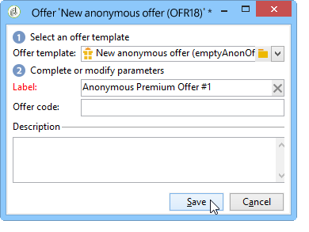
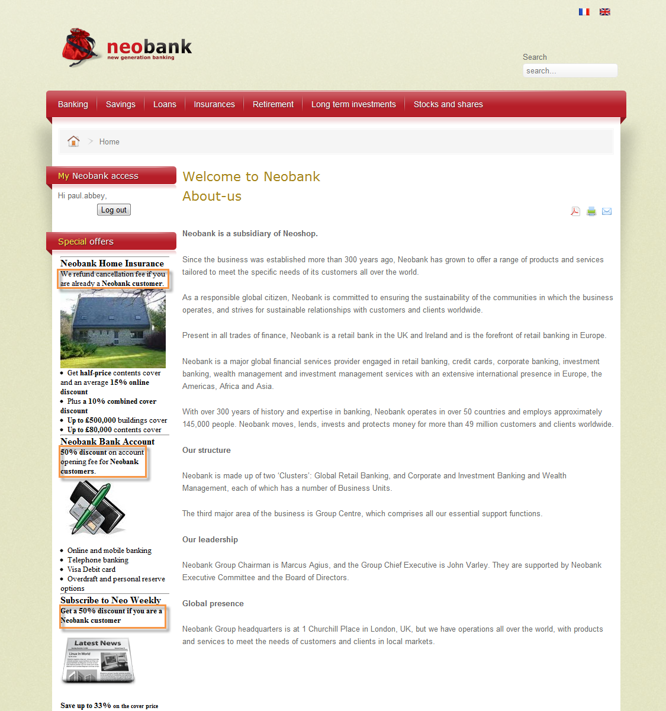

# 入站渠道上的选件{#offers-on-an-inbound-channel}

## 向匿名访客展示优惠 {#presenting-an-offer-to-an-anonymous-visitor}

Neobank网站希望在其网站上显示一个针对浏览该页面的身份不明的访客的优惠信息。

要设置此交互，我们将：

1. [创建匿名环境](#creating-an-anonymous-environment)。
1. [创建匿名优惠空间](#creating-anonymous-offer-spaces)。
1. [创建选件类别和主题](#creating-an-offer-category-and-a-theme)。
1. [创建匿名选件](#creating-anonymous-offers)。
1. [在网站上配置Web选件空间](#configure-the-web-offer-space-on-the-website)。

### 创建匿名环境 {#creating-an-anonymous-environment}

按照创建选件环 [境中详细介绍的过程](../../interaction/using/live-design-environments.md#creating-an-offer-environment) ，根据访客的维度创建 **匿名环境**。

您将获得包含新环境的树结构：


### 创建匿名选件空间 {#creating-anonymous-offer-spaces}

1. 在您的匿名环境(**访客**)中，转到 **[!UICONTROL Administration]** >节 **[!UICONTROL Spaces]** 点。
1. 单击 **[!UICONTROL New]** 以创建呼叫渠道。

   

   >[!NOTE]
   >
   >该空间会自动链接到匿名环境。

1. 更改标签并选择渠 **[!UICONTROL Inbound Web]** 道。 您还必须选中该 **[!UICONTROL Enable unitary mode]** 框。

   

1. 选择用于空间的选件内容字段，并根据需要通过选中相关框指定它们。

   这样，任何缺少以下元素之一的选件都将不符合此空间的条件：

   * 标题
   * HTML内容
   * 图像URL
   * 目标URL。
   

1. 编辑HTML渲染函数，例如：

   ```
   function (imageUrl, targetUrl, shortContent, htmlSource){
         var html = "<p><b>" + shortContent + "</b></p>";
         html += "<p>" + htmlSource + "</p>";
         html += "<a _urlType='11' href='" + targetUrl + "'></a>";
         return html;
       }   
   ```

   >[!CAUTION]
   >
   >渲染函数必须按照先前选择的顺序命名用于空间的字段，以便正确显示选件。

   

1. 节省优惠空间。

### 创建选件类别和主题 {#creating-an-offer-category-and-a-theme}

1. 转到刚 **[!UICONTROL Offer catalog]** 创建的环境中的节点。
1. 右键单击该节 **[!UICONTROL Offer catalog]** 点并选择 **[!UICONTROL Create a new 'Offer category' folder]**。

   将新类别命名为 **Financial产品** ，例如。

1. 转到类别的选项卡 **[!UICONTROL Eligibility]** 并输入 **financing** 作为主题，然后保存更改。

   

### 创建匿名选件 {#creating-anonymous-offers}

1. 转到您刚刚创建的类别。
1. 单击 **[!UICONTROL New]**.

   

1. 选择现成的匿名选件模板或先前创建的模板。

   

1. 更改标签并保存选件。

   

1. 转到选项卡 **[!UICONTROL Eligibility]** 并根据其应用程序上下文指定选件的粗细。

   在此示例中，选件配置为在年末之前作为优先级显示在站点的主页上。

   

1. 转到选项卡 **[!UICONTROL Content]** 并定义选件的内容。

   >[!NOTE]
   >
   >您可以选择 **[!UICONTROL Content definitions]** 显示Web空间所需的元素列表。

   

1. 再创建一个选件。

   

1. 转到选项卡 **[!UICONTROL Eligibility]** 并应用与第一个选件相同的权重。
1. 运行每个优惠的批准周期，以便在线环境中提供这些优惠及其批准的优惠空间。

### 在网站上配置Web选件空间 {#configure-the-web-offer-space-on-the-website}

要使您刚刚配置的选件在网站上可见，请将JavaScript代码插入站点的HTML页面以调用交互引擎(有关详细信息，请参阅 [关于入站渠道](../../interaction/using/about-inbound-channels.md))。

1. 转到HTML页面并插入一个@id属性，其值与之前创建的匿名选件空间的内部名称相匹配(请参阅创建匿名选件空间 [)，前面](#creating-anonymous-offer-spaces)是i_ ****。

   

1. 插入呼叫URL。

   

   上面的蓝色URL框与实例名称、环境的内部名称(请参阅创建匿名环境 [)以及链接到该类别的主题(](#creating-an-anonymous-environment)Creating a forfer category and a theme[](#creating-an-offer-category-and-a-theme))相对应。 后者是可选的。

当访客访问网站主页时，具有融资主题的选件 **将按** HTML页面上的配置显示。


多次访问该页面的用户将看到类别中的一个选件或其他选件，因为这两个选件的权重相同。

## 如果联系人身份不明，则切换到匿名环境 {#switching-to-an-anonymous-environment-in-case-of-unidentified-contacts}

Neobank公司希望为两个不同的目标创建营销推广信息。 它希望为其匿名网站浏览器显示通用选件。 如果这些用户中的一位是Neobank提供的标识符的客户，公司希望他们一登录就收到个性化的推广信息。

本案例研究基于以下场景：

1. 访客无需登录即可浏览Neobank网站。

   

   页面上会显示三个匿名选件：Neobank产品 **提供两份最佳优惠** ,Neobank合作伙伴提供一份优惠。

   

1. Neobank客户用户使用其凭据登录。

   

   展示了三个个性化的推广信息。

   

要实施此案例研究，您需要两个选件环境：一个用于匿名交互，另一个用于为已识别的联系人配置选件。 如果联系人未登录，因此未识别，则标识的优惠环境将配置为自动切换到匿名优惠环境。

应用以下步骤：

* 使用以下步骤创建特定于匿名入站交互的选件目录：

   1. [为匿名联系人创建环境](#creating-an-environment-for-anonymous-contacts)
   1. [为匿名环境配置选件空间](#configuring-offer-spaces-for-the-anonymous-environment)
   1. [在匿名环境中创建选件类别](#creating-offer-categories-in-an-anonymous-environment)
   1. [为匿名访客创建优惠](#creating-offers-for-anonymous-visitors)

* 使用以下步骤创建特定于已识别的入站交互的选件目录：

   1. [在标识的环境中配置选件空间](#configure-the-offer-spaces-in-the-identified-environment)
   1. [在已识别的环境中创建选件类别](#creating-offer-categories-in-an-identified-environment)
   1. [创建个性化推广信息](#creating-personalized-offers)

* 配置对选件引擎的调用：

   1. [在网页上配置选件空间](#configuring-offer-spaces-on-the-web-page)
   1. [指定标识的选件空间的高级设置](#specifying-the-advanced-settings-of-the-identified-offer-spaces)

### 为匿名联系人创建环境 {#creating-an-environment-for-anonymous-contacts}

1. 通过交付映射向导（访客映射）为匿名入站交互创建&#x200B;**选件环** 境。 有关详细信息，请参阅 [创建选件环境](../../interaction/using/live-design-environments.md#creating-an-offer-environment)。

   

### 为匿名环境配置选件空间 {#configuring-offer-spaces-for-the-anonymous-environment}

必须在网站上展示的选件分为两个不同的类别：最佳 **优惠和合** 作伙伴 ****。 在此示例中，我们将为每个类别创建一个特定的选件空间。

要创建与“最佳选件”类别匹配的选 **件空间** ，请应用以下过程：

1. 在Adobe Campaign树中，转到刚刚创建的匿名环境并添加选件空间。

   

1. 创建新的文 **[!UICONTROL Inbound web]** 字空间。

   

1. 为其输入标签：例 **如Web最佳匿名优惠** 。
1. 添加用于此选件空间的选件内容字段并配置渲染功能。

   

   >[!CAUTION]
   >
   >渲染函数必须按照先前选择的顺序命名用于空间的字段，以便正确显示选件。

1. 使用相同的过程创建一个与“合作伙伴”类别匹配的入站Web渠道 **选件** 。

   

### 在匿名环境中创建选件类别 {#creating-offer-categories-in-an-anonymous-environment}

首先，创建两个选件类别：“最 **佳选件** ”类别和“合 **作伙伴** ”类别。 每个类别都包含两个匿名联系人的优惠。

1. 转到您刚 **[!UICONTROL Offer catalog]** 创建的匿名环境中。
1. 添加一个 **[!UICONTROL Offer category]** 包含“最 **佳选件** ”标签的文件夹。

   

1. 创建第二个类别， **将Partner** 作为标签。

   

### 为匿名访客创建优惠 {#creating-offers-for-anonymous-visitors}

现在，我们将在以上创建的每个类别中创建两个选件。

1. 转到“最佳 **优惠** ”类别并创建匿名优惠。

   

1. 转到选项卡 **[!UICONTROL Eligibility]** 并根据其应用程序上下文指定选件的粗细。

   

1. 转到选项卡 **[!UICONTROL Content]** 并定义选件的内容。

   

1. 在“最佳选件”类别中创建 **第二个选件** 。

   

1. 转到“合作伙 **伴** ”类别并创建匿名选件。
1. 转到选项卡 **[!UICONTROL Content]** 并定义选件的内容。

   

1. 转到选项卡 **[!UICONTROL Eligibility]** 并根据其应用程序上下文指定选件的粗细。

   

1. 为“合作伙伴”类别创建第 **二个选** 件。

   

1. 转到选项卡 **[!UICONTROL Eligibility]** 并应用您应用于此类别中第一个选件的权重，以便这些选件在网站上连续显示。

   

1. 运行每个优惠的批准周期，开始使其实时生效。 在批准内容时，请根 **据优惠** ，激 **活合作伙伴或最佳优惠** 。

### 在标识的环境中配置选件空间 {#configure-the-offer-spaces-in-the-identified-environment}

您将在网站上展示的优惠来自两个不同的类别：最佳 **优惠和合** 作伙伴 ****。 在此示例中，我们要为每个类别创建一个特定空间。

要创建两个选件空间，请应用与匿名选件空间相同的过程。 请参阅为 [匿名环境配置选件空间](#configuring-offer-spaces-for-the-anonymous-environment)。

1. 在Adobe Campaign树中，转到刚刚创建的环境，并添加“最佳选件”和“合 **作伙伴****** ”选件空间。
1. 应用为匿名环境配 [置选件空间中详细介绍的过程](#configuring-offer-spaces-for-the-anonymous-environment)。

   

1. 选择选 **[!UICONTROL Fall back on an anonymous environment if no individuals were identified]** 项。

   

1. 使用下拉列表，选择以前创建的匿名Web选件空间(请参阅为匿名 [环境配置选件空间](#configuring-offer-spaces-for-the-anonymous-environment))。

   

### 指定标识的选件空间的高级设置 {#specifying-the-advanced-settings-of-the-identified-offer-spaces}

在此示例中，联系人标识由于Adobe Campaign数据库中的电子邮件地址而发生。 要将收件人电子邮件添加到空间，请应用以下过程：

1. 在标识的环境中，转到选件空间文件夹。
1. 选择“最 **佳选件** ”选件空间并单击 **[!UICONTROL Advanced parameters]**。

   

1. 在选项卡 **[!UICONTROL Target identification]** 中，单击 **[!UICONTROL Add]**。

   

1. 单 **[!UICONTROL Edit expression]**&#x200B;击，转到收件人表并选择字 **[!UICONTROL Email]** 段。

   

1. 单 **[!UICONTROL OK]** 击以关闭窗 **[!UICONTROL Advanced parameters]** 口并完成配置“最佳选 **件** ”选件空间。
1. 对合作伙伴提供的空间应 **用相** 同的流程。

   

### 在已识别的环境中创建选件类别 {#creating-offer-categories-in-an-identified-environment}

我们将创建两个不同的类别：“最 **佳优惠** ”类别和“合作伙伴 **** ”类别，每个类别都提供两个个性化优惠。

1. 转到所识 **[!UICONTROL Offer catalogs]** 别环境中的节点。
1. 与在匿名环境中一样，添加两个 **[!UICONTROL Offer category]** 文件夹，其 **中“最佳选件** ”和“ **合作伙伴** ”作为标签。

   

### 创建个性化推广信息 {#creating-personalized-offers}

我们希望为每个类别创建两个个性化的推广信息，即四个推广信息。

1. 转到“最佳 **优惠”类别** ，创建第一个个性化优惠。

   

1. 转到选项卡 **[!UICONTROL Eligibility]** 并根据其应用程序上下文指定选件的粗细。

   

1. 转到选项卡 **[!UICONTROL Content]** 并定义选件的内容。

   

1. 在“最佳选件”类别中创建 **第二个选件** 。

   

1. 转到“合作伙 **伴** ”类别并创建个性化优惠。

   

1. 转到选项卡 **[!UICONTROL Eligibility]** 并根据其应用程序上下文指定选件的粗细。

   

1. 为“合作伙伴”类别创建第 **二个选** 件。

   

1. 转到选项卡 **[!UICONTROL Eligibility]** 并应用您应用于此类别中第一个选件的权重，以便这些选件在网站上连续显示。
1. 运行每个选件的审批周期以开始更新它们。 在内容批准过程中，激活 **合作伙伴****或最佳优惠** 。

### 在网页上配置选件空间 {#configuring-offer-spaces-on-the-web-page}

Neobank公司的网站有三个促销空间：两个用于“最佳优惠”类别中的银行 **相关优惠** ，一个用于“合作伙伴”类别中 **的优惠** 。


要在网站的HTML页面上配置这些选件空间，请应用以下过程：

1. 在HTML页面的内容中，插入三个

   具有@id属性的元素，其值将允许我们在网站的各种选件空间中调用选件。

   

1. 然后插入用于定义属性值的脚本。

   

   在本例中， **ContBO1** 和 **ContBO2** 将收到 **OsWebBestOfferIdentified的值，即OsWebBestOfferOfferIdentified**，即先前在标识的环境中创建的 **** BestOfferOferOfer空间的内部名称。 CatBestOffer **** 和CatBestOfferAnonym **值与针对匿名和已识别环境的BestOffer类别的****** 内部名称相匹配。

   

   同样， **ContPtn接收** OSWebPartnerIntified **，该值与在所识别的环境中创建的** Partner **** offer space的内部名称相匹配。 **CatPartner** 和 **CatPartnerAnonym** 为匿名和已识别的环境匹配 **Partner** 类别的内部名称。

   

1. 将允许您识别登录到Neobank站点的人员的信息指定到 **interactionTarget** 变量。

   

   人员的标识可以基于浏览器cookie、URL、电子邮件或人员的标识符中的读取参数。 如果使用的是除主键之外的收件人表字段，则需要在空间的高级参数中定义该字段(请参阅指定标识的优惠空间的高级设置 [](#specifying-the-advanced-settings-of-the-identified-offer-spaces))。

1. 插入呼叫URL。

   

   该URL包含 **EnvNebankRecip**，即标识环境的内部名称。

打开网页时；该脚本允许您调用交互引擎以在网页的相关空间中显示选件的内容。 在一次对Adobe Campaign服务器的调用中，引擎会确定环境、优惠空间和要选择的类别。

在此示例中，引擎识别标识的环境(**EnvNeobankIdnRecip**)。 它为网页上的第一和第二优惠空间确定优惠空间(**OSWebBestOfferIdentified**)和最佳优惠 **(** CatBestOffer **)，以及(** OSWebBestOfferIdentified)提供空间和合作伙伴类别(**CatBestOffer**********)。CatPartner为第三处提供场地。

如果引擎无法识别收件人，则它会切换到在已识别的选件空间中引用的匿名选件空间，并切换到脚本中指定的匿名类别(**CatPartner****和CatPartnerAnonym**)。
