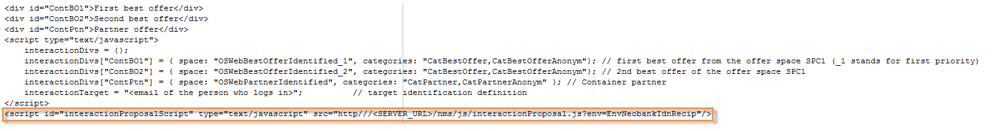

# 入站渠道优惠{#offers-on-an-inbound-channel}

## 向匿名优惠呈现访客 {#presenting-an-offer-to-an-anonymous-visitor}

Neobank网站希望在其网站上显示一个优惠，目标是浏览网页的身份不明的访客。

要设置此交互，我们将：

1. [创建匿名环境](#creating-an-anonymous-environment)
1. [创建匿名优惠空间](#creating-anonymous-offer-spaces)
1. [创建优惠类别和主题](#creating-an-offer-category-and-a-theme)
1. [创建匿名优惠。](#creating-anonymous-offers)
1. [在网站上配置Web优惠空间](#configure-the-web-offer-space-on-the-website)

### 创建匿名环境 {#creating-an-anonymous-environment}

按照创建优惠 [环境中详细的步骤](../../interaction/using/live-design-environments.md#creating-an-offer-environment) ，根据访客的维度创建 **匿名**&#x200B;环境。

您将获得包含新环境的树结构：


### 创建匿名优惠空间 {#creating-anonymous-offer-spaces}

1. 在您的匿名环境(**访客**)中，转 **[!UICONTROL Administration]** 到>节 **[!UICONTROL Spaces]** 点。
1. 单击 **[!UICONTROL New]** 以创建呼叫渠道。

   

   >[!NOTE]
   >
   >该空间会自动链接到匿名环境。

1. 更改标签并选择 **[!UICONTROL Inbound Web]** 渠道。 您还必须选中该 **[!UICONTROL Enable unitary mode]** 框。

   

1. 选择用于空间的优惠内容字段，并根据需要通过选中相关框来指定它们。

   这样，任何缺少以下某个元素的优惠将不能获得此空间：

   * 标题
   * HTML内容
   * 图像URL
   * 目标URL

   

1. 编辑HTML渲染函数，例如：

   ```
   function (imageUrl, targetUrl, shortContent, htmlSource){
         var html = "<p><b>" + shortContent + "</b></p>";
         html += "<p>" + htmlSource + "</p>";
         html += "<a _urlType='11' href='" + targetUrl + "'></a>";
         return html;
       }   
   ```

   >[!IMPORTANT]
   >
   >渲染函数必须按照之前选择的顺序命名用于空间的字段，以便正确显示优惠。

   

1. 保存优惠空间。

### 创建优惠类别和主题 {#creating-an-offer-category-and-a-theme}

1. 转到您刚 **[!UICONTROL Offer catalog]** 创建的环境中的节点。
1. 右键单击该节 **[!UICONTROL Offer catalog]** 点并选择 **[!UICONTROL Create a new 'Offer category' folder]**。

   将新类别命名为 **Financial产品** ，例如。

1. 转到类别的选 **[!UICONTROL Eligibility]** 项卡， **将融资** 作为主题输入，然后保存更改。

   

### 创建匿名优惠 {#creating-anonymous-offers}

1. 转到您刚刚创建的类别。
1. 单击 **[!UICONTROL New]**.

   

1. 选择现成的匿名优惠模板或先前创建的模板。

   

1. 更改标签并保存优惠。

   

1. 转到选 **[!UICONTROL Eligibility]** 项卡，根据优惠的应用程序上下文指定权重。

   在此示例中，优惠配置为在站点的主页上显示为优先级，直到年末。

   

1. 转到选 **[!UICONTROL Content]** 项卡并定义优惠的内容。

   >[!NOTE]
   >
   >您可以选 **[!UICONTROL Content definitions]** 择显示Web空间所需元素的列表。

   

1. 创建第二个优惠。

   

1. 转到选 **[!UICONTROL Eligibility]** 项卡并应用与第一个权重相同的优惠。
1. 运行每个优惠的批准周期，以便在线环境中提供这些优惠空间及其批准的客户。

### 在网站上配置Web优惠空间 {#configure-the-web-offer-space-on-the-website}

要使您刚刚配置的优惠在网站上可见，请将JavaScript代码插入站点的HTML页面以调用交互引擎(有关详细信息，请参阅关 [于入站渠道](../../interaction/using/about-inbound-channels.md))。

1. 转到HTML页并插入一个@id属性，其值与之前创建的匿名优惠空间的内部名称相匹配(请参 [阅创建匿名优惠空间](#creating-anonymous-offer-spaces))，前面 **是i_**。

   

1. 插入呼叫URL。

   

   上面的蓝色URL框与实例名称、环境的内部名称(请参 [阅创建匿名环境](#creating-an-anonymous-environment))以及链接到类别的主题([创建优惠类别和主题](#creating-an-offer-category-and-a-theme))相对应。 后者是可选的。

当访客访问网站的主页时，具有融资主题 **的优惠** ，在HTML页面上会按配置方式显示。


多次访问该页面的用户将在类别中看到一个或其他优惠，因为他们都被分配了相同的权重。

## 如果联系人身份不明，请改用匿名环境 {#switching-to-an-anonymous-environment-in-case-of-unidentified-contacts}

Neobank公司希望为两个不同的目标创建营销优惠。 它希望为其匿名网站浏览器显示通用优惠。 如果这些用户中的一个是Neobank提供的标识符的客户，公司希望他们一登录就收到个性化的优惠。

本案例研究基于以下场景：

1. 访客无需登录即可浏览Neobank网站。

   

   页面上会显示三个匿名优惠:Neobank **产品的两位优惠** 优惠,Neobank合作伙伴的一位优惠。

   

1. Neobank客户用户使用其凭据登录。

   

   展示三个个性化优惠。

   

要实施此案例研究，您需要具有两个优惠环境:一个用于匿名交互，另一个用于优惠，特别针对已识别的联系人进行配置。 标识的优惠环境将配置为在联系人未登录且因此未识别时自动切换到匿名优惠环境。

应用以下步骤：

* 使用以下步骤创建特定于匿名入站交互的优惠目录：

   1. [为匿名联系人创建环境](#creating-an-environment-for-anonymous-contacts)
   1. [为匿名优惠空间配置环境](#configuring-offer-spaces-for-the-anonymous-environment)
   1. [在匿名优惠中创建类别环境](#creating-offer-categories-in-an-anonymous-environment)
   1. [为匿名优惠创建访客](#creating-offers-for-anonymous-visitors)

* 使用以下步骤创建特定于已标识入站交互的优惠目录：

   1. [在标识的优惠空间中配置环境](#configure-the-offer-spaces-in-the-identified-environment)
   1. [在标识的优惠中创建类别环境](#creating-offer-categories-in-an-identified-environment)
   1. [创建个性化优惠](#creating-personalized-offers)

* 配置对优惠引擎的调用：

   1. [在网页上配置优惠空间](#configuring-offer-spaces-on-the-web-page)
   1. [指定标识优惠空间的高级设置](#specifying-the-advanced-settings-of-the-identified-offer-spaces)

### 为匿名联系人创建环境 {#creating-an-environment-for-anonymous-contacts}

1. 通过优惠映射向导(访客映射)为匿名入站交互创&#x200B;**建投放** 环境。 有关此内容的详细信息，请参 [阅创建优惠环境](../../interaction/using/live-design-environments.md#creating-an-offer-environment)。

   

### 为匿名优惠空间配置环境 {#configuring-offer-spaces-for-the-anonymous-environment}

网站上必须显示的优惠属于两个不同的类别: **最佳优惠** 和 **合作伙伴**。 在此示例中，我们将为每个优惠空间创建一个特定类别。

要创建与最佳优惠空间匹配 **的优惠** ，请应用以下流程：

1. 在Adobe Campaign树中，转到您刚刚创建的匿名环境并添加优惠空间。

   

1. 创建新的 **[!UICONTROL Inbound web]** 文字空间。

   

1. 为其输入标签： **例如** ,Web最佳匿名优惠
1. 添加用于此优惠的优惠空间内容字段并配置渲染功能。

   

   >[!IMPORTANT]
   >
   >渲染函数必须按照之前选择的顺序命名用于空间的字段，以便正确显示优惠。

1. 使用相同的流程创建入站Web渠道优惠空间，以匹配合 **作伙伴** 类别。

   

### 在匿名优惠中创建类别环境 {#creating-offer-categories-in-an-anonymous-environment}

开始通过创建两个优惠类别:最佳 **优惠** 类别和合 **作伙伴** 类别 每个类别将包含两个匿名联系人优惠。

1. 转到您 **[!UICONTROL Offer catalog]** 刚刚创建的匿名环境。
1. 添加一个 **[!UICONTROL Offer category]** 标签 **为最佳优惠** 的文件夹。

   

1. 以Partner作为标签 **创建** 第二个类别。

   

### 为匿名优惠创建访客 {#creating-offers-for-anonymous-visitors}

现在，我们将在以上创建的每个优惠中创建两个类别。

1. 转到“最佳 **优惠** ”类别并创建匿名优惠。

   

1. 转到选 **[!UICONTROL Eligibility]** 项卡，根据优惠的应用程序上下文指定权重。

   

1. 转到选 **[!UICONTROL Content]** 项卡并定义优惠的内容。

   

1. 在“最佳优惠”优惠中 **创建第二个类别** 。

   

1. 转到合作伙 **伴类别** ，创建匿名优惠。
1. 转到选 **[!UICONTROL Content]** 项卡并定义优惠的内容。

   

1. 转到选 **[!UICONTROL Eligibility]** 项卡，根据优惠的应用程序上下文指定权重。

   

1. 为合作伙伴优惠创建第 **二个类别** 。

   

1. 转到选项 **[!UICONTROL Eligibility]** 卡并应用与您应用到此类别中第一个权重符的优惠符，这样，这些优惠符就会连续显示在网站上。

   

1. 为每个优惠运行审批周期，开始使其生效。 在批准内容时，请 **激活** “合 **作伙伴** ”或“最佳优惠”优惠空间,优惠称。

### 在标识的优惠空间中配置环境 {#configure-the-offer-spaces-in-the-identified-environment}

您将在网站上展示的优惠来自两个不同的类别: **最佳优惠** 和 **合作伙伴**。 在此示例中，我们要为每个类别创建特定空间。

要创建两个优惠空间，请应用与匿名优惠空间相同的过程。 请参阅 [配置优惠空间以获取匿名环境](#configuring-offer-spaces-for-the-anonymous-environment)。

1. 在Adobe Campaign树中，转到您刚刚创建的环境，并添加“最佳 **优惠** ”和“合 **作伙伴** 优惠空间”。
1. 应用配置优惠空间中 [详细介绍的匿名环境流程](#configuring-offer-spaces-for-the-anonymous-environment)。

   

1. 选择选 **[!UICONTROL Fall back on an anonymous environment if no individuals were identified]** 项。

   

1. 使用下拉列表，选择以前创建的匿名Web优惠空间(请参 [阅为匿名环境配置优惠空间](#configuring-offer-spaces-for-the-anonymous-environment))。

   

### 指定标识优惠空间的高级设置 {#specifying-the-advanced-settings-of-the-identified-offer-spaces}

在此示例中，联系人标识由于Adobe Campaign库中的电子邮件地址而发生。 要向空间添加收件人电子邮件，请应用以下过程：

1. 在标识的环境中，转到优惠空间文件夹。
1. 选择“最 **佳优惠** ”优惠空间，然后单 **[!UICONTROL Advanced parameters]**&#x200B;击。

   

1. 在 **[!UICONTROL Target identification]** 选项卡中，单击 **[!UICONTROL Add]**。

   

1. 单 **[!UICONTROL Edit expression]**&#x200B;击，转到收件人表并选择字 **[!UICONTROL Email]** 段。

   

1. 单击 **[!UICONTROL OK]** 以关闭窗 **[!UICONTROL Advanced parameters]** 口并完成配置“最 **佳优惠** ”优惠空间。
1. 对合作伙伴优惠空间应用相 **同流程** 。

   

### 在标识的优惠中创建类别环境 {#creating-offer-categories-in-an-identified-environment}

我们将创建两个单独的类别:最佳 **优惠** 类别和合 **作伙伴** 类别，每个都有两个个性化优惠。

1. 转到已识 **[!UICONTROL Offer catalogs]** 别环境中的节点。
1. 与在匿名环境中一样，添加两个 **[!UICONTROL Offer category]** 以“最佳 **优惠** ”和“ **合作伙伴** ”作为标签的文件夹。

   

### 创建个性化优惠 {#creating-personalized-offers}

我们希望为每个类别创建两个个性化优惠，即四个优惠。

1. 转到“最佳 **优惠** ”类别并创建第一个个性化优惠。

   

1. 转到选 **[!UICONTROL Eligibility]** 项卡，根据优惠的应用程序上下文指定权重。

   

1. 转到选 **[!UICONTROL Content]** 项卡并定义优惠的内容。

   

1. 在“最佳优惠”优惠中 **创建第二个类别** 。

   

1. 转到合作伙 **伴类别** ，创建个性化优惠。

   

1. 转到选 **[!UICONTROL Eligibility]** 项卡，根据优惠的应用程序上下文指定权重。

   

1. 为合作伙伴优惠创建第 **二个类别** 。

   

1. 转到选项 **[!UICONTROL Eligibility]** 卡并应用与您应用到此类别中第一个权重符的优惠符，这样，这些优惠符就会连续显示在网站上。
1. 运行每个优惠的审批周期，开始更新它们。 在内容批准过程中，激活 **合作伙伴** 或最 **佳优惠** 优惠空间。

### 在网页上配置优惠空间 {#configuring-offer-spaces-on-the-web-page}

Neobank公司的网站有三个优惠空间：两个适用于最佳优惠优惠 **的银行相关类别** ，一个适用于合作伙伴 **类别的优惠** 。


要在网站的HTML页面上配置这些优惠空间，请应用以下过程：

1. 在HTML页面的内容中，插入三个

   具有@id属性的元素，其值将允许我们调用网站各优惠空间中的优惠。

   

1. 然后插入用于定义属性值的脚本。

   

   在本例中， **ContBO** 1 **和ContBO2收到OsWebBestOfferIntified** 值，即先前在所识别的环境中创建 ******** 的Best优惠优惠空间的内部名称。 CatBestOffer **和CatBestOffer** Anonym值 **与匿名和已识别的环境的Best** 优惠类别的内部名称 **** 相匹配。

   

   同样， **ContPtn接收** OSWebPartnerIndified **值，该值与在所标识的环境中创建的Partner** 优惠空间的内部名 **** 称相匹配。 **CatPartner** 和 **CatPartnerAnonym** 将匿名和已识别的环境的Partner **** 类别的内部名称匹配。

   

1. 将允许您识别登录到Neobank站点的人员的信息分配给 **interactionTarget** 变量。

   

   人的标识可以基于浏览器cookie、URL中的读取参数、电子邮件或人的标识符。 如果使用收件人表中除主键以外的字段，则需要在空间的高级参数中定义该字段(请参 [阅指定标识优惠空间的高级设置](#specifying-the-advanced-settings-of-the-identified-offer-spaces))。

1. 插入呼叫URL。

   

   该URL包 **含EnvNebankRecip**，标识环境的内部名称。

打开网页时；脚本允许您调用交互引擎以在网页的相关空间中显示优惠的内容。 在对Adobe Campaign服务器的一次调用中，引擎确定要选择的环境、优惠空间和类别。

在此示例中，引擎识别标识的环境&#x200B;**(EnvNeobankIdnRecip**)。 它为网页上的第一个和第&#x200B;**二个优惠空间识别**(OSWebBestOfferInterfied)和最佳 **优惠类别(CatBestOffer** )以及优惠空间(**************** OSWebEbOfferIdentified)优惠空间和合作伙伴识别()类别识别(CatBeOffor)。CatPartner在站点上创建第三个优惠空间。

如果引擎无法识别收件人，则它会切换至已识别优惠空间中引用的匿名优惠空间，并切换至脚本中&#x200B;**指定的匿** 名类别 **(CatPartner**&#x200B;和CatPartnerAnonym)。
