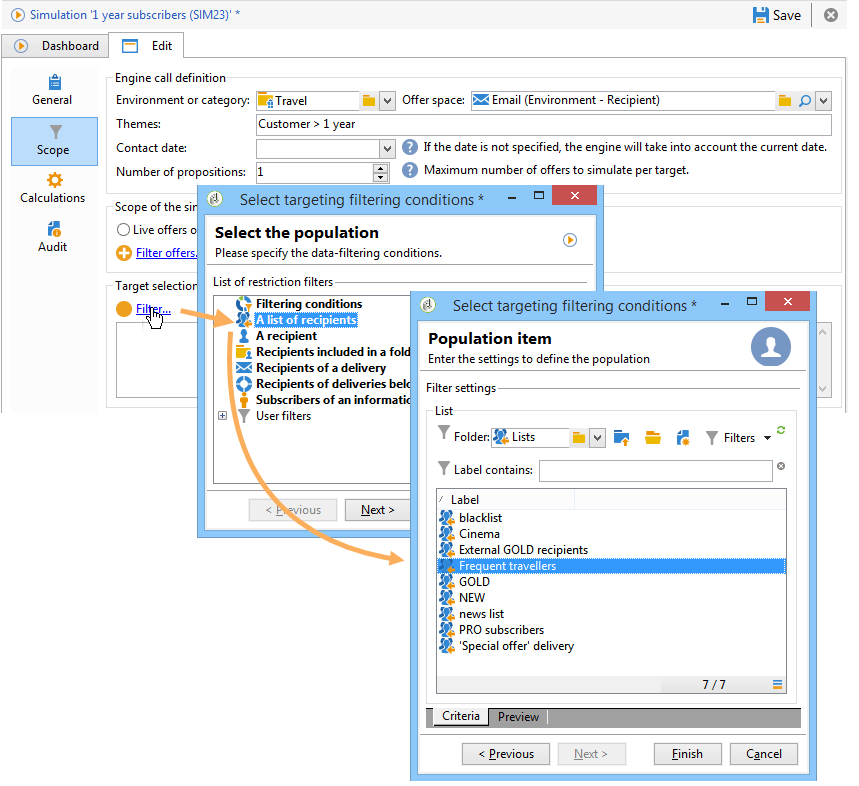

# 出站渠道优惠{#offers-on-an-outbound-channel}

## 电子邮件优惠投放{#email-offer-delivery}

在我们的数据库中，有一类别前往非洲的旅行优惠。 已配置每个优惠的资格、上下文和陈述。 现在，我们希望创建一个活动，通过电子邮件向我们的优惠演示。

1. 创建营销活动和定位工作流。

   

1. 编辑电子邮件投放，然后单击&#x200B;**[!UICONTROL Offers]**&#x200B;图标。

   

1. 为优惠环境选择与假日匹配的电子邮件空间。

   

1. 选择包含非洲旅行优惠的类别。

   

1. 将投放中的优惠数设置为2。

   

1. 关闭优惠管理窗口并创建投放内容。

   

1. 使用菜单插入第一个优惠建议并选择HTML渲染功能。

   

1. 插入第二个优惠建议。

   

1. 单击&#x200B;**[!UICONTROL Preview]**&#x200B;在投放中预览优惠，然后选择收件人预览优惠，使在接收时显示。

   

1. 保存投放并开始定位工作流。
1. 打开投放，然后单击投放的&#x200B;**[!UICONTROL Audit]**&#x200B;选项卡：您可以看到，优惠引擎已从目录中的各种优惠中选择要提出的建议。

   

## 执行优惠模拟{#perform-an-offer-simulation}

1. 在&#x200B;**[!UICONTROL Profiles and Targets]**&#x200B;选项卡中，单击&#x200B;**[!UICONTROL Simulations]**&#x200B;链接，然后单击&#x200B;**[!UICONTROL Create]**&#x200B;按钮。

   

1. 选择一个标签并根据需要指定执行设置。

   

1. 保存模拟。 然后在新选项卡中打开。

   

1. 单击&#x200B;**[!UICONTROL Edit]**&#x200B;选项卡，然后单击&#x200B;**[!UICONTROL Scope]**。

   

1. 选择要模拟其类别的优惠。

   

1. 选择要用于优惠空间的模拟。

   

1. 输入有效日期。 您必须至少输入开始日期。 这样，优惠引擎可以过滤优惠，并选择在给定日期有效的过滤器。
1. 如有必要，请指定一个或多个主题，以将优惠数限制为设置中包含此关键字的数。

   在我们的示例中，**Travel**&#x200B;类别包含两个子类别，它们有两个单独的主题。 我们希望为具有&#x200B;**Customers>1年**&#x200B;主题的优惠运行模拟。

   

1. 选择要目标的收件人。

   

1. 配置要发送到每个优惠的收件人数。

   在我们的示例中，优惠引擎将为每个优惠选择权重最高的3个收件人。

   

1. 保存设置，然后单击&#x200B;**[!UICONTROL Dashboard]**&#x200B;选项卡中的&#x200B;**[!UICONTROL Start]**&#x200B;以运行模拟。

   

1. 模拟完成后，请查阅&#x200B;**[!UICONTROL Results]**&#x200B;以详细了解每个优惠的建议。

   在我们的示例中，优惠引擎基于3个建议的优惠划分。

   

1. 显示&#x200B;**[!UICONTROL Breakdown of offers by rank]**&#x200B;以视图由优惠引擎选择的优惠的列表。

   

1. 如有必要，可以通过单击&#x200B;**[!UICONTROL Start simulation]**&#x200B;更改范围设置并再次运行模拟。

   

1. 要保存模拟数据，请使用报告中提供的历史记录或导出功能。

   

