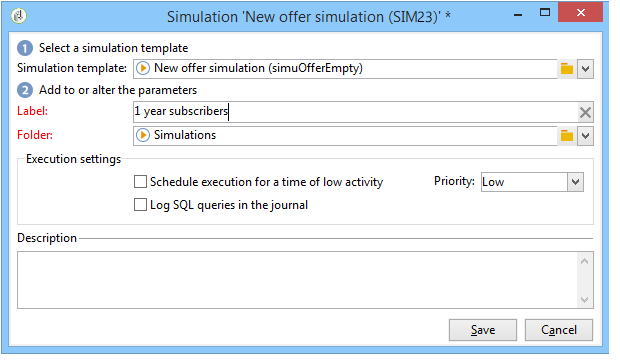

# 出站渠道优惠{#offers-on-an-outbound-channel}

## 电子邮件选件投放 {#email-offer-delivery}

在我们的数据库中，有一类前往非洲的旅行优惠。 已配置每个优惠的资格、上下文和表示形式。 现在，我们要创建一个营销活动，通过电子邮件展示我们的优惠。

1. 创建营销活动和定位工作流。

   

1. 编辑电子邮件投放，然后单击 **[!UICONTROL Offers]** 图标。

   

1. 为优惠环境选择与假日匹配的电子邮件空间。

   

1. 选择包含非洲旅行优惠的类别。

   

1. 将投放中的选件数设置为2。

   

1. 关闭选件管理窗口并创建投放内容。

   

1. 使用菜单插入第一个优惠建议并选择HTML渲染功能。

   

1. 插入第二个优惠建议。

   

1. 单击 **[!UICONTROL Preview]** 要在投放中预览优惠，请选择收件人以预览其接收优惠。

   

1. 保存投放并启动定向工作流。
1. 打开您的投放，然后单击 **[!UICONTROL Audit]** 投放的选项卡：您可以看到优惠引擎已从目录中的各种优惠中选择了要提出的主张。

   

## 执行优惠模拟 {#perform-an-offer-simulation}

1. 在 **[!UICONTROL Profiles and Targets]** 选项卡，单击 **[!UICONTROL Simulations]** 链接，然后单击 **[!UICONTROL Create]** 按钮。

   

1. 选择标签并根据需要指定执行设置。

   

1. 保存模拟。 然后，该操作将在新选项卡中打开。

   

1. 单击 **[!UICONTROL Edit]** 选项卡，然后 **[!UICONTROL Scope]**.

   

1. 选择要模拟优惠的类别。

   

1. 选择要用于模拟的优惠空间。

   

1. 输入有效日期。 您必须至少输入开始日期。 这允许优惠引擎筛选优惠，并选择在给定日期有效的优惠。
1. 如有必要，请指定一个或多个主题，以将选件数量限制为设置中包含此关键字的选件。

   在我们的示例中， **旅游** 类别包含两个子类别，这两个子类别具有两个单独的主题。 我们希望使用对优惠进行模拟 **客户>1年** 主题。

   

1. 选择要定位的收件人。

   

1. 配置要发送给每个收件人的优惠数量。

   在我们的示例中，选件引擎将选择每个收件人具有最高权重的3个选件。

   

1. 保存设置，然后单击 **[!UICONTROL Start]** 在 **[!UICONTROL Dashboard]** 选项卡运行模拟。

   

1. 模拟完成后，请查阅 **[!UICONTROL Results]** 以了解每个选件的建议详细细分。

   在我们的示例中，优惠引擎将优惠划分基于3个建议。

   

1. 显示 **[!UICONTROL Breakdown of offers by rank]** 以查看优惠引擎选择的优惠列表。

   

1. 如有必要，可以更改范围设置并通过单击再次运行模拟 **[!UICONTROL Start simulation]**.

   

1. 要保存模拟数据，请使用报告中提供的历史记录或导出函数。

   
