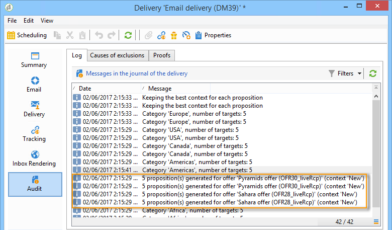

# 出站渠道上的选件{#offers-on-an-outbound-channel}

## 电子邮件推广信息发送 {#email-offer-delivery}

在我们的数据库中，有一类前往非洲的旅行优惠。 已配置每个选件的资格、上下文和表示形式。 现在，我们希望创建营销活动，通过电子邮件提供我们的推广信息。

1. 创建营销活动和定位工作流。

   

1. 编辑电子邮件发送，然后单击 **[!UICONTROL Offers]** 图标。

   

1. 为与节假日匹配的选件环境选择电子邮件空间。

   

1. 选择包含非洲旅行优惠的类别。

   

1. 将分发中的选件数量设置为两个。

   

1. 关闭选件管理窗口并创建分发内容。

   

1. 使用菜单插入第一个优惠建议并选择HTML渲染功能。

   

1. 插入第二个优惠建议。

   

1. 单击 **[!UICONTROL Preview]** 以在分发中预览选件，然后选择收件人以在收到选件时进行预览。

   

1. 保存您的交付并启动定位工作流。
1. 打开您的分发，然后单击 **[!UICONTROL Audit]** 分发的选项卡：您可以看到选件引擎已从目录中的各种选件中选择要提出的建议。

   

## 执行选件模拟 {#perform-an-offer-simulation}

1. 在宇宙 **[!UICONTROL Profiles and Targets]** 中，单击链 **[!UICONTROL Simulations]** 接，然后单击按 **[!UICONTROL Create]** 钮。

   

1. 选择一个标签，然后根据需要指定执行设置。

   

1. 保存模拟。 然后，新选项卡中会打开该选项卡。

   

1. 单击选 **[!UICONTROL Edit]** 项卡，然后 **[!UICONTROL Scope]**。

   

1. 选择要模拟其选件的类别。

   

1. 选择要用于模拟的选件空间。

   

1. 输入有效日期。 您必须至少输入开始日期。 这样，选件引擎过滤器选件并选择在给定日期有效的选件。
1. 如有必要，请指定一个或多个主题，将选件数量限制为设置中包含此关键字的选件数量。

   在我们的示例中， **Travel** category包含两个子类别，分别包含两个不同的主题。 我们希望使用“客户> 1年”主题对 **优惠进行模拟** 。

   

1. 选择要定位的收件人。

   

1. 配置要发送给每个收件人的选件数量。

   在我们的示例中，优惠引擎将为每个收件人选择权重最高的3个优惠。

   

1. 保存设置，然后单击 **[!UICONTROL Start]** 选项卡 **[!UICONTROL Dashboard]** 以运行模拟。

   

1. 完成模拟后，请查阅，以详细 **[!UICONTROL Results]** 了解每个选件的主张。

   在我们的示例中，选件引擎已根据3个主张划分选件。

   

1. 显示选 **[!UICONTROL Breakdown of offers by rank]** 件引擎选择的选件列表。

   

1. 如有必要，可以更改范围设置，然后单击以再次运行模拟 **[!UICONTROL Start simulation]**。

   

1. 要保存模拟数据，请使用报告中提供的历史记录或导出功能。

   

