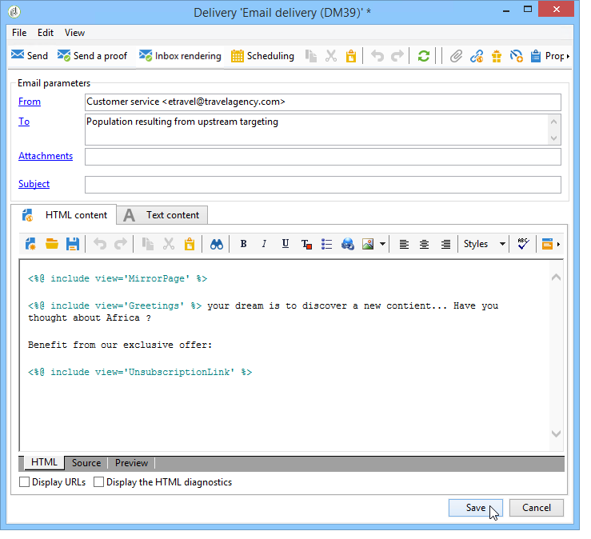

# 出站渠道优惠{#offers-on-an-outbound-channel}

## 电子邮件选件投放{#email-offer-delivery}

在我们的数据库中，有一类前往非洲的旅行优惠。 已配置每个选件的资格、上下文和表示形式。 现在，我们希望创建一个营销活动，通过电子邮件提供我们的优惠。

1. 创建营销活动和定位工作流。

   

1. 编辑电子邮件投放，然后单击&#x200B;**[!UICONTROL Offers]**&#x200B;图标。

   

1. 为选件环境选择与假日匹配的电子邮件空间。

   

1. 选择包含非洲旅游优惠的类别。

   

1. 将投放中的选件数量设置为2。

   

1. 关闭选件管理窗口并创建投放的内容。

   

1. 使用菜单插入第一个选件建议并选择HTML渲染功能。

   

1. 插入第二个优惠建议。

   

1. 单击&#x200B;**[!UICONTROL Preview]**&#x200B;以预览投放中的选件，然后选择收件人以预览将收到的选件。

   

1. 保存投放并启动定位工作流。
1. 打开投放，然后单击投放的&#x200B;**[!UICONTROL Audit]**&#x200B;选项卡：您可以看到选件引擎已从目录中的各种选件中选择了要提出的建议。

   

## 执行选件模拟{#perform-an-offer-simulation}

1. 在&#x200B;**[!UICONTROL Profiles and Targets]**&#x200B;选项卡中，单击&#x200B;**[!UICONTROL Simulations]**&#x200B;链接，然后单击&#x200B;**[!UICONTROL Create]**&#x200B;按钮。

   

1. 选择标签，并根据需要指定执行设置。

   

1. 保存模拟。 然后，会在新选项卡中打开该对话框。

   

1. 单击&#x200B;**[!UICONTROL Edit]**&#x200B;选项卡，然后单击&#x200B;**[!UICONTROL Scope]**。

   

1. 选择要模拟选件的类别。

   

1. 选择要用于模拟的选件空间。

   

1. 输入有效日期。 您必须至少输入开始日期。 这允许选件引擎过滤选件并选择在给定日期有效的选件。
1. 如有必要，请指定一个或多个主题，以将选件数量限制为设置中包含此关键字的选件数量。

   在我们的示例中，**Travel**&#x200B;类别包含两个具有两个不同主题的子类别。 我们希望使用&#x200B;**Customers>1 year**&#x200B;主题对选件运行模拟。

   

1. 选择要定位的收件人。

   

1. 配置要发送给每个收件人的选件数量。

   在我们的示例中，选件引擎将为每个收件人选择权重最高的3个选件。

   

1. 保存设置，然后单击&#x200B;**[!UICONTROL Dashboard]**&#x200B;选项卡中的&#x200B;**[!UICONTROL Start]**&#x200B;以运行模拟。

   

1. 模拟完成后，请查阅&#x200B;**[!UICONTROL Results]** ，详细了解每个选件的建议。

   在我们的示例中，选件引擎基于3个建议来划分选件。

   

1. 显示&#x200B;**[!UICONTROL Breakdown of offers by rank]**&#x200B;以查看选件引擎选择的选件列表。

   

1. 如有必要，可以更改范围设置，并通过单击&#x200B;**[!UICONTROL Start simulation]**&#x200B;再次运行模拟。

   

1. 要保存模拟数据，请使用报告中提供的历史记录或导出函数。

   
