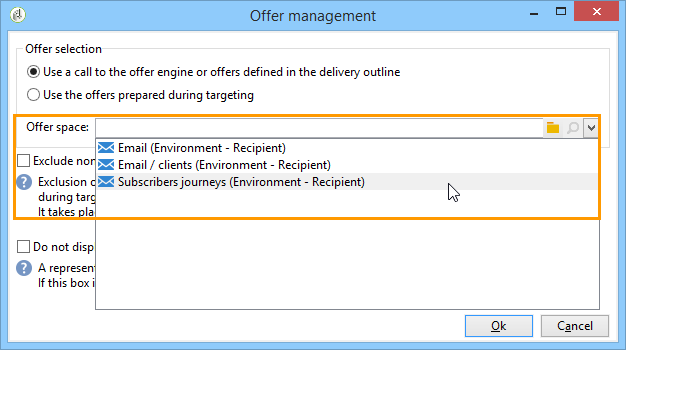

# 出站渠道优惠{#offers-on-an-outbound-channel}

## 电子邮件优惠投放 {#email-offer-delivery}

在我们的类别库里，有一旅行优惠前往非洲。 已配置每个优惠的资格、上下文和表示。 现在，我们希望创建一个活动，通过电子邮件向优惠展示。

1. 创建营销活动和定位工作流。

   

1. 编辑电子邮件投放，然后单击 **[!UICONTROL Offers]** 图标。

   

1. 为优惠环境选择与假期匹配的电子邮件空间。

   

1. 选择包含非洲旅行类别的优惠。

   

1. 将投放中的优惠数设置为2。

   

1. 关闭优惠管理窗口并创建投放内容。

   

1. 使用菜单插入第一个优惠建议并选择HTML渲染功能。

   

1. 插入第二个优惠建议。

   

1. 单 **[!UICONTROL Preview]** 击预览投放中的优惠，然后选择一个预览来收件人将收到的优惠。

   

1. 保存投放并开始定位工作流。
1. 打开投放并单击 **[!UICONTROL Audit]** 投放的选项卡：您可以看到优惠引擎已选择要从目录中的各种优惠中提出的建议。

   

## 执行优惠模拟 {#perform-an-offer-simulation}

1. 在宇宙 **[!UICONTROL Profiles and Targets]** 中，单击链 **[!UICONTROL Simulations]** 接，然后单击按 **[!UICONTROL Create]** 钮。

   

1. 选择一个标签并根据需要指定执行设置。

   

1. 保存模拟。 然后在新选项卡中打开。

   

1. 单击选 **[!UICONTROL Edit]** 项卡，然后 **[!UICONTROL Scope]**。

   

1. 选择要模拟其类别的优惠。

   

1. 选择要用于优惠空间的模拟。

   

1. 输入有效日期。 您必须至少输入开始日期。 这样，优惠引擎可以过滤优惠，并选择在给定日期有效的过滤器。
1. 如有必要，请指定一个或多个主题，将优惠数限制为设置中包含此关键字的数。

   在我们的示例中， **旅行类别** 包含两个子类别，其中两个子主题是单独的。 我们希望为优惠运行模拟，其主题 **为“客户>1年** ”。

   

1. 选择要目标的收件人。

   

1. 配置要发送给每个优惠的收件人数。

   在我们的示例中，优惠引擎将为每个优惠选择权重最高的3个收件人。

   

1. 保存设置，然后 **[!UICONTROL Start]** 单击选 **[!UICONTROL Dashboard]** 项卡以运行模拟。

   

1. 模拟完成后，请查阅，以了 **[!UICONTROL Results]** 解每个优惠的主张的详细细目。

   在本例中，优惠引擎根据3个命题进行优惠细分。

   

1. 显示视图 **[!UICONTROL Breakdown of offers by rank]** 列表引擎选择的优惠的优惠。

   

1. 如有必要，可以更改范围设置并通过单击再次运行模拟 **[!UICONTROL Start simulation]**。

   

1. 要保存模拟数据，请使用报告中提供的历史记录或导出功能。

   

