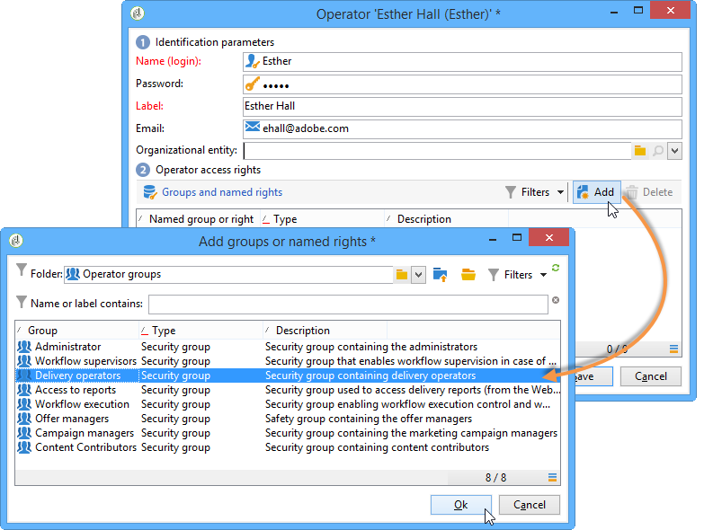

# 操作员用户档案{#operator-profiles}

使用交互的运算符有两种类型：选件经理和投放经理。 它们各自具有特定权限，仅允许它们访问树和平台的某些部分。

* **[!UICONTROL Offer manager]** :创建和维护选件。请注意，如果在工作流中使用选件，则运算符需要位于&#x200B;**[!UICONTROL Administrator]**&#x200B;或&#x200B;**[!UICONTROL Offer managers]**&#x200B;运算符组中才能执行工作流。
* **[!UICONTROL Delivery manager]** :批准和使用选件

创建特定于交互的运算符的步骤与创建平台上所有其他运算符的步骤相同。 如需详细信息，请参阅[此部分](../../platform/using/access-management.md)。权限在操作员创建期间进行配置。

## 选件管理器 {#offer-manager}

1. 创建新运算符。
1. 转到&#x200B;**[!UICONTROL Groups and named rights]**&#x200B;窗口，单击&#x200B;**[!UICONTROL Add]**&#x200B;并选择&#x200B;**[!UICONTROL Offer manager]**&#x200B;组。

   

分配给选件管理器的权限允许他们执行以下任务：

* 修改&#x200B;**[!UICONTROL Design]**&#x200B;环境。
* 查看&#x200B;**[!UICONTROL Live]**&#x200B;环境。
* 配置管理功能（预定义空格和过滤器）。
* 创建和更改类别。
* 创建选件。
* 配置选件资格。
* 批准选件。

   >[!NOTE]
   >
   >在两种情况下，选件管理器只能批准选件。 第一个是，如果没有人特别指定为审阅者，第二个是，如果负责创建模板（具有指定审阅者的权限）的操作员在选件所依据的选件模板中将其指定为审阅者。

## 投放管理器 {#delivery-manager}

1. 创建新运算符。
1. 转到&#x200B;**[!UICONTROL Groups and named rights]**&#x200B;窗口，单击&#x200B;**[!UICONTROL Add]**&#x200B;并选择&#x200B;**[!UICONTROL Delivery manager]**&#x200B;组。

   

分配给投放管理器的权限，使他们能够执行以下任务：

* 显示&#x200B;**[!UICONTROL Live]**&#x200B;环境。
* 显示和修改选件类别。
* 如果将此投放管理器指定为其审阅者之一，则批准选件。

   >[!NOTE]
   >
   >只有在选件配置期间被定义为审阅者时，投放管理器才能批准选件。

## 根据运营者重新评估权利 {#recap-of-rights-according-to-operator}

<table> 
 <tbody> 
  <tr> 
   <td> </td> 
   <td> <strong>选件管理器（编辑）</strong>  </td> 
   <td> <strong>选件管理器（正式启用）</strong>  </td> 
  </tr> 
  <tr> 
   <td> <strong>树结构级别</strong>  </td> 
   <td> </td> 
   <td> </td> 
  </tr> 
  <tr> 
   <td> 正在编辑的选件/ Live选件  </td> 
   <td> 读/写  </td> 
   <td> 读取  </td> 
  </tr> 
  <tr> 
   <td> Recipient - Environment  </td> 
   <td> 读/写  </td> 
   <td> 读取  </td> 
  </tr> 
  <tr> 
   <td> 管理  </td> 
   <td> 读/写  </td> 
   <td> 读取  </td> 
  </tr> 
  <tr> 
   <td> 空格  </td> 
   <td> 读/写  </td> 
   <td> 读取  </td> 
  </tr> 
  <tr> 
   <td> 预定义选件过滤器  </td> 
   <td> 读/写  </td> 
   <td> 读取  </td> 
  </tr> 
  <tr> 
   <td> 分类  </td> 
   <td> 读/写  </td> 
   <td> 读取  </td> 
  </tr> 
  <tr> 
   <td> 类型规则  </td> 
   <td> 读/写  </td> 
   <td> 读取  </td> 
  </tr> 
  <tr> 
   <td> 选件目录  </td> 
   <td> 读/写  </td> 
   <td> 读取  </td> 
  </tr> 
  <tr> 
   <td> 选件类别  </td> 
   <td> 读/写  </td> 
   <td> 读取  </td> 
  </tr> 
 </tbody> 
</table>

<table> 
 <tbody> 
  <tr> 
   <td> </td> 
   <td> <strong>投放管理器（编辑）</strong>  </td> 
   <td> <strong>投放管理器（实时）</strong>  </td> 
  </tr> 
  <tr> 
   <td> <strong>树结构级别</strong>  </td> 
   <td> </td> 
   <td> </td> 
  </tr> 
  <tr> 
   <td> 正在编辑的选件/ Live选件  </td> 
   <td> </td> 
   <td> 读取  </td> 
  </tr> 
  <tr> 
   <td> Recipient - Environment  </td> 
   <td> </td> 
   <td> 读取  </td> 
  </tr> 
  <tr> 
   <td> 管理  </td> 
   <td> </td> 
   <td> </td> 
  </tr> 
  <tr> 
   <td> 空格  </td> 
   <td> </td> 
   <td> </td> 
  </tr> 
  <tr> 
   <td> 预定义选件过滤器  </td> 
   <td> 读取  </td> 
   <td> 读取  </td> 
  </tr> 
  <tr> 
   <td> 分类  </td> 
   <td> 读取  </td> 
   <td> 读取  </td> 
  </tr> 
  <tr> 
   <td> 类型规则  </td> 
   <td> </td> 
   <td> 读取  </td> 
  </tr> 
  <tr> 
   <td> 选件目录  </td> 
   <td> 读取  </td> 
   <td> 读取  </td> 
  </tr> 
  <tr> 
   <td> 选件类别  </td> 
   <td> </td> 
   <td> 读取  </td> 
  </tr> 
 </tbody> 
</table>
