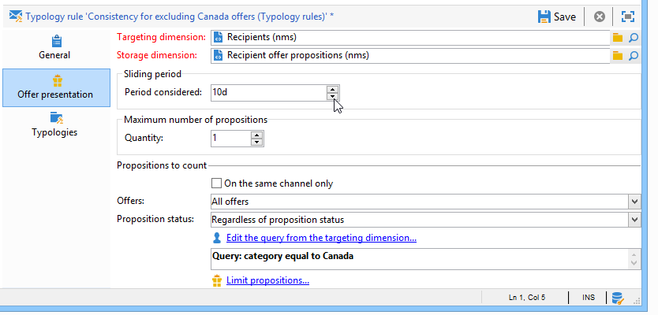

# 推荐规则{#presentation-rules}

## Creating a presentation rule {#creating-a-presentation-rule}

在我们的优惠库中，有几个前往欧洲、非洲、美国和加拿大的旅行。 我们想派优惠去加拿大，但如果收件人拒绝这种优惠，我们不想再把它寄给他们

我们将配置我们的规则，以便每个收件人只提供一次加拿大之旅，如果拒绝，则不再提供。

1. 在Adobe Campaign树中，转到 **[!UICONTROL Administration]** > **[!UICONTROL Campaign management]** > **[!UICONTROL Typology management]** >节 **[!UICONTROL Typology rules]** 点。
1. Create a new **[!UICONTROL Offer presentation]** type rule.

   

1. 根据需要更改其标签和说明。

   

1. 选择选 **[!UICONTROL All channels]** 项以将规则扩展到所有渠道。

   

1. 单击链 **[!UICONTROL Edit expression]** 接，然后选择 **[!UICONTROL Category]** 节点作为表达式。

   

1. 选择与您的加拿大旅行类别匹配的优惠，然 **[!UICONTROL OK]** 后单击以关闭查询窗口。

   

1. 在选项卡 **[!UICONTROL Offer presentation]** 中，选择与环境中配置的维相同的维。

   

1. 指定应用规则的期间。

   

1. 将提议限制在一个，这样已经拒绝前往加拿大的收件人就不会再收到类似的优惠。

   

1. 选择筛 **[!UICONTROL Offers for the same category]** 选器以从加拿大优惠中排 **除所有** 类别。

   

1. 选择筛 **[!UICONTROL Rejected propositions]** 选器以仅考虑被收件人拒绝的建议。

   

1. 选择此规则将适用的收件人。

   在我们的例子中，我们将选择“常 **旅客** ”收件人。

   

1. 在优惠类型学中引用规则。

   

1. 转到优惠环境(**环境** -本例中为收件人 **[!UICONTROL Eligibility]** )，并引用刚使用选项卡中的下拉列表创建的新排版。

   

## 应用推荐规则 {#applying-the-presentation-rule}

以下是先前创建的类型规则的应用程序示例。

我们要发送属于加拿大优惠建议的第一个类别。 如果优惠被任何收件人拒绝一次，则不会再向他们提供。

1. 在“常 **旅客** ”收件人文件夹中，选择一个用户档案来检查其有资格的优惠:单击选 **[!UICONTROL Propositions]** 项卡，然后单击选 **[!UICONTROL Preview]** 项卡。

   在我们的示 **例中** ,Tim Ramsey有资格获得优惠，该是美洲 **** 类别的一部分。

   

1. 开始，创建电子邮件投放，将您的常旅 **收件人与** 优惠目标。
1. 选择优惠引擎调用参数。

   在我们的示例中，选 **择“在美国旅行** ”类别，其中 **包含加** 拿大和美国 **** 的子类别。

   

1. 将优惠插入邮件正文并发送投放。 有关此内容的详细信息，请参 [阅关于出站渠道](../../interaction/using/about-outbound-channels.md)。

   收件人收到了符合其资格的优惠。

1. 收件人拒绝了加拿大优惠，如提案历史所示。

   

1. 检查他们现在有资格的优惠。

   我们可以看到加拿大没有选择任何优惠。

   

**相关主题**

* [管理优惠并控制渠道间的冗余](https://helpx.adobe.com/campaign/kb/simplifying-campaign-management-acc.html#Manageoffersandcontrolredundancyacrosschannels)