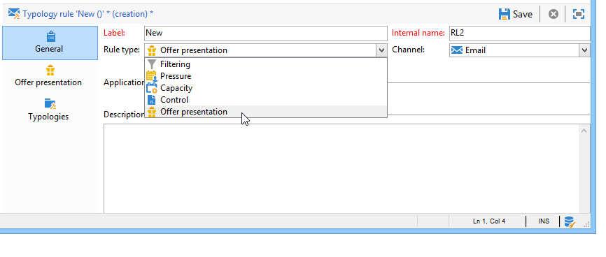

# 推荐规则{#presentation-rules}

## 创建推荐规则{#creating-a-presentation-rule}

在我们的优惠库中，有几个前往欧洲、非洲、美国和加拿大的旅行。 我们想派优惠去加拿大，但如果收件人拒绝这种优惠，我们不想再把它寄给他们

我们将配置我们的规则，以便每个收件人只提供一次加拿大之旅，如果拒绝，则不再提供。

1. 在Adobe Campaign树中，转到&#x200B;**[!UICONTROL Administration]** > **[!UICONTROL Campaign management]** > **[!UICONTROL Typology management]** > **[!UICONTROL Typology rules]**&#x200B;节点。
1. 新建一个&#x200B;**[!UICONTROL Offer presentation]**&#x200B;类型规则。

   

1. 根据需要更改其标签和说明。

   

1. 选择&#x200B;**[!UICONTROL All channels]**&#x200B;选项将规则扩展到所有渠道。

   

1. 单击&#x200B;**[!UICONTROL Edit expression]**&#x200B;链接，然后选择&#x200B;**[!UICONTROL Category]**&#x200B;节点作为表达式。

   

1. 选择与您前往加拿大的旅行类别匹配的优惠，然后单击&#x200B;**[!UICONTROL OK]**&#x200B;以关闭查询窗口。

   

1. 在&#x200B;**[!UICONTROL Offer presentation]**&#x200B;选项卡中，选择与环境中配置的相同尺寸。

   

1. 指定应用规则的期间。

   

1. 将提议限制在一个，这样已经拒绝前往加拿大的收件人就不会再收到类似的优惠。

   

1. 选择&#x200B;**[!UICONTROL Offers for the same category]**&#x200B;过滤器以排除&#x200B;**Canada**&#x200B;优惠中的所有类别。

   

1. 选择&#x200B;**[!UICONTROL Rejected propositions]**&#x200B;筛选器以仅考虑被收件人拒绝的主张。

   

1. 选择此规则将适用的收件人。

   在我们的示例中，我们将选择&#x200B;**常客**&#x200B;收件人。

   

1. 在优惠类型学中引用规则。

   

1. 转到优惠环境(本例中为&#x200B;**环境-收件人**)，并引用刚使用&#x200B;**[!UICONTROL Eligibility]**&#x200B;选项卡中的下拉列表创建的新类型。

   

## 应用推荐规则{#applying-the-presentation-rule}

以下是先前创建的类型规则的应用程序示例。

我们要发送属于加拿大优惠建议的第一个类别。 如果优惠被任何收件人拒绝一次，则不会再向他们提供。

1. 在&#x200B;**频繁出差者**&#x200B;收件人文件夹中，选择其中一个用户档案来检查其符合条件的优惠:单击&#x200B;**[!UICONTROL Propositions]**&#x200B;选项卡，然后单击&#x200B;**[!UICONTROL Preview]**&#x200B;选项卡。

   在我们的示例中，**Tim Ramsey**&#x200B;有资格获得属于&#x200B;**Americas**&#x200B;优惠的类别。

   

1. 开始方式是创建一个电子邮件投放，将您的&#x200B;**常旅客**&#x200B;收件人目标为优惠。
1. 选择优惠引擎调用参数。

   在我们的示例中，选择&#x200B;**在美国旅行**&#x200B;类别，其中包含&#x200B;**Canada**&#x200B;和&#x200B;**美国**&#x200B;子类别。

   

1. 将优惠插入邮件正文并发送投放。 有关详细信息，请参阅[关于出站渠道](../../interaction/using/about-outbound-channels.md)。

   收件人收到了符合其资格的优惠。

1. 收件人拒绝了加拿大优惠，如提案历史所示。

   

1. 检查他们现在有资格的优惠。

   我们可以看到加拿大没有选择任何优惠。

   

**相关主题**

* [管理优惠并控制渠道间的冗余](https://helpx.adobe.com/campaign/kb/simplifying-campaign-management-acc.html#Manageoffersandcontrolredundancyacrosschannels)