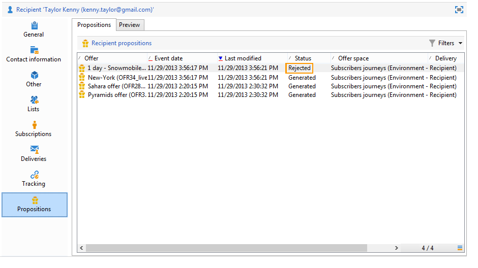

# 演示规则{#presentation-rules}

## 创建演示规则 {#creating-a-presentation-rule}

在我们的数据库中，有几个旅行优惠，分别针对欧洲、非洲、美国和加拿大。 我们希望发送前往加拿大的旅游邀请，但如果接收方拒绝此类邀请，我们不希望再次将其发送给他们

我们将配置我们的规则，以便每个收件人只提供一次加拿大之旅，如果拒绝，则不再提供。

1. 在Adobe Campaign树中，转到 **[!UICONTROL Administration]** > **[!UICONTROL Campaign management]** > **[!UICONTROL Typology management]** >节 **[!UICONTROL Typology rules]** 点。
1. 创建新的 **[!UICONTROL Offer presentation]** 类型规则。

   

1. 根据需要更改其标签和说明。

   

1. 选择选 **[!UICONTROL All channels]** 项以将规则扩展到所有渠道。

   

1. 单击链 **[!UICONTROL Edit expression]** 接，然后选择节 **[!UICONTROL Category]** 点作为表达式。

   

1. 选择与您的加拿大差旅选件匹配的类别，然后单 **[!UICONTROL OK]** 击以关闭查询窗口。

   

1. 在选项卡 **[!UICONTROL Offer presentation]** 中，选择与环境中配置的维相同的尺寸。

   

1. 指定应用规则的期间。

   

1. 将提议限制为一个，这样已拒绝前往加拿大的接收者将不会再收到类似的建议。

   

1. 选择筛 **[!UICONTROL Offers for the same category]** 选器以从加拿大类别中排除所 **有选件** 。

   

1. 选择筛 **[!UICONTROL Rejected propositions]** 选器以仅考虑收件人拒绝的主张。

   

1. 选择将应用此规则的收件人。

   在我们的示例中，我们将选择“常 **客** ”接收者。

   

1. 在选件类型学中引用该规则。

   

1. 转到选件环境(本例中为“**Environment”-“Recipient** ”)，并引用刚刚使用选项卡中的下拉列表创建的新类型 **[!UICONTROL Eligibility]** 学。

   

## 应用表示规则 {#applying-the-presentation-rule}

以下是先前创建的排版规则的应用程序示例。

我们希望发送属于加拿大类别的第一个优惠建议。 如果任何收件人拒绝此选件一次，则不会再向他们提供此选件。

1. 在“经常 **出差者** ”收件人文件夹中，选择其中一个配置文件以检查他们有资格享受的优惠：单击选 **[!UICONTROL Propositions]** 项卡，然后单击选 **[!UICONTROL Preview]** 项卡。

   在我们的示例中， **Tim Ramsey** 有资格获得属于“美洲”类别的 **优惠** 。

   

1. 首先，创建一个电子邮件发送，该电子邮件将通过优惠信息 **定位到您的** “常客”收件人。
1. 选择选件引擎调用参数。

   在我们的示例中，选 **择了“在美国旅行** ”类别，其中包含 **加拿大****** 和美国子类别。

   

1. 在邮件正文中插入您的选件并发送传送。 有关详细信息，请参阅关于 [出站渠道](../../interaction/using/about-outbound-channels.md)。

   收件人收到了符合条件的选件。

1. 接受方拒绝了加拿大的报价，如提案历史中所示。

   

1. 检查他们现在有资格享受的选件。

   我们可以看到，没有为加拿大选择任何优惠。

   

**相关主题**

* [跨渠道管理优惠和控制冗余](https://helpx.adobe.com/campaign/kb/simplifying-campaign-management-acc.html#Manageoffersandcontrolredundancyacrosschannels)