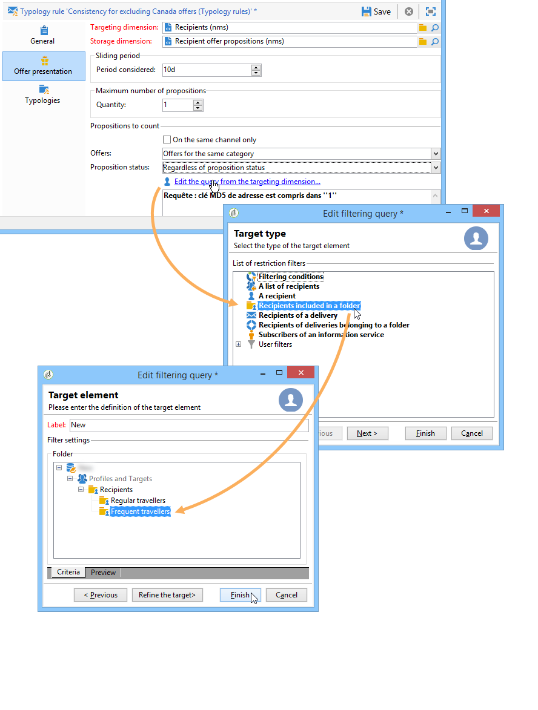

# 呈现规则{#presentation-rules}

## 创建演示规则 {#creating-a-presentation-rule}

在我们的数据库中，有几份前往欧洲、非洲、美国和加拿大的旅行优惠。 我们希望发送前往加拿大的优惠，但如果接受者拒绝此类优惠，我们不希望再将其发送给他们

我们将配置我们的规则，以便每个收件人仅提供一次加拿大之旅，如果被拒绝，则不再提供。

1. 在Adobe Campaign树中，转到 **[!UICONTROL Administration]** > **[!UICONTROL Campaign management]** > **[!UICONTROL Typology management]** > **[!UICONTROL Typology rules]** 节点。
1. 新建 **[!UICONTROL Offer presentation]** 类型规则。

   

1. 如有必要，请更改其标签和说明。

   

1. 选择 **[!UICONTROL All channels]** 选项以将规则扩展到所有渠道。

   

1. 单击 **[!UICONTROL Edit expression]** 链接，然后选择 **[!UICONTROL Category]** 节点。

   

1. 选择与您的加拿大差旅选件匹配的类别，然后单击 **[!UICONTROL OK]** 以关闭查询窗口。

   

1. 在 **[!UICONTROL Offer presentation]** 选项卡，选择与环境中配置的维度相同的维度。

   

1. 指定应用规则的时段。

   

1. 将建议限制为一个，以便已经拒绝前往加拿大的收件人不会再收到类似的建议。

   

1. 选择 **[!UICONTROL Offers for the same category]** 过滤器，从 **加拿大** 类别。

   

1. 选择 **[!UICONTROL Rejected propositions]** 过滤以仅考虑收件人拒绝的建议。

   

1. 选择将应用此规则的收件人。

   在本例中，我们将选择 **常客** 收件人。

   

1. 在选件分类中引用规则。

   

1. 转到选件环境(**环境 — 收件人** 在本例中)，并引用使用 **[!UICONTROL Eligibility]** 选项卡。

   

## 应用演示规则 {#applying-the-presentation-rule}

以下是之前创建的分类规则的应用程序示例。

我们想发送属于加拿大类别的第一个优惠建议。 如果任何收件人拒绝该选件一次，则不会再向他们提供该选件。

1. 在 **常客** 收件人文件夹中，选择一个配置文件以检查其符合条件的选件：单击 **[!UICONTROL Propositions]** 选项卡，然后 **[!UICONTROL Preview]** 选项卡。

   在我们的示例中， **蒂姆·拉姆齐** 有资格获得属于 **美洲** 类别。

   

1. 首先，创建以您的 **常客** 具有选件的收件人。
1. 选择选件引擎调用参数。

   在本例中， **美国旅行** 类别，其中包含 **加拿大** 和 **美国** 子类别。

   

1. 将选件插入消息正文并发送投放。 有关更多信息，请参阅 [关于出站渠道](../../interaction/using/about-outbound-channels.md).

   收件人收到了他们有资格获得的选件。

1. 收件人拒绝了加拿大选件，如建议历史中所示。

   

1. 检查他们现在符合条件的选件。

   我们可以看到没有选择加拿大的优惠。

   
